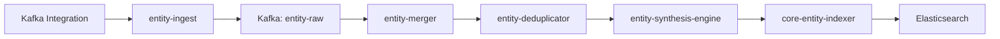
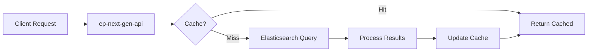

# 📕 Kafka Entity Platform: Advanced Topics and Reference

<div align="center">


**Master best practices, integrations, security, future roadmap, and comprehensive reference**

</div>

---

## 📑 Document Series Navigation

<table>
<tr>
<td width="25%" align="center">

### [📘 Part 1](KAFKA_ENTITY_FUNDAMENTALS.md)
**Fundamentals**
- Introduction
- Platform Basics
- Core Concepts
- Entity Hierarchy
- Lifecycle & Flow

</td>
<td width="25%" align="center">

### [📗 Part 2](KAFKA_ENTITY_IMPLEMENTATION.md)
**Implementation**
- Synthesis Engine
- Golden Metrics
- Relationships
- Providers
- Dashboards

</td>
<td width="25%" align="center">

### [📙 Part 3](KAFKA_ENTITY_OPERATIONS.md)
**Operations**
- Configuration
- Testing
- Excellence
- Troubleshooting
- Performance

</td>
<td width="25%" align="center" bgcolor="#ffebee">

### 📕 Part 4 (This Doc)
**Advanced**
- Best Practices
- Integration
- Security
- Future
- Reference

</td>
</tr>
</table>

---

## 📖 Table of Contents

16. [Best Practices and Design Patterns](#best-practices)
17. [Platform Integration Points](#platform-integration)
18. [Security and Compliance](#security-compliance)
19. [Future-Proofing and Extensibility](#future-proofing)
20. [Comprehensive Glossary](#glossary)
- [Appendix A: Quick Reference](#appendix-a)
- [Appendix B: Troubleshooting Checklist](#appendix-b)

---

## 16. Best Practices and Design Patterns {#best-practices}

### Entity Design Best Practices

#### Stable Identifiers

<div style="background-color: #e8f5e9; border-radius: 8px; padding: 20px; margin: 20px 0;">

**Good Practices:**
- ✓ Use immutable attributes
- ✓ Include account/region for uniqueness
- ✓ Handle special characters
- ✓ Validate identifier components

**Bad Practices:**
- ✗ Using display names as identifiers
- ✗ Timestamp in identifier
- ✗ Mutable attributes
- ✗ User-provided strings without validation

</div>

**Examples:**
```yaml
Good: arn:aws:kafka:us-east-1:123456:cluster/prod/abc-123
Good: confluent.kafka.cluster.id = "lkc-12345"
Bad: clusterName = "Production Kafka (NEW)"
Bad: clusterId = "kafka-${timestamp}"
```

#### Tag Design

<table>
<tr>
<th width="30%">🏷️ Tag Type</th>
<th width="35%">📝 Guidelines</th>
<th width="35%">⏱️ TTL Strategy</th>
</tr>
<tr>
<td><b>Golden Tags</b></td>
<td>

- Most commonly searched
- Rarely changing values
- Reasonable cardinality
- Meaningful to users

</td>
<td>

No TTL (permanent)

</td>
</tr>
<tr>
<td><b>Static Tags</b></td>
<td>

- Provider type
- Region
- Version info

</td>
<td>

No TTL:
- `provider`
- `cloud.region`
- `kafka.version`

</td>
</tr>
<tr>
<td><b>Semi-dynamic Tags</b></td>
<td>

- Counts
- Configuration
- Status

</td>
<td>

Hours/Days:
- `broker.count`: P1D
- `topic.count`: P1D
- `health.status`: P1H

</td>
</tr>
<tr>
<td><b>Dynamic Tags</b></td>
<td>

- Metrics
- Real-time data
- Rapidly changing

</td>
<td>

Minutes:
- `consumer.lag`: P5M
- `throughput.rate`: P1M
- `active.connections`: P5M

</td>
</tr>
</table>

#### Entity Expiration

```yaml
TTL Guidelines:
  Infrastructure entities: 8-30 days
    - Clusters: 30 days
    - Brokers: 8 days
    - Topics: 8 days
    
  High-cardinality entities: 1-4 hours
    - Partitions: 4 hours
    - Consumer instances: 1 hour
    
  Activity-based entities: 15 minutes - 1 day
    - Producer connections: 15 minutes
    - Consumer connections: 15 minutes
    - Temporary topics: 1 day
```

### Synthesis Pattern Best Practices

#### Multi-Provider Support

<div style="background-color: #f0f8ff; border-radius: 8px; padding: 20px; margin: 20px 0;">

**Pattern: Provider Abstraction**

```yaml
implementation:
  # Base rule structure
  - identifier: getIdentifier(provider)
    name: getName(provider)
    conditions: getConditions(provider)
    tags:
      # Common tags
      kafka.cluster.name:
        entityTagName: kafka.cluster.name
      # Provider-specific
      provider:
        value: getProviderType()
      
helpers:
  getIdentifier(provider):
    switch(provider):
      case SELF_MANAGED: return clusterName
      case AWS_MSK: return aws.kafka.clusterArn
      case CONFLUENT: return confluent.kafka.cluster.id
```

</div>

#### Fallback Patterns

```yaml
Pattern: Graceful Degradation

tags:
  clusterName:
    entityTagName: kafka.cluster.name
    fallbackAttribute: aws.kafka.clusterName
    fallbackAttribute: displayName
    fallbackAttribute: name
    defaultValue: "unknown-cluster"
    
benefits:
  - Handles provider variations
  - Prevents synthesis failures
  - Maintains data quality
```

#### Conditional Synthesis

```yaml
Pattern: Progressive Enhancement

# Basic entity
- identifier: clusterName
  conditions:
    - attribute: eventType
      value: KafkaClusterSample
      
# Enhanced with version info
- identifier: clusterName
  conditions:
    - attribute: eventType
      value: KafkaClusterSample
    - attribute: kafka.version
      present: true
  tags:
    kafka.version:
      entityTagName: kafka.version
      
benefits:
  - Start with minimal data
  - Add features as available
  - No blocking on optional data
```

### Relationship Best Practices

#### Bidirectional Relationships

<div style="background-color: #e3f2fd; border-radius: 8px; padding: 20px; margin: 20px 0;">

**Pattern: Symmetric Relationships**

```yaml
# Forward: Cluster → Topic
- name: clusterContainsTopic
  relationship:
    relationshipType: CONTAINS
    source: cluster
    target: topic
    
# Reverse: Topic → Cluster  
- name: topicContainedByCluster
  relationship:
    relationshipType: CONTAINED_BY
    source: topic
    target: cluster
```

**Benefits:**
- Complete graph traversal
- UI flexibility
- Query optimization

</div>

#### TTL Alignment

```yaml
Pattern: Coordinated Expiration

rule:
  If entity TTL < relationship TTL:
    Set relationship TTL = entity TTL
    
example:
  Partition entity: 4 hours
  Partition relationships: 4 hours (not 24)
  
benefits:
  - Prevents orphaned relationships
  - Reduces cleanup overhead
  - Maintains consistency
```

#### Relationship Cardinality

<table>
<tr>
<th width="30%">🔗 Pattern</th>
<th width="70%">📝 Strategy</th>
</tr>
<tr>
<td><b>One-to-Many</b></td>
<td>

- Use single source, multiple targets
- Example: Cluster → many Brokers

</td>
</tr>
<tr>
<td><b>Many-to-Many</b></td>
<td>

- Create junction entity if needed
- Example: Topics ↔ Consumer Groups

</td>
</tr>
<tr>
<td><b>High Cardinality</b></td>
<td>

- Aggregate when possible
- Example: Topic → Partition count (not individual)

</td>
</tr>
</table>

### Metric Design Patterns

#### Provider Agnostic Metrics

```yaml
Pattern: Unified Metrics

goldenMetric:
  title: "Throughput"
  unit: BYTES_PER_SECOND
  queries:
    # Each provider maps to same concept
    nriKafka:
      select: "sum(`broker.bytesInPerSec`)"
      from: "KafkaBrokerSample"
    awsMsk:
      select: "sum(`aws.kafka.BytesInPerSec.byBroker`)"
      from: "AwsMskBrokerSample"
    confluentCloud:
      select: "sum(`io.confluent.kafka.server/received_bytes`)"
      from: "Metric"
      
benefits:
  - Consistent dashboards
  - Provider migration support
  - Unified alerting
```

#### Calculated Metrics

```yaml
Pattern: Derived Values

healthScore:
  title: "Health Score"
  unit: PERCENTAGE
  queries:
    calculated:
      select: "
        (
          filter(count(*), WHERE activeControllerCount = 1) +
          filter(count(*), WHERE offlinePartitionsCount = 0) +
          filter(count(*), WHERE underReplicatedPartitions = 0)
        ) / 3 * 100
      "
      
benefits:
  - Business-aligned metrics
  - Simplified alerting
  - Composite health view
```

#### Metric Aggregation Patterns

<div style="background-color: #f5f5f5; border-radius: 8px; padding: 20px; margin: 20px 0;">

```yaml
# Sum for additive metrics
throughput:
  select: "sum(bytesPerSec)"
  
# Average for resource metrics  
cpuUsage:
  select: "average(cpuPercent)"
  
# Max for worst-case metrics
consumerLag:
  select: "max(lag)"
  
# Percentile for latency
responseTime:
  select: "percentile(duration, 95)"
```

</div>

### Dashboard Design Patterns

#### Progressive Disclosure

```yaml
Pattern: Layered Information

Level 1 - Executive Summary:
  - Overall health status
  - Key business metrics
  - Trend indicators
  
Level 2 - Operational View:
  - Component health
  - Performance metrics
  - Resource utilization
  
Level 3 - Engineering Detail:
  - Individual components
  - Debug information
  - Raw metrics
```

#### Responsive Design

<table>
<tr>
<th width="30%">📱 Device</th>
<th width="70%">🎨 Layout</th>
</tr>
<tr>
<td><b>Desktop (1920px)</b></td>
<td>

- 4 column layout
- Multiple charts per row
- Detailed tables

</td>
</tr>
<tr>
<td><b>Tablet (1024px)</b></td>
<td>

- 2 column layout
- Stacked charts
- Condensed tables

</td>
</tr>
<tr>
<td><b>Mobile (480px)</b></td>
<td>

- Single column
- Key metrics only
- Expandable sections

</td>
</tr>
</table>

#### Context Preservation

```yaml
Pattern: Stateful Navigation

implementation:
  - Save time range selection
  - Preserve filter choices
  - Remember sort order
  - Maintain zoom level
  
benefits:
  - Better user experience
  - Faster investigation
  - Consistent analysis
```

### Error Handling Patterns

#### Graceful Degradation

<div style="background-color: #ffebee; border-radius: 8px; padding: 20px; margin: 20px 0;">

**Pattern: Fallback Strategies**

```yaml
metricQuery:
  try:
    - Primary query with all features
  catch:
    - Simplified query without facets
  finally:
    - Basic count query
    
example:
  primary: "SELECT histogram(latency, 50, 20) FACET service"
  fallback: "SELECT average(latency) FACET service"
  basic: "SELECT count(*) FROM Transaction"
```

</div>

#### Circuit Breaker

```yaml
Pattern: Failure Protection

implementation:
  states:
    - Closed: Normal operation
    - Open: Fast failure
    - Half-Open: Test recovery
    
  thresholds:
    - Error rate > 50%: Open circuit
    - Success count > 10: Close circuit
    - Timeout: 30 seconds
    
benefits:
  - Prevent cascade failures
  - Fast failure response
  - Automatic recovery
```

#### Retry Strategies

```yaml
Pattern: Smart Retry

strategy:
  - Immediate retry: Network glitches
  - Exponential backoff: Rate limits
  - Circuit breaker: Persistent failures
  
implementation:
  retries: 3
  backoff: [1s, 2s, 4s]
  jitter: ±20%
  
conditions:
  retry: [500, 502, 503, 504]
  no-retry: [400, 401, 403, 404]
```

### Performance Patterns

#### Lazy Loading

```yaml
Pattern: Deferred Computation

implementation:
  - Load visible widgets first
  - Fetch details on expansion
  - Cache computed results
  - Prefetch likely next data
  
example:
  # Initial load
  GET /api/entity/summary
  
  # On expansion
  GET /api/entity/details
  GET /api/entity/relationships
  GET /api/entity/metrics
```

#### Batch Operations

```yaml
Pattern: Efficient Bulk Processing

implementation:
  collect:
    - Accumulate requests
    - Wait for batch size or timeout
    
  process:
    - Single bulk operation
    - Parallel processing
    - Result distribution
    
example:
  instead of:
    for entity in entities:
      create_entity(entity)
      
  use:
    create_entities_bulk(entities)
```

#### Caching Strategies

<table>
<tr>
<th width="30%">🏪 Cache Level</th>
<th width="70%">📋 Configuration</th>
</tr>
<tr>
<td><b>Browser</b></td>
<td>

- Static assets: 1 year
- API responses: 1 minute

</td>
</tr>
<tr>
<td><b>CDN</b></td>
<td>

- Dashboards: 5 minutes
- Metrics: 30 seconds

</td>
</tr>
<tr>
<td><b>Application</b></td>
<td>

- Entity data: 1 minute
- Relationships: 5 minutes

</td>
</tr>
<tr>
<td><b>Database</b></td>
<td>

- Query results: 30 seconds
- Aggregations: 5 minutes

</td>
</tr>
</table>

### Security Patterns

#### Defense in Depth

<div style="background-color: #e3f2fd; border-radius: 8px; padding: 20px; margin: 20px 0;">

**Pattern: Layered Security**

```yaml
layers:
  1. Network:
     - TLS encryption
     - IP allowlisting
     - DDoS protection
     
  2. Authentication:
     - API keys
     - OAuth tokens
     - Service accounts
     
  3. Authorization:
     - Role-based access
     - Entity-level permissions
     - Operation restrictions
     
  4. Audit:
     - All operations logged
     - Change tracking
     - Compliance reports
```

</div>

#### Least Privilege

```yaml
Pattern: Minimal Access

implementation:
  services:
    - Read-only by default
    - Scoped to specific entities
    - Time-limited tokens
    
  users:
    - Role-based access
    - Entity filtering
    - Operation limits
    
example:
  kafka-reader:
    - Can: Read Kafka entities
    - Cannot: Modify entities
    - Cannot: Access other types
```

---

## 17. Platform Integration Points {#platform-integration}

### Integration Architecture

```yaml
Integration Layers:
  1. Data Ingestion:
     - Infrastructure agents
     - Cloud integrations
     - APM agents
     - Custom APIs
     
  2. Stream Processing:
     - Kafka event bus
     - Stream processors
     - Enrichment services
     
  3. Storage Systems:
     - Elasticsearch
     - PostgreSQL
     - Redis
     - S3
     
  4. API Interfaces:
     - GraphQL
     - REST
     - WebSocket
     - gRPC
```

### Entity Platform Services

#### Core Services Integration

<div style="background-color: #f5f5f5; border-radius: 8px; padding: 20px; margin: 20px 0;">

**entity-ingest**
```yaml
purpose: Entry point for all entity data
integration:
  - REST API endpoint
  - Kafka producer
  - Schema validation
```

**entity-synthesis-engine**
```yaml
purpose: Apply business rules
integration:
  - Kafka consumer
  - Rule engine
  - External enrichment
```

**core-entity-indexer**
```yaml
purpose: Store entities
integration:
  - Kafka consumer
  - Elasticsearch bulk API
  - Shard routing
```

</div>

#### Supporting Services

```yaml
entity-definitions-publisher:
  purpose: Distribute configuration
  integration:
    - Zookeeper watcher
    - S3 reader
    - Kafka publisher
    
relationship-orchestration:
  purpose: Batch relationship operations
  integration:
    - PostgreSQL job store
    - Entity API client
    - Scheduled execution
    
entity-audit-trail:
  purpose: Track all changes
  integration:
    - Kafka consumer
    - Audit log storage
    - Compliance APIs
```

### Data Flow Integration

#### Ingestion Pipeline



#### Query Pipeline



### APM Integration

#### Distributed Tracing

<table>
<tr>
<th width="30%">📊 Span Type</th>
<th width="70%">🏷️ Required Attributes</th>
</tr>
<tr>
<td><b>Producer Spans</b></td>
<td>

```yaml
- span.kind: "producer"
- messaging.system: "kafka"
- messaging.destination.name: topic
- messaging.kafka.cluster.id: cluster
- messaging.kafka.partition: partition
```

</td>
</tr>
<tr>
<td><b>Consumer Spans</b></td>
<td>

```yaml
- span.kind: "consumer"
- messaging.system: "kafka"
- messaging.source.name: topic
- messaging.kafka.consumer.group: group
- messaging.kafka.offset: offset
```

</td>
</tr>
</table>

#### Service Map Integration

```yaml
Entity Relationships from Spans:
  Producer Detection:
    - Source: APM Application Entity
    - Target: Kafka Topic Entity
    - Type: PRODUCES_TO
    
  Consumer Detection:
    - Source: APM Application Entity  
    - Target: Kafka Topic Entity
    - Type: CONSUMES_FROM
    
  Visualization:
    - Service depends on Kafka
    - Data flow direction
    - Latency attribution
```

### Infrastructure Integration

#### Agent Collection

<div style="background-color: #e8f5e9; border-radius: 8px; padding: 20px; margin: 20px 0;">

**nri-kafka Integration**
```yaml
Collection Method: JMX polling
Frequency: 15-60 seconds
Events Generated:
  - KafkaClusterSample
  - KafkaBrokerSample
  - KafkaTopicSample
  - KafkaPartitionSample
  - KafkaConsumerSample
  - KafkaProducerSample
```

</div>

#### Cloud Integrations

```yaml
AWS Integration:
  Services:
    - CloudWatch Metrics
    - Kinesis Data Firehose
    - MSK API
    
  Data Flow:
    CloudWatch -> Polling -> AwsMskClusterSample
    Metric Streams -> Kinesis -> MetricRaw
    
Confluent Integration:
  API Endpoints:
    - Metrics API v2
    - Cluster API
    
  Authentication:
    - API Key
    - API Secret
```

### Alert Integration

#### Alert Conditions

```yaml
Entity-Based Alerts:
  Creation:
    - Select entity type
    - Choose golden metric
    - Set threshold
    - Configure notifications
    
  Examples:
    - Cluster health != "Healthy"
    - Offline partitions > 0
    - Consumer lag > 10000
    - Broker CPU > 90%
```

#### Alert Enrichment

```yaml
Context Added:
  - Entity tags
  - Related entities
  - Recent changes
  - Historical trends
  
Notification Payload:
  {
    "entity": {
      "guid": "xxx",
      "name": "prod-kafka",
      "type": "MESSAGE_QUEUE_CLUSTER"
    },
    "violation": {
      "metric": "offlinePartitionsCount",
      "threshold": 0,
      "actual": 5
    },
    "related": [
      {"type": "BROKER", "count": 3},
      {"type": "TOPIC", "count": 50}
    ]
  }
```

### Dashboard Integration

#### Entity-Centric Dashboards

<div style="background-color: #f0f8ff; border-radius: 8px; padding: 20px; margin: 20px 0;">

**Automatic Dashboards:**
- Created from dashboard.json
- Linked to entity type
- Context variables populated
- Available in entity UI

**Custom Dashboards:**
- Import entity context
- Use entity tags
- Link to entities
- Share across teams

</div>

#### Cross-Entity Navigation

```yaml
Navigation Features:
  - Click broker -> see broker entity
  - View related entities
  - Navigate relationships
  - Drill down to details
  
Implementation:
  - Entity GUIDs in queries
  - Relationship API calls
  - Context preservation
  - Back navigation
```

### API Integration Patterns

#### GraphQL Integration

```graphql
# Query entities
query GetKafkaCluster($guid: EntityGuid!) {
  actor {
    entity(guid: $guid) {
      name
      type
      tags
      goldenMetrics {
        title
        value
        unit
      }
      relationships {
        type
        target {
          entity {
            name
            type
          }
        }
      }
    }
  }
}
```

#### REST API Integration

```yaml
Common Endpoints:
  # Get entity
  GET /v1/entities/{guid}
  
  # Search entities
  GET /v1/entities/search?type=MESSAGE_QUEUE_CLUSTER
  
  # Get relationships
  GET /v1/entities/{guid}/relationships
  
  # Update tags
  PUT /v1/entities/{guid}/tags
```

#### Webhook Integration

```yaml
Entity Events:
  - entity.created
  - entity.updated
  - entity.deleted
  - relationship.created
  - relationship.deleted
  
Webhook Payload:
  {
    "eventType": "entity.created",
    "timestamp": "2024-01-15T10:00:00Z",
    "entity": {
      "guid": "xxx",
      "type": "MESSAGE_QUEUE_CLUSTER",
      "name": "prod-kafka"
    }
  }
```

### Monitoring Integration

#### Metrics Export

```yaml
Prometheus Format:
  # Entity count by type
  entity_count{type="MESSAGE_QUEUE_CLUSTER"} 42
  
  # Synthesis rate
  entity_synthesis_rate{status="success"} 1000
  
  # API latency
  api_latency_seconds{endpoint="/entities",quantile="0.99"} 0.1
```

#### Log Integration

```yaml
Structured Logging:
  {
    "timestamp": "2024-01-15T10:00:00Z",
    "level": "INFO",
    "service": "entity-synthesis-engine",
    "entity.guid": "xxx",
    "entity.type": "MESSAGE_QUEUE_CLUSTER",
    "message": "Entity created successfully",
    "duration": 45
  }
```

### Custom Integration Development

#### SDK Usage

```python
from newrelic_entity_client import EntityClient

client = EntityClient(api_key="xxx")

# Create custom entity
entity = client.create_entity(
    domain="INFRA",
    type="MESSAGE_QUEUE_CLUSTER",
    name="custom-kafka",
    tags={
        "kafka.cluster.name": "custom-kafka",
        "provider": "CUSTOM"
    }
)

# Create relationships
client.create_relationship(
    source_guid=entity.guid,
    target_guid=broker_guid,
    type="CONTAINS"
)
```

#### Integration Best Practices

<div style="background-color: #e8f5e9; border-radius: 8px; padding: 20px; margin: 20px 0;">

**Guidelines:**
1. Use standard entity types when possible
2. Follow naming conventions
3. Include required golden tags
4. Set appropriate TTLs
5. Handle errors gracefully
6. Implement retry logic
7. Monitor integration health
8. Document custom attributes

</div>

---

## 18. Security and Compliance {#security-compliance}

### Security Architecture

#### Defense in Depth

```yaml
Security Layers:
  1. Network Security:
     - TLS 1.2+ for all communications
     - Private network isolation
     - Web Application Firewall
     - DDoS protection
     
  2. Authentication:
     - API key authentication
     - Service account management
     - Token rotation policies
     - Multi-factor authentication
     
  3. Authorization:
     - Role-based access control (RBAC)
     - Entity-level permissions
     - Operation-specific grants
     - Deny by default
     
  4. Data Protection:
     - Encryption at rest
     - Encryption in transit
     - Key management service
     - Data classification
```

### Access Control

#### RBAC Model

<table>
<tr>
<th width="30%">👤 Role</th>
<th width="70%">🔐 Permissions</th>
</tr>
<tr>
<td><b>kafka-admin</b></td>
<td>

- create: all Kafka entities
- read: all Kafka entities
- update: all Kafka entities
- delete: all Kafka entities

</td>
</tr>
<tr>
<td><b>kafka-operator</b></td>
<td>

- read: all Kafka entities
- update: configurations
- create: alerts

</td>
</tr>
<tr>
<td><b>kafka-viewer</b></td>
<td>

- read: all Kafka entities

</td>
</tr>
<tr>
<td><b>developer</b></td>
<td>

- read: own application's Kafka entities
- read: related topics

</td>
</tr>
</table>

#### Entity-Level Security

```yaml
Access Control Lists:
  entity:
    guid: "xxx"
    type: "MESSAGE_QUEUE_CLUSTER"
    acl:
      - principal: "user:john@example.com"
        permissions: ["read", "update"]
      - principal: "role:kafka-admin"
        permissions: ["*"]
      - principal: "service:monitoring"
        permissions: ["read"]
```

### Data Protection

#### Encryption Standards

<div style="background-color: #f0f8ff; border-radius: 8px; padding: 20px; margin: 20px 0;">

**Encryption at Rest:**
- Algorithm: AES-256-GCM
- Key rotation: 90 days
- Key storage: Hardware Security Module

**Encryption in Transit:**
- Protocol: TLS 1.2+
- Cipher suites: ECDHE-RSA-AES256-GCM-SHA384
- Certificate validation: Required
- Perfect forward secrecy: Enabled

</div>

#### Sensitive Data Handling

<table>
<tr>
<th width="20%">🔒 Level</th>
<th width="40%">📝 Classification</th>
<th width="40%">🛡️ Handling</th>
</tr>
<tr>
<td><b>Level 1</b></td>
<td>Public: Cluster names, metrics</td>
<td>Standard encryption, normal retention</td>
</tr>
<tr>
<td><b>Level 2</b></td>
<td>Internal: IP addresses, hostnames</td>
<td>Standard encryption, normal retention</td>
</tr>
<tr>
<td><b>Level 3</b></td>
<td>Confidential: Connection strings</td>
<td>Enhanced encryption, masked in logs, reduced retention</td>
</tr>
<tr>
<td><b>Level 4</b></td>
<td>Restricted: API keys, passwords</td>
<td>Enhanced encryption, masked in logs, reduced retention, access logging</td>
</tr>
</table>

### Compliance Framework

#### Regulatory Compliance

```yaml
Certifications:
  - SOC 2 Type II
  - ISO 27001
  - GDPR compliant
  - HIPAA ready
  - PCI DSS Level 1

Compliance Features:
  - Data residency controls
  - Right to erasure (GDPR)
  - Audit logging
  - Data retention policies
  - Privacy by design
```

#### Audit Requirements

```yaml
Audit Events:
  - Entity creation/modification/deletion
  - Access attempts (success/failure)
  - Configuration changes
  - Permission modifications
  - Data exports
  
Audit Log Format:
  {
    "timestamp": "2024-01-15T10:00:00Z",
    "actor": {
      "type": "user",
      "id": "user@example.com",
      "ip": "192.168.1.1"
    },
    "action": "entity.update",
    "resource": {
      "type": "MESSAGE_QUEUE_CLUSTER",
      "guid": "xxx"
    },
    "changes": {
      "tags.environment": {
        "old": "staging",
        "new": "production"
      }
    },
    "result": "success"
  }
```

### Security Monitoring

#### Threat Detection

<div style="background-color: #ffebee; border-radius: 8px; padding: 20px; margin: 20px 0;">

**Monitoring Patterns:**

**Suspicious Activities:**
- Unusual access patterns
- Bulk data exports
- Permission escalation attempts
- Failed authentication spikes

**Automated Responses:**
- Account lockout after failures
- Alert on anomalous behavior
- Automatic log collection
- Incident ticket creation

</div>

#### Security Metrics

```yaml
Key Security Indicators:
  - Authentication failure rate
  - Authorization denial rate
  - Encryption coverage percentage
  - Vulnerability scan results
  - Patch compliance rate
  - Security training completion
  
Dashboards:
  - Security overview
  - Access patterns
  - Compliance status
  - Vulnerability tracking
```

### Vulnerability Management

#### Scanning and Patching

<table>
<tr>
<th width="30%">🔍 Scan Type</th>
<th width="35%">📅 Schedule</th>
<th width="35%">🚨 Response Time</th>
</tr>
<tr>
<td>Container images</td>
<td>Every build</td>
<td>Critical: 24 hours</td>
</tr>
<tr>
<td>Dependencies</td>
<td>Daily</td>
<td>High: 7 days</td>
</tr>
<tr>
<td>Infrastructure</td>
<td>Weekly</td>
<td>Medium: 30 days</td>
</tr>
<tr>
<td>Penetration testing</td>
<td>Quarterly</td>
<td>Low: Next release</td>
</tr>
</table>

#### Dependency Management

```yaml
Supply Chain Security:
  - Dependency scanning
  - License compliance
  - Version pinning
  - Signed artifacts
  
Tools:
  - Snyk for vulnerabilities
  - OWASP dependency check
  - Container scanning
  - SBOM generation
```

### Incident Response

#### Response Plan

<table>
<tr>
<th width="20%">🚨 Level</th>
<th width="40%">📝 Description</th>
<th width="40%">⏱️ Response</th>
</tr>
<tr>
<td><b>SEV1</b></td>
<td>Critical Security: Data breach, system compromise, active exploitation</td>
<td>Immediate</td>
</tr>
<tr>
<td><b>SEV2</b></td>
<td>High Security: Vulnerability discovered, suspicious activity, failed controls</td>
<td>1 hour</td>
</tr>
<tr>
<td><b>SEV3</b></td>
<td>Medium Security: Policy violation, configuration drift</td>
<td>24 hours</td>
</tr>
</table>

#### Response Procedures

```yaml
Incident Workflow:
  1. Detection:
     - Automated alerts
     - Manual report
     - Monitoring trigger
     
  2. Containment:
     - Isolate affected systems
     - Revoke compromised credentials
     - Block malicious IPs
     
  3. Investigation:
     - Collect logs
     - Analyze timeline
     - Identify root cause
     
  4. Remediation:
     - Patch vulnerabilities
     - Update configurations
     - Strengthen controls
     
  5. Recovery:
     - Restore services
     - Verify security
     - Monitor closely
     
  6. Lessons Learned:
     - Document incident
     - Update procedures
     - Train team
```

### Privacy Protection

#### Data Minimization

<div style="background-color: #e8f5e9; border-radius: 8px; padding: 20px; margin: 20px 0;">

**Collection Principles:**
- Collect only necessary data
- Anonymize where possible
- Aggregate for privacy
- Delete when not needed

**Implementation:**
- No PII in entity names
- Hash sensitive identifiers
- Truncate log entries
- Redact in exports

</div>

#### User Rights

```yaml
GDPR Rights Implementation:
  Right to Access:
    - Export user's entities
    - Include all metadata
    - Provide in standard format
    
  Right to Erasure:
    - Delete user's entities
    - Remove from backups
    - Update audit logs
    
  Right to Portability:
    - Export in JSON/CSV
    - Include relationships
    - Document schema
```

### Security Best Practices

#### Development Security

```yaml
Secure Coding:
  - Input validation
  - Output encoding
  - Parameterized queries
  - Error handling
  
Code Review:
  - Security checklist
  - Automated scanning
  - Peer review
  - Security team approval
```

#### Operational Security

```yaml
Production Access:
  - Just-in-time access
  - Approval workflow
  - Session recording
  - Automatic revocation
  
Secret Management:
  - Vault integration
  - Rotation automation
  - No hardcoded secrets
  - Encrypted storage
```

#### Security Training

<table>
<tr>
<th width="30%">👥 Audience</th>
<th width="70%">📚 Training Topics</th>
</tr>
<tr>
<td><b>All Staff</b></td>
<td>

- Security awareness
- Phishing recognition
- Password policies
- Incident reporting

</td>
</tr>
<tr>
<td><b>Developers</b></td>
<td>

- Secure coding
- OWASP Top 10
- Security testing
- Threat modeling

</td>
</tr>
<tr>
<td><b>Operations</b></td>
<td>

- Security tools
- Incident response
- Compliance requirements
- Audit procedures

</td>
</tr>
</table>

---

## 19. Future-Proofing and Extensibility {#future-proofing}

### Platform Evolution Strategy

#### Extensibility Framework

<div style="background-color: #e3f2fd; border-radius: 8px; padding: 20px; margin: 20px 0;">

**Design Principles:**

1. **Plugin Architecture**
   - New entity types via configuration
   - Custom synthesis rules
   - Provider-specific handlers
   - Metric calculators

2. **Schema Evolution**
   - Backward compatible changes
   - Version negotiation
   - Graceful degradation
   - Migration tools

3. **API Versioning**
   - Semantic versioning
   - Deprecation policy
   - Multiple version support
   - Client libraries

</div>

### Future Entity Types

#### Emerging Kafka Patterns

```yaml
Stream Processing Entities:
  STREAM_PROCESSOR:
    - Kafka Streams applications
    - ksqlDB queries
    - Flink jobs
    
  SCHEMA_REGISTRY:
    - Schema versions
    - Compatibility checks
    - Evolution tracking
    
  KAFKA_CONNECT:
    - Connectors
    - Tasks
    - Transformations
```

#### Cloud-Native Extensions

```yaml
Serverless Kafka:
  EVENT_STREAM:
    - AWS EventBridge
    - Azure Event Hub
    - Google Pub/Sub
    
  FUNCTION_TRIGGER:
    - Lambda triggers
    - Function bindings
    - Event subscriptions
```

### Technology Roadmap

#### Platform Enhancements

<table>
<tr>
<th width="20%">⏱️ Timeline</th>
<th width="80%">🚀 Features</th>
</tr>
<tr>
<td><b>Near Term<br>(6 months)</b></td>
<td>

- GraphQL subscriptions
- Real-time entity updates
- Advanced search capabilities
- ML-based anomaly detection

</td>
</tr>
<tr>
<td><b>Medium Term<br>(12 months)</b></td>
<td>

- Entity versioning
- Time-travel queries
- Predictive analytics
- Auto-remediation actions

</td>
</tr>
<tr>
<td><b>Long Term<br>(24 months)</b></td>
<td>

- Federated entity platform
- Multi-cloud native
- Edge computing support
- Quantum-safe encryption

</td>
</tr>
</table>

#### Kafka-Specific Features

```yaml
Planned Capabilities:
  - Automatic capacity planning
  - Partition rebalancing recommendations
  - Consumer lag predictions
  - Topic lifecycle management
  - Cost optimization suggestions
  - Performance profiling
  - Chaos engineering integration
```

### Integration Roadmap

#### Future Integrations

<div style="background-color: #f5f5f5; border-radius: 8px; padding: 20px; margin: 20px 0;">

**Message Queue Platforms:**
- RabbitMQ entities
- Azure Service Bus
- Google Pub/Sub
- Amazon SQS/SNS
- NATS
- Apache Pulsar

**Observability Platforms:**
- OpenTelemetry native
- Prometheus federation
- Grafana integration
- Jaeger tracing

</div>

#### Protocol Support

```yaml
Upcoming Protocols:
  - gRPC streaming
  - GraphQL subscriptions
  - Server-sent events
  - WebRTC data channels
  - MQTT for IoT
  - AMQP support
```

### Scalability Evolution

#### Next-Generation Architecture

```yaml
Architectural Improvements:
  1. Cell-Free Architecture:
     - Global entity mesh
     - Automatic routing
     - No cell boundaries
     
  2. Edge Processing:
     - Local synthesis
     - Regional aggregation
     - Central coordination
     
  3. Serverless Components:
     - Function-based synthesis
     - Event-driven scaling
     - Cost optimization
```

#### Performance Targets

<div style="background-color: #e8f5e9; border-radius: 8px; padding: 20px; margin: 20px 0;">

**Future Scale Goals:**
- 100M entities active
- 1M entities/second ingestion
- <10ms query latency
- 99.99% availability
- PB-scale storage
- Real-time updates

</div>

### AI/ML Integration

#### Intelligent Monitoring

<table>
<tr>
<th width="30%">🤖 Capability</th>
<th width="70%">📝 Description</th>
</tr>
<tr>
<td><b>Anomaly Detection</b></td>
<td>

- Baseline learning
- Deviation alerts
- Pattern recognition

</td>
</tr>
<tr>
<td><b>Predictive Analytics</b></td>
<td>

- Failure prediction
- Capacity forecasting
- Trend analysis

</td>
</tr>
<tr>
<td><b>Auto-Remediation</b></td>
<td>

- Problem diagnosis
- Solution recommendation
- Automated fixes

</td>
</tr>
</table>

#### Natural Language Interface

```yaml
Conversational Monitoring:
  Queries:
    "Show me unhealthy Kafka clusters"
    "Why is consumer lag increasing?"
    "Predict tomorrow's throughput"
    
  Actions:
    "Scale up the production cluster"
    "Create an alert for high lag"
    "Rebalance topic partitions"
```

### Migration Strategies

#### Version Migration

```yaml
Smooth Transitions:
  Entity Definition Updates:
    1. Deploy new version
    2. Dual-write period
    3. Migrate readers
    4. Deprecate old version
    
  Breaking Changes:
    1. Feature flag control
    2. Canary deployment
    3. Rollback capability
    4. Clear communication
```

#### Backward Compatibility

<div style="background-color: #f0f8ff; border-radius: 8px; padding: 20px; margin: 20px 0;">

**Compatibility Guarantees:**
- 2 major versions supported
- 6 month deprecation notice
- Migration tools provided
- Documentation maintained

**Never Break:**
- Entity GUIDs
- Core relationships
- Basic metrics
- API contracts

</div>

### Community and Ecosystem

#### Open Standards

```yaml
Standards Adoption:
  - OpenTelemetry for traces
  - CloudEvents for events
  - OpenAPI for APIs
  - AsyncAPI for streaming
  
Contributions:
  - Entity schema standards
  - Kafka best practices
  - Monitoring patterns
  - Integration libraries
```

#### Developer Experience

```yaml
Developer Tools:
  - Entity SDK libraries
  - CLI tools
  - IDE plugins
  - Interactive tutorials
  
Documentation:
  - API references
  - Code examples
  - Video tutorials
  - Community forums
```

### Sustainability

#### Resource Efficiency

<div style="background-color: #e8f5e9; border-radius: 8px; padding: 20px; margin: 20px 0;">

**Green Computing:**
- Carbon footprint tracking
- Efficient algorithms
- Optimized storage
- Smart scheduling

**Optimization Goals:**
- 50% less CPU usage
- 40% less memory
- 60% less network
- 70% less storage

</div>

#### Long-Term Maintenance

```yaml
Sustainability Practices:
  - Automated testing
  - Self-healing systems
  - Predictive maintenance
  - Knowledge preservation
  
Technical Debt:
  - Regular refactoring
  - Dependency updates
  - Code simplification
  - Documentation updates
```

---

## 20. Comprehensive Glossary {#glossary}

### A

**Account ID**
- Unique identifier for a New Relic account
- Used in entity GUID generation
- Example: `12345678`

**Active Controller**
- The Kafka broker currently acting as cluster controller
- Exactly one per healthy cluster
- Manages partition leadership and cluster metadata

**Aggregation**
- Process of combining multiple data points
- Common functions: sum, average, max, min
- Used in metric calculations

**Alert**
- Automated notification of a threshold violation
- Can be created on entity golden metrics
- Supports multiple notification channels

**APM (Application Performance Monitoring)**
- Monitoring of application-level metrics and traces
- Source of producer/consumer relationships
- Provides distributed tracing context

**ARN (Amazon Resource Name)**
- Unique identifier for AWS resources
- Format: `arn:aws:service:region:account:resource`
- Used as primary identifier for AWS MSK

**Attribute**
- Key-value pair in telemetry data
- Can be used in synthesis rules
- Example: `kafka.cluster.name = "prod-kafka"`

### B

**Batch Processing**
- Processing multiple items together for efficiency
- Used in synthesis, indexing, and relationship creation
- Improves throughput and reduces overhead

**Billboard Widget**
- Dashboard visualization for single values
- Good for status indicators and KPIs
- Supports thresholds and color coding

**Broker**
- Individual Kafka server in a cluster
- Handles client requests and data storage
- Identified by numeric broker ID

### C

**Cardinality**
- Number of unique values for an attribute
- High cardinality can impact performance
- Example: partition IDs have high cardinality

**Cell**
- Geographic deployment region
- Independent failure domain
- Examples: US-East, EU-Central

**Circuit Breaker**
- Pattern to prevent cascade failures
- Automatically stops calls to failing services
- States: closed, open, half-open

**CloudWatch**
- AWS monitoring service
- Source of MSK metrics via polling
- Higher latency than direct collection

**Cluster**
- Group of Kafka brokers working together
- Top-level entity in Kafka hierarchy
- Contains brokers, topics, and consumer groups

**Confluent Cloud**
- Managed Kafka as a Service
- Provides cloud-native Kafka clusters
- Uses cluster IDs like `lkc-12345`

**Consumer Group**
- Coordinated group of consumers
- Ensures each partition consumed by one member
- Tracks consumption progress (lag)

**Consumer Lag**
- Difference between latest and consumed offset
- Key indicator of consumption health
- Measured in number of messages

**CQRS (Command Query Responsibility Segregation)**
- Separate paths for writes and reads
- Kafka for writes, Elasticsearch for reads
- Enables optimization for each use case

### D

**Dashboard**
- Visual display of metrics and status
- Can be attached to entity types
- Supports multiple pages and widgets

**Dead Letter Queue**
- Queue for messages that fail processing
- Prevents data loss on errors
- Allows manual intervention

**Deduplication**
- Removing duplicate events
- Time-window based
- Ensures exactly-once processing

**Domain**
- High-level categorization of entities
- Examples: INFRA, APM, BROWSER
- Part of entity type hierarchy

### E

**Entity**
- Monitored component with identity
- Has GUID, type, tags, and metrics
- Core abstraction of the platform

**Entity Expiration**
- Automatic cleanup of inactive entities
- Configurable TTL per entity type
- Prevents unbounded growth

**Entity Platform**
- System for managing entities and relationships
- Provides synthesis, storage, and query capabilities
- Foundation for New Relic monitoring

**Entity Synthesis**
- Process of creating entities from telemetry
- Applies rules to match and transform data
- Produces entities with GUIDs and tags

**Event**
- Telemetry data point
- Contains attributes and timestamp
- Source data for entity synthesis

**Event Sourcing**
- Pattern where state changes are events
- Enables replay and audit
- Used in entity platform architecture

**Exactly-Once Processing**
- Guarantee that events processed once
- Achieved through deduplication
- Critical for data accuracy

### F

**Facet**
- Grouping dimension in queries
- Creates breakdown by attribute
- Example: `FACET broker.id`

**Fallback Attribute**
- Alternative attribute when primary missing
- Provides graceful degradation
- Improves synthesis reliability

**Feature Flag**
- Runtime configuration toggle
- Enables gradual rollout
- Can disable features without deployment

### G

**Golden Metrics**
- Most important metrics for entity type
- Appear prominently in UI
- Used for health calculations

**Golden Tags**
- Primary searchable attributes
- Used for filtering and discovery
- Should be stable and meaningful

**GraphQL**
- Query language for APIs
- Flexible data fetching
- Primary API for entity platform

**GUID (Globally Unique Identifier)**
- Unique identifier for entities
- Deterministically generated
- Base64 encoded hash

### H

**Health Status**
- Calculated entity state
- Values: Healthy, Warning, Critical, Unknown
- Based on golden metrics

**Heartbeat**
- Periodic signal indicating liveness
- Used for availability monitoring
- Can trigger entity expiration

**Heatmap**
- Visualization showing density
- Good for distribution analysis
- Uses color intensity

**High Watermark**
- Highest offset in Kafka partition
- Indicates replication progress
- Used for consistency monitoring

### I

**Identifier**
- Unique string within account
- Used to generate entity GUID
- Must be stable and unique

**In-Sync Replicas (ISR)**
- Replicas caught up with leader
- Indicates replication health
- Should match replication factor

**Indexing**
- Storing entities for fast retrieval
- Uses Elasticsearch
- Supports complex queries

**Integration**
- Data collection mechanism
- Examples: nri-kafka, AWS integration
- Produces telemetry events

### J

**JMX (Java Management Extensions)**
- Protocol for monitoring Java applications
- Source of Kafka metrics
- Provides detailed internal metrics

**JSON**
- JavaScript Object Notation
- Data format for APIs and configuration
- Human-readable structure

### K

**Kafka**
- Distributed streaming platform
- Core technology being monitored
- Apache open source project

**Kafka Streams**
- Stream processing library
- Can be monitored as entities
- Produces metrics and traces

**Kinesis**
- AWS streaming service
- Used for metric streams
- Alternative to polling

### L

**Lag**
- Delay in message consumption
- Key performance indicator
- Measured per partition

**Latency**
- Time delay in processing
- Measured at various points
- Critical for performance

**Leader**
- Primary replica for partition
- Handles all reads/writes
- One per partition

**Line Chart**
- Visualization for trends
- Shows metrics over time
- Supports multiple series

### M

**Message Queue**
- System for asynchronous communication
- Kafka is one type
- Decouples producers and consumers

**Metadata**
- Data about data
- Includes tags, properties
- Enriches entity information

**Metric**
- Numerical measurement
- Has value, unit, timestamp
- Core monitoring data

**Metric Streams**
- AWS service for real-time metrics
- Alternative to CloudWatch polling
- Lower latency delivery

**MSK (Managed Streaming for Kafka)**
- AWS managed Kafka service
- Simplified operations
- Integrated with AWS services

**Multi-Cell**
- Deployment across regions
- Provides global coverage
- Independent failure domains

### N

**NRQL (New Relic Query Language)**
- SQL-like query language
- Used for metric queries
- Powers dashboards and alerts

**Node**
- Individual server or broker
- Physical or virtual machine
- Runs Kafka process

### O

**Offset**
- Position in Kafka partition
- Tracks consumption progress
- Monotonically increasing

**Offline Partitions**
- Partitions without leader
- Indicates cluster problems
- Should always be zero

**OpenTelemetry**
- Open standard for observability
- Source of trace data
- Provides span attributes

### P

**Partition**
- Unit of parallelism in Kafka
- Ordered sequence of messages
- Distributed across brokers

**Pipeline**
- Series of processing stages
- Transforms raw data to entities
- Includes dedup, merge, synthesis

**Producer**
- Application sending to Kafka
- Creates messages
- Can be monitored as entity

**Provider**
- Kafka deployment type
- Examples: SELF_MANAGED, AWS_MSK, CONFLUENT_CLOUD
- Determines available features

### Q

**Query**
- Request for data
- Written in NRQL
- Powers metrics and dashboards

**Queue Depth**
- Number of pending messages
- Indicates processing delay
- Monitored for capacity

### R

**Rebalance**
- Redistribution of partitions
- Occurs on consumer changes
- Can cause temporary delays

**Relationship**
- Connection between entities
- Types: CONTAINS, PRODUCES_TO, etc.
- Has TTL and direction

**Replica**
- Copy of partition data
- Provides fault tolerance
- Configured per topic

**Replication Factor**
- Number of partition copies
- Typically 3 for production
- Balances durability and cost

### S

**Schema**
- Structure definition
- For events or entities
- Enables validation

**Shard**
- Elasticsearch partition
- Distributes data
- Enables parallel processing

**Span**
- Distributed trace segment
- Contains timing and metadata
- Source of relationships

**Synthesis Rule**
- Configuration for entity creation
- Matches events to entity types
- Extracts attributes

### T

**Tag**
- Key-value metadata
- Attached to entities
- Used for search and filter

**Telemetry**
- Monitoring data
- Includes metrics, events, logs, traces
- Raw input for entity platform

**Throughput**
- Data processing rate
- Measured in bytes/messages per second
- Key performance metric

**Time Series**
- Data points over time
- Used for trend analysis
- Core data structure

**Topic**
- Logical channel in Kafka
- Contains partitions
- Named message stream

**TTL (Time To Live)**
- Expiration time
- For entities, tags, relationships
- Manages data lifecycle

**Type**
- Entity classification
- Examples: MESSAGE_QUEUE_CLUSTER, MESSAGE_QUEUE_BROKER
- Determines behavior

### U

**Under-Replicated Partitions**
- Partitions with insufficient replicas
- Indicates replication issues
- Should be zero in healthy cluster

**Unit**
- Measurement type
- Examples: COUNT, BYTES_PER_SECOND, PERCENTAGE
- Provides context for metrics

### V

**Validation**
- Checking data correctness
- Applied at multiple stages
- Ensures data quality

**Version**
- Software or schema version
- Enables compatibility
- Tracked for upgrades

**Visualization**
- Graphical representation
- Types: line, bar, table, heatmap
- Makes data understandable

### W

**Widget**
- Dashboard component
- Displays specific visualization
- Configurable with queries

**Workflow**
- Sequence of operations
- Can be automated
- Examples: entity creation, alerting

### Y

**YAML**
- Yet Another Markup Language
- Configuration format
- Human-readable structure

### Z

**Zookeeper**
- Distributed coordination service
- Stores configuration
- Enables leader election

**Zone**
- Availability zone
- Fault isolation boundary
- Part of region

---

## Appendix A: Quick Reference {#appendix-a}

### Common NRQL Queries

```sql
-- Check cluster health
SELECT latest(activeControllerCount), latest(offlinePartitionsCount)
FROM KafkaClusterSample
WHERE clusterName = 'your-cluster'

-- Monitor consumer lag
SELECT max(consumer.lag) 
FROM KafkaOffsetSample
WHERE consumerGroup = 'your-group'
FACET topic

-- Track throughput
SELECT sum(broker.bytesInPerSec) as 'In', sum(broker.bytesOutPerSec) as 'Out'
FROM KafkaBrokerSample
WHERE clusterName = 'your-cluster'
TIMESERIES AUTO

-- Find unhealthy brokers
SELECT latest(broker.underReplicatedPartitions)
FROM KafkaBrokerSample
WHERE broker.underReplicatedPartitions > 0
FACET broker.id
```

### Entity Type Reference

| Entity Type | Domain | Alertable | Default TTL |
|-------------|---------|-----------|-------------|
| MESSAGE_QUEUE_CLUSTER | INFRA | Yes | 8 days |
| MESSAGE_QUEUE_BROKER | INFRA | Yes | 8 days |
| MESSAGE_QUEUE_TOPIC | INFRA | Yes | 8 days |
| MESSAGE_QUEUE_PARTITION | INFRA | No | 4 hours |
| MESSAGE_QUEUE_CONSUMER_GROUP | INFRA | Yes | 30 days |
| MESSAGE_QUEUE_PRODUCER | INFRA | Yes | 30 days |
| MESSAGE_QUEUE_CONSUMER | INFRA | Yes | 30 days |

### Relationship Type Reference

| Relationship | Source | Target | TTL |
|--------------|---------|---------|-----|
| CONTAINS | Cluster | Broker | 24h |
| CONTAINS | Cluster | Topic | 24h |
| CONTAINS | Topic | Partition | 24h |
| HOSTS | Broker | Partition | 24h |
| CONTAINS | Consumer Group | Consumer | 24h |
| CONSUMES_FROM | Consumer Group | Topic | 15m |
| PRODUCES_TO | Application | Topic | 15m |
| CONSUMES_FROM | Application | Topic | 15m |

### Provider Comparison

| Feature | Self-Managed | AWS MSK | Confluent Cloud |
|---------|--------------|----------|-----------------|
| Full Metrics | ✓ | Partial | Partial |
| Real-time | ✓ | Optional | ✓ |
| Managed | ✗ | ✓ | ✓ |
| Multi-region | Manual | ✓ | ✓ |
| Cost | Infrastructure | Service + CloudWatch | Service |

---

## Appendix B: Troubleshooting Checklist {#appendix-b}

### Entity Not Appearing

- [ ] Check event type matches exactly
- [ ] Verify all required attributes present
- [ ] Confirm feature flags enabled
- [ ] Check synthesis rule conditions
- [ ] Verify account has entity platform
- [ ] Look for errors in NrIntegrationError

### Missing Relationships

- [ ] Both entities exist
- [ ] Identifiers match exactly
- [ ] Within TTL window
- [ ] Relationship conditions met
- [ ] Required attributes present
- [ ] Check relationship events

### Metric Issues

- [ ] Raw data exists
- [ ] Event type correct
- [ ] Attribute names match
- [ ] Time range appropriate
- [ ] Aggregation function valid
- [ ] Provider query selected

### Performance Problems

- [ ] Check entity count
- [ ] Monitor synthesis rate
- [ ] Verify query efficiency
- [ ] Check cache hit rate
- [ ] Monitor resource usage
- [ ] Review dashboard complexity

---

## Conclusion

This comprehensive guide has covered every aspect of Kafka entity definitions in New Relic's Entity Platform. From fundamental concepts to advanced troubleshooting, from provider-specific implementations to future roadmap, this documentation serves as both a learning resource and operational reference.

The Kafka entity definitions enable sophisticated monitoring capabilities that transform raw Kafka metrics into intelligent, actionable insights. By understanding the concepts and patterns documented here, teams can effectively monitor their Kafka infrastructure, troubleshoot issues quickly, and optimize performance proactively.

As the platform continues to evolve, this guide will serve as a foundation for understanding not just how the system works today, but the principles that will guide its future development. The combination of powerful abstractions, flexible configuration, and comprehensive monitoring capabilities makes the Entity Platform a robust solution for Kafka observability at any scale.

<div align="center">

### 🆘 Need Help?

**For the latest updates and community discussions:**

- 💬 Slack: #entity-platform
- 📖 Documentation: [Internal Wiki]
- 📧 Support: entity-platform-support@newrelic.com
- 🐛 Issues: [GitHub Repository]

---

*Entity Platform for Kafka • Part 4 of 4 • Last Updated: January 2025*  
*Total Documentation: ~50,000 words across 4 documents*

</div>