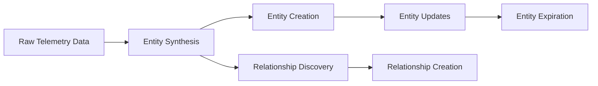
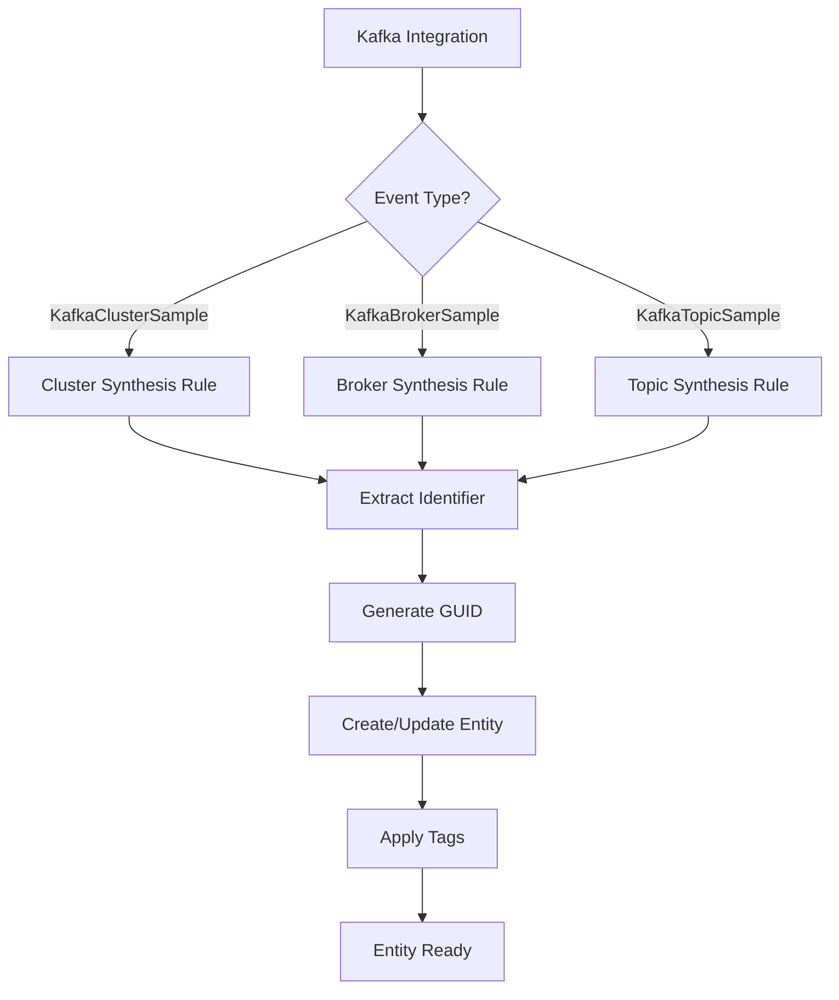

# The Complete Guide to Kafka Entity Definitions in New Relic's Entity Platform

## Table of Contents

1. [Introduction: What This PR Does](#introduction)
2. [Understanding the Entity Platform](#understanding-entity-platform)
3. [Core Concepts Explained](#core-concepts)
4. [The Kafka Entity Hierarchy](#kafka-hierarchy)
5. [Entity Synthesis: How Raw Data Becomes Entities](#entity-synthesis)
6. [Golden Metrics and Tags](#golden-metrics-tags)
7. [Relationships: Connecting the Dots](#relationships)
8. [Provider-Specific Implementation](#providers)
9. [Dashboards and Visualization](#dashboards)
10. [Testing and Validation](#testing)
11. [Troubleshooting Guide](#troubleshooting)
12. [Best Practices and Design Patterns](#best-practices)
13. [Glossary of Terms](#glossary)

---

## 1. Introduction: What This PR Does {#introduction}

This PR adds comprehensive monitoring capabilities for Apache Kafka to New Relic's Entity Platform. Think of it as teaching New Relic how to understand and monitor Kafka infrastructure in a smart, organized way.

### What Problems Does This Solve?

Before this PR:
- Kafka metrics were just raw data points
- No understanding of Kafka's hierarchy (clusters contain brokers contain partitions)
- No automatic relationship mapping between Kafka and your applications
- Different Kafka providers (AWS MSK, Confluent) required different monitoring approaches

After this PR:
- Kafka components become first-class "entities" with lifecycle management
- Automatic discovery of relationships (which app produces to which topic?)
- Unified monitoring across different Kafka providers
- Smart health calculations based on Kafka best practices

### The Big Picture

```
Your Kafka Infrastructure          New Relic Entity Platform
------------------------          ------------------------
Kafka Cluster                -->  MESSAGE_QUEUE_CLUSTER entity
├── Broker 1                 -->  MESSAGE_QUEUE_BROKER entity
├── Broker 2                 -->  MESSAGE_QUEUE_BROKER entity
├── Topic: orders            -->  MESSAGE_QUEUE_TOPIC entity
│   ├── Partition 0          -->  MESSAGE_QUEUE_PARTITION entity
│   └── Partition 1          -->  MESSAGE_QUEUE_PARTITION entity
└── Consumer Group: api      -->  MESSAGE_QUEUE_CONSUMER_GROUP entity
```

---

## 2. Understanding the Entity Platform {#understanding-entity-platform}

### What is an Entity?

An **entity** in New Relic is a monitored component with:
- A unique identity (GUID)
- A type (like HOST, APPLICATION, or MESSAGE_QUEUE_CLUSTER)
- Properties (tags)
- Metrics
- Relationships to other entities

Think of entities as "smart objects" that New Relic understands and can reason about.

### Why Entities Matter

Without entities:
```
Raw metrics: kafka.broker.bytesInPerSec = 1000000
```

With entities:
```
Broker Entity "prod-broker-1":
- Health: Healthy
- Throughput: 1 MB/s
- Part of: prod-kafka-cluster
- Hosts: 47 partitions
- Connected to: order-service, payment-service
```

### The Entity Lifecycle



1. **Raw Data Arrives**: Metrics from Kafka integrations
2. **Synthesis**: Rules match data to entity definitions
3. **Creation**: New entity with unique GUID
4. **Updates**: Continuous metric updates
5. **Expiration**: Cleanup after TTL expires

---

## 3. Core Concepts Explained {#core-concepts}

### Domains and Types

Every entity belongs to a **domain** and has a **type**:

```yaml
domain: INFRA
type: MESSAGE_QUEUE_CLUSTER
```

- **Domain**: High-level category (INFRA = Infrastructure)
- **Type**: Specific kind of entity

### Golden Tags

Golden tags are the most important attributes for searching and filtering:

```yaml
goldenTags:
  - kafka.cluster.name      # Human-readable cluster name
  - kafka.cluster.id        # Unique cluster identifier
  - cloud.provider          # aws, confluent, self-managed
  - provider                # Provider type constant
```

### Synthesis Rules

Synthesis rules are like recipes that tell New Relic how to create entities from raw data:

```yaml
synthesis:
  rules:
    - identifier: clusterName               # Unique ID
      name: clusterName                     # Display name
      encodeIdentifierInGUID: true          # Create stable GUID
      conditions:                           # When to apply this rule
        - attribute: eventType
          value: KafkaClusterSample
      tags:                                 # Properties to extract
        clusterName:
          entityTagName: kafka.cluster.name
```

### Configuration

Controls entity behavior:

```yaml
configuration:
  alertable: true                    # Can create alerts
  entityExpirationTime: EIGHT_DAYS   # Auto-cleanup after 8 days
  isContainer: true                  # Contains other entities
```

---

## 4. The Kafka Entity Hierarchy {#kafka-hierarchy}

### Visual Hierarchy

```
MESSAGE_QUEUE_CLUSTER
├── MESSAGE_QUEUE_BROKER (1..n)
├── MESSAGE_QUEUE_TOPIC (1..n)
│   └── MESSAGE_QUEUE_PARTITION (1..n per topic)
├── MESSAGE_QUEUE_CONSUMER_GROUP (0..n)
│   └── MESSAGE_QUEUE_CONSUMER (1..n per group)
└── MESSAGE_QUEUE_PRODUCER (0..n)
```

### Entity Descriptions

#### 1. MESSAGE_QUEUE_CLUSTER
The top-level Kafka cluster entity. Represents the entire Kafka deployment.

**Key Metrics**:
- Active Controllers (should be exactly 1)
- Offline Partitions (should be 0)
- Under-replicated Partitions
- Total throughput

**Health Logic**:
```
Healthy = Active Controllers == 1 AND Offline Partitions == 0
Critical = Active Controllers != 1 OR Offline Partitions > 0
```

#### 2. MESSAGE_QUEUE_BROKER
Individual Kafka broker (server) within a cluster.

**Key Metrics**:
- CPU usage
- Disk usage  
- Network handler idle percentage
- Partitions hosted

**Identifies Problems**:
- Resource exhaustion
- Uneven partition distribution
- Network bottlenecks

#### 3. MESSAGE_QUEUE_TOPIC
A Kafka topic - the logical channel for messages.

**Key Metrics**:
- Messages in/out per second
- Bytes in/out per second
- Consumer lag
- Partition count

**Monitors**:
- Topic activity
- Consumer health
- Data flow rates

#### 4. MESSAGE_QUEUE_PARTITION
Individual partition within a topic.

**Special Considerations**:
- High cardinality (many partitions)
- Shorter TTL (4 hours vs 8 days)
- Not alertable (alert at topic level)

**Key Attributes**:
- Leader broker
- In-sync replicas
- Log size

#### 5. MESSAGE_QUEUE_CONSUMER_GROUP
A group of consumers working together.

**Key Metrics**:
- Total lag (how far behind)
- Max partition lag
- Consumer count
- Rebalance rate

**Critical for**:
- Monitoring consumption health
- Detecting processing delays
- Capacity planning

#### 6. MESSAGE_QUEUE_PRODUCER/CONSUMER
Individual producer and consumer applications.

**Sources**:
- Kafka integration metrics
- APM spans (OpenTelemetry)

**Enables**:
- Application-to-Kafka mapping
- End-to-end tracing

---

## 5. Entity Synthesis: How Raw Data Becomes Entities {#entity-synthesis}

### The Synthesis Process



### Detailed Rule Breakdown

Let's examine a cluster synthesis rule:

```yaml
synthesis:
  rules:
    - identifier: clusterName
      name: clusterName
      encodeIdentifierInGUID: true
      conditions:
        - attribute: eventType
          value: KafkaClusterSample
      tags:
        clusterName:
          entityTagName: kafka.cluster.name
```

**Step by Step**:

1. **Data Arrives**: 
   ```json
   {
     "eventType": "KafkaClusterSample",
     "clusterName": "prod-kafka",
     "cluster.activeControllerCount": 1
   }
   ```

2. **Rule Matches**: `eventType == "KafkaClusterSample"` ✓

3. **Extract Identifier**: `identifier = "prod-kafka"`

4. **Generate GUID**: 
   ```
   GUID = hash(accountId + domain + type + identifier)
   GUID = "MTIzNDU2NzhJTkZSQU1FU1NBR0VfUVVFVUVfQ0xVU1RFUnByb2Qta2Fma2E"
   ```

5. **Create Entity**:
   - Name: "prod-kafka"
   - Type: MESSAGE_QUEUE_CLUSTER
   - Tags: kafka.cluster.name="prod-kafka"

### Multi-Provider Synthesis

The PR handles three different Kafka providers with different rules:

#### Self-Managed Kafka (nri-kafka)
```yaml
- identifier: clusterName
  conditions:
    - attribute: eventType
      value: KafkaClusterSample
```

#### AWS MSK - Polling
```yaml
- identifier: aws.kafka.clusterArn  # ARN for global uniqueness
  conditions:
    - attribute: eventType
      value: AwsMskClusterSample
    - attribute: provider.source
      value: cloudwatch
```

#### AWS MSK - Metric Streams
```yaml
- identifier: "{{ aws.accountId }}:{{ aws.region }}:{{ aws.kafka.ClusterName }}"
  conditions:
    - attribute: eventType
      value: MetricRaw
    - attribute: aws.Namespace
      value: AWS/Kafka
```

#### Confluent Cloud
```yaml
- identifier: confluent.kafka.cluster.id
  conditions:
    - attribute: eventType
      value: ConfluentCloudClusterSample
```

### Fallback Attributes

Smart fallback handling for flexibility:

```yaml
tags:
  aws.kafka.clusterName:
    entityTagName: kafka.cluster.name
    fallbackAttribute: clusterName      # If AWS name missing, try generic
    fallbackAttribute: displayName      # If that's missing, try display
```

---

## 6. Golden Metrics and Tags {#golden-metrics-tags}

### What Are Golden Metrics?

Golden metrics are the most important measurements for each entity type. They appear in the UI and drive key visualizations.

### Metric Structure

```yaml
activeControllerCount:
  title: "Active Controllers"
  unit: COUNT
  queries:
    nriKafka:
      select: "latest(`cluster.activeControllerCount`)"
      from: "KafkaClusterSample"
      where: "entity.guid = '{entity.guid}'"
      eventId: "entity.guid"
```

**Components**:
- **title**: Human-readable name
- **unit**: Measurement unit (COUNT, BYTES_PER_SECOND, PERCENTAGE)
- **queries**: Provider-specific NRQL queries

### Multi-Provider Metric Queries

The same metric can have different queries per provider:

```yaml
throughputInBytesPerSec:
  title: "Incoming Throughput"
  unit: BYTES_PER_SECOND
  queries:
    nriKafka:
      select: "sum(`broker.bytesInPerSec`)"
      from: "KafkaBrokerSample"
    awsMsk:
      select: "sum(`aws.kafka.BytesInPerSec.byBroker`)"
      from: "AwsMskBrokerSample"
    confluentCloud:
      select: "sum(`io.confluent.kafka.server/received_bytes`)"
      from: "Metric"
```

### Summary Metrics

Summary metrics provide quick status information:

```yaml
healthStatus:
  title: "Health"
  unit: STRING
  queries:
    newRelic:
      select: "CASE 
        WHEN latest(activeControllerCount) = 1 
         AND latest(offlinePartitionsCount) = 0 
        THEN 'Healthy' 
        WHEN latest(activeControllerCount) != 1 
         OR latest(offlinePartitionsCount) > 0 
        THEN 'Critical' 
        ELSE 'Unknown' 
      END"
```

### Key Metrics by Entity Type

#### Cluster Metrics
- **Health**: Active controllers, offline partitions
- **Throughput**: Bytes in/out per second
- **Scale**: Broker count, topic count

#### Broker Metrics
- **Resources**: CPU, memory, disk usage
- **Performance**: Request handler idle %, network processor idle %
- **Load**: Partition count, leader count

#### Topic Metrics
- **Activity**: Messages/bytes in/out per second
- **Consumption**: Max consumer lag
- **Scale**: Partition count, replication factor

#### Consumer Group Metrics
- **Lag**: Total lag, max partition lag, lag trend
- **Stability**: Rebalance rate
- **Scale**: Member count, topics consumed

---

## 7. Relationships: Connecting the Dots {#relationships}

### What Are Relationships?

Relationships connect entities to show how your infrastructure fits together.

### Relationship Types

1. **CONTAINS**: Hierarchical ownership
   - Cluster CONTAINS Brokers
   - Cluster CONTAINS Topics
   - Topic CONTAINS Partitions

2. **HOSTS**: Physical hosting
   - Broker HOSTS Partitions

3. **CONSUMES_FROM**: Data flow
   - Consumer Group CONSUMES_FROM Topic
   - Application CONSUMES_FROM Topic

4. **PRODUCES_TO**: Data flow
   - Application PRODUCES_TO Topic

### Relationship Definition Structure

```yaml
relationships:
  - name: clusterContainsBroker
    version: "1"
    origins:
      - nri-kafka
      - aws-msk
    conditions:
      - attribute: eventType
        anyOf: ["KafkaBrokerSample", "AwsMskBrokerSample"]
    relationship:
      expires: P24H                    # 24-hour TTL
      relationshipType: CONTAINS
      source:
        buildGuid:                     # Build GUID from attributes
          domain: INFRA
          type: MESSAGE_QUEUE_CLUSTER
          identifier:
            fragments:
              - attribute: clusterName
      target:
        lookupGuid:                    # Find existing entity
          candidateCategory: entity
```

### TTL Strategy

Different TTLs for different relationship types:

- **Structural** (24 hours): Cluster→Broker, Topic→Partition
  - Stable, infrastructure relationships
  - Change infrequently

- **Behavioral** (15 minutes): App→Topic, ConsumerGroup→Topic
  - Dynamic, activity-based
  - May change with application behavior

### APM Integration Relationships

Special relationships for application monitoring:

```yaml
- name: applicationProducesToTopic
  conditions:
    - attribute: span.kind
      value: producer
    - attribute: messaging.system
      value: kafka
  relationship:
    source:
      extractGuid:              # Use existing APM entity
        attribute: entity.guid
    target:
      buildGuid:               # Build Kafka topic GUID
        identifier:
          fragments:
            - attribute: messaging.kafka.cluster.id
            - value: ":"
            - attribute: messaging.destination.name
```

This enables:
- Service maps showing Kafka connections
- End-to-end transaction tracing
- Impact analysis

---

## 8. Provider-Specific Implementation {#providers}

### Overview of Providers

The PR supports three Kafka providers, each with unique characteristics:

1. **Self-Managed Kafka** (nri-kafka integration)
2. **AWS MSK** (Managed Streaming for Kafka)
3. **Confluent Cloud** (SaaS Kafka)

### Self-Managed Kafka (nri-kafka)

**Data Source**: New Relic Infrastructure Kafka Integration

**Identifiers**:
- Cluster: `clusterName`
- Broker: `clusterName:brokerId`
- Topic: `clusterName:topicName`

**Special Features**:
- Direct JMX metrics access
- Producer/Consumer metrics
- Detailed partition information

**Example Event**:
```json
{
  "eventType": "KafkaClusterSample",
  "clusterName": "prod-kafka-cluster",
  "cluster.activeControllerCount": 1,
  "cluster.offlinePartitionsCount": 0
}
```

### AWS MSK

**Two Integration Methods**:

#### 1. CloudWatch Polling
- Traditional polling of CloudWatch metrics
- Higher latency (1-5 minutes)
- Uses ARN as identifier for global uniqueness

**Example Event**:
```json
{
  "eventType": "AwsMskClusterSample",
  "aws.kafka.clusterArn": "arn:aws:kafka:us-east-1:123456789012:cluster/msk-prod/uuid",
  "aws.kafka.clusterName": "msk-prod",
  "provider.source": "cloudwatch"
}
```

#### 2. Metric Streams
- Real-time streaming via Kinesis
- Lower latency
- Different event structure

**Example Event**:
```json
{
  "eventType": "MetricRaw",
  "aws.Namespace": "AWS/Kafka",
  "aws.kafka.ClusterName": "msk-prod",
  "metricStreamName": "msk-metrics-stream"
}
```

**Unique Identifier Strategy**:
```yaml
# Polling: Use ARN (globally unique)
identifier: aws.kafka.clusterArn

# Streams: Composite ID (no ARN available)
identifier: "{{ aws.accountId }}:{{ aws.region }}:{{ aws.kafka.ClusterName }}"
```

### Confluent Cloud

**Data Source**: Confluent Cloud Metrics API

**Identifiers**:
- Cluster: `confluent.kafka.cluster.id` (e.g., "lkc-abc123")
- Uses cluster ID throughout

**Special Metrics**:
- Cluster load percentage
- Hot partition detection
- Cloud provider/region info

**Example Event**:
```json
{
  "eventType": "ConfluentCloudClusterSample",
  "confluent.kafka.cluster.id": "lkc-abc123",
  "resource.kafka.id": "confluent-prod-cluster",
  "confluent.kafka.cluster_load_percent": 65.5
}
```

### Provider Comparison Table

| Feature | Self-Managed | AWS MSK | Confluent Cloud |
|---------|--------------|----------|-----------------|
| Identifier | Cluster name | ARN or composite | Cluster ID |
| Latency | Near real-time | 1-5 min (polling) or real-time (streams) | Near real-time |
| Metrics Depth | Full JMX access | CloudWatch subset | API subset |
| Producer/Consumer | ✓ | Limited | Limited |
| Hot Partition Detection | Manual | ✗ | ✓ |
| Multi-region | Manual setup | Built-in | Built-in |

---

## 9. Dashboards and Visualization {#dashboards}

### Dashboard Structure

Each entity type can have a dashboard with multiple pages:

```json
{
  "name": "{{{entity.name}}} Kafka Cluster",
  "pages": [
    {
      "name": "Overview",
      "widgets": [...]
    },
    {
      "name": "Broker Performance",
      "widgets": [...]
    }
  ]
}
```

### Widget Types and Usage

#### 1. Billboard (Status Display)
```json
{
  "visualization": {
    "id": "viz.billboard"
  },
  "rawConfiguration": {
    "nrqlQueries": [{
      "query": "SELECT latest(activeControllerCount) as 'Active Controllers'"
    }],
    "thresholds": [{
      "alertSeverity": "CRITICAL",
      "name": "Active Controllers != 1",
      "value": 0.99
    }]
  }
}
```

**Use for**: Key status metrics, health indicators

#### 2. Line Chart (Trends)
```json
{
  "visualization": {
    "id": "viz.line"
  },
  "rawConfiguration": {
    "nrqlQueries": [{
      "query": "SELECT sum(broker.bytesInPerSec) TIMESERIES AUTO"
    }]
  }
}
```

**Use for**: Throughput trends, performance over time

#### 3. Table (Detailed Breakdown)
```json
{
  "visualization": {
    "id": "viz.table"
  },
  "rawConfiguration": {
    "nrqlQueries": [{
      "query": "SELECT latest(cpu), latest(disk) FACET broker.id"
    }]
  }
}
```

**Use for**: Per-broker metrics, consumer group details

#### 4. Heatmap (Distribution)
```json
{
  "visualization": {
    "id": "viz.heatmap"
  }
}
```

**Use for**: Topic throughput distribution

### Dynamic Entity Context

Dashboards use entity context variables:

- `{{{entity.name}}}` - Entity's display name
- `{{{entity.guid}}}` - Entity's unique ID
- `{{{kafka.cluster.name}}}` - Cluster name tag
- `{{{account.id}}}` - Account ID

### Multi-Provider Queries

Dashboards handle multiple providers in queries:

```sql
SELECT sum(broker.bytesInPerSec) as 'Bytes In' 
FROM KafkaBrokerSample, AwsMskBrokerSample 
WHERE clusterName = '{{{kafka.cluster.name}}}' 
   OR aws.kafka.clusterArn = '{{{kafka.cluster.arn}}}'
```

---

## 10. Testing and Validation {#testing}

### Test Data Structure

Each entity type includes test data for validation:

```
entity-types/message-queue-cluster/tests/
├── nri-kafka.json
├── aws-msk-polling.json
├── aws-msk-streams.json
└── confluent-cloud.json
```

### Test Data Example

```json
[
  {
    "eventType": "KafkaClusterSample",
    "clusterName": "prod-kafka-cluster",
    "kafka.version": "3.5.0",
    "cluster.activeControllerCount": 1,
    "cluster.offlinePartitionsCount": 0,
    "accountId": 12345678,
    "timestamp": 1700000000000
  }
]
```

### Validation Process

1. **Syntax Validation**: YAML structure correct
2. **Synthesis Testing**: Rules produce valid entities
3. **Metric Validation**: Queries return expected results
4. **Relationship Testing**: Connections form correctly

### Testing Checklist

- [ ] All event types have test data
- [ ] Each provider variant tested
- [ ] Edge cases covered (missing attributes)
- [ ] Metric queries validated
- [ ] Relationships form correctly
- [ ] TTLs appropriate for use case

---

## 11. Troubleshooting Guide {#troubleshooting}

### Common Issues and Solutions

#### Entities Not Appearing

**Symptom**: Kafka data flowing but no entities

**Checks**:
1. Verify event type matches synthesis rules
2. Check required attributes present
3. Validate account has Entity Platform enabled
4. Confirm integration version supports entity synthesis

**Debug Query**:
```sql
SELECT count(*) FROM KafkaClusterSample 
WHERE clusterName IS NOT NULL 
SINCE 1 hour ago
```

#### Wrong Provider Type

**Symptom**: AWS MSK showing as SELF_MANAGED

**Solution**: Check synthesis rule conditions:
```yaml
conditions:
  - attribute: eventType
    value: AwsMskClusterSample  # Must match exactly
  - attribute: provider.source
    value: cloudwatch           # Required for polling
```

#### Missing Relationships

**Symptom**: Topics not connected to cluster

**Checks**:
1. Both entities must exist
2. Identifiers must match exactly
3. TTL may have expired (15m for dynamic)
4. Check relationship conditions

**Debug Query**:
```sql
SELECT uniques(clusterName) FROM KafkaTopicSample 
WHERE clusterName IS NOT NULL
```

#### Metric Queries Returning No Data

**Symptom**: Golden metrics show "No data"

**Common Causes**:
1. Wrong event type in FROM clause
2. Entity GUID placeholder not replaced
3. Attribute names don't match actual data
4. Time range too narrow

**Debug Pattern**:
```sql
-- First, verify raw data exists
SELECT count(*) FROM KafkaClusterSample SINCE 1 hour ago

-- Then check specific attributes
SELECT uniques(cluster.activeControllerCount) 
FROM KafkaClusterSample SINCE 1 hour ago

-- Finally test the actual metric query
SELECT latest(`cluster.activeControllerCount`) 
FROM KafkaClusterSample 
WHERE clusterName = 'your-cluster-name'
```

#### High Cardinality Warnings

**Symptom**: Too many partition entities

**Solutions**:
1. Shorter TTL configured (4 hours)
2. Consider sampling strategy
3. Monitor entity count:

```sql
SELECT uniqueCount(partition) 
FROM KafkaPartitionSample 
SINCE 1 day ago
```

---

## 12. Best Practices and Design Patterns {#best-practices}

### Entity Design Principles

#### 1. Stable Identifiers
```yaml
# Good: Uses unchanging cluster ID
identifier: confluent.kafka.cluster.id

# Bad: Uses potentially changing name
identifier: displayName
```

#### 2. Appropriate TTLs
- **Infrastructure**: 8-30 days (stable)
- **High-cardinality**: 4 hours (partitions)
- **Behavioral**: 15 minutes (relationships)

#### 3. Provider Abstraction
```yaml
tags:
  provider:
    value: AWS_MSK          # Consistent enum
  integration.type:
    value: polling          # Track integration method
```

### Metric Query Patterns

#### 1. Multi-Provider Support
```sql
-- Handle different attribute names
SELECT sum(broker.bytesInPerSec) OR sum(aws.kafka.BytesInPerSec.byBroker)
FROM KafkaBrokerSample, AwsMskBrokerSample
```

#### 2. Null Safety
```sql
-- Use COALESCE for optional attributes
SELECT COALESCE(latest(broker.cpuPercent), 0) as 'CPU %'
```

#### 3. Efficient Aggregation
```sql
-- Pre-filter before aggregation
SELECT sum(bytesInPerSec) 
FROM KafkaBrokerSample 
WHERE entity.guid = '{entity.guid}'  -- Filter first
```

### Relationship Patterns

#### 1. Composite Identifiers
```yaml
identifier:
  fragments:
    - attribute: clusterName
    - value: ":"              # Separator
    - attribute: topicName
```

#### 2. Fallback Chains
```yaml
- attribute: clusterName
  fallbackAttribute: aws.kafka.clusterArn
  fallbackAttribute: confluent.kafka.cluster.id
```

#### 3. Conditional Relationships
```yaml
conditions:
  - attribute: partition.leader
    present: true  # Only create if leader known
```

### Performance Optimization

#### 1. Query Efficiency
- Use `latest()` instead of `average()` for status metrics
- Limit facet cardinality with `LIMIT`
- Use `eventId` for deduplication

#### 2. Entity Volume Management
- Set appropriate TTLs
- Use `alertable: false` for high-cardinality entities
- Consider sampling for partition-level data

#### 3. Tag Strategy
- Only include searchable attributes as golden tags
- Use `entityTagName` for consistent naming
- Avoid high-cardinality values in golden tags

---

## 13. Glossary of Terms {#glossary}

### Entity Platform Terms

**Domain**: High-level categorization of entities (INFRA, APM, BROWSER)

**Entity**: A monitored component with identity, type, and properties

**Entity Type**: Specific kind of entity (MESSAGE_QUEUE_CLUSTER)

**GUID**: Globally Unique Identifier for an entity

**Golden Tags**: Primary attributes for searching and filtering

**Synthesis**: Process of creating entities from telemetry data

**TTL**: Time To Live - how long before entity expires

### Kafka Terms

**Broker**: A Kafka server that stores and serves messages

**Cluster**: Collection of Kafka brokers working together

**Consumer Group**: Set of consumers cooperating to consume topics

**ISR**: In-Sync Replicas - replicas caught up with the leader

**Lag**: How far behind a consumer is from the latest message

**Partition**: Ordered log segment within a topic

**Producer**: Application sending messages to Kafka

**Topic**: Logical channel for messages

### Integration Terms

**nri-kafka**: New Relic Infrastructure Kafka integration

**AWS MSK**: Amazon Managed Streaming for Apache Kafka

**Confluent Cloud**: Confluent's managed Kafka service

**CloudWatch**: AWS metrics service

**Metric Streams**: Real-time AWS metrics delivery

**JMX**: Java Management Extensions (for Kafka metrics)

### Relationship Terms

**CONTAINS**: Hierarchical ownership relationship

**HOSTS**: Physical hosting relationship

**CONSUMES_FROM**: Data consumption relationship

**PRODUCES_TO**: Data production relationship

**buildGuid**: Create GUID from attributes

**lookupGuid**: Find existing entity GUID

**extractGuid**: Use GUID from event attribute

---

## Appendix: Quick Reference

### Entity Type Summary

| Entity Type | Domain | TTL | Alertable | Container |
|-------------|--------|-----|-----------|-----------|
| MESSAGE_QUEUE_CLUSTER | INFRA | 8 days | Yes | Yes |
| MESSAGE_QUEUE_BROKER | INFRA | 8 days | Yes | No |
| MESSAGE_QUEUE_TOPIC | INFRA | 8 days | Yes | No |
| MESSAGE_QUEUE_PARTITION | INFRA | 4 hours | No | No |
| MESSAGE_QUEUE_CONSUMER_GROUP | INFRA | 30 days | Yes | No |
| MESSAGE_QUEUE_PRODUCER | INFRA | 30 days | Yes | No |
| MESSAGE_QUEUE_CONSUMER | INFRA | 30 days | Yes | No |

### Key File Paths

```
entity-types/
├── message-queue-cluster/
│   ├── definition.yml          # Entity definition
│   ├── golden_metrics.yml      # Key metrics
│   ├── summary_metrics.yml     # Summary display
│   └── dashboard.json          # Default dashboard
relationships/
├── message-queue-cluster-to-message-queue-broker.yml
└── [other relationship files]
```

### Common NRQL Patterns

```sql
-- Entity-scoped query
SELECT latest(metric) FROM EventType 
WHERE entity.guid = '{entity.guid}'

-- Multi-provider query  
SELECT sum(metric) FROM EventA, EventB
WHERE conditionA OR conditionB

-- Time series with auto-interval
SELECT average(metric) FROM EventType
TIMESERIES AUTO

-- Faceted aggregation
SELECT latest(metric) FROM EventType
FACET dimension LIMIT 50
```

---

## Conclusion

This PR transforms Kafka from disconnected metrics into a rich, interconnected entity model. By understanding these concepts, you can:

1. Monitor Kafka health intelligently
2. Trace data flow through your architecture  
3. Unify monitoring across different Kafka providers
4. Build powerful dashboards and alerts
5. Troubleshoot issues faster with relationship context

The Entity Platform provides the foundation for smart, context-aware monitoring that scales with your infrastructure.

For questions or contributions, refer to the Entity Platform documentation or reach out to the platform team.

---

*Generated on: 2025-01-10*
*Entity Platform Version: As documented in platform-documentation*