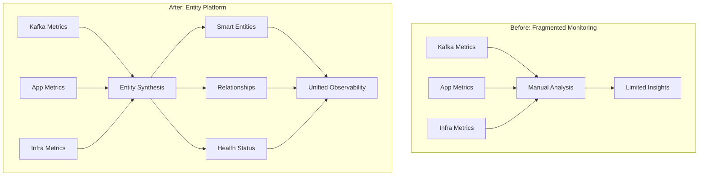
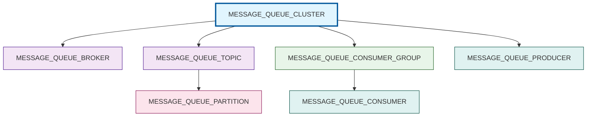
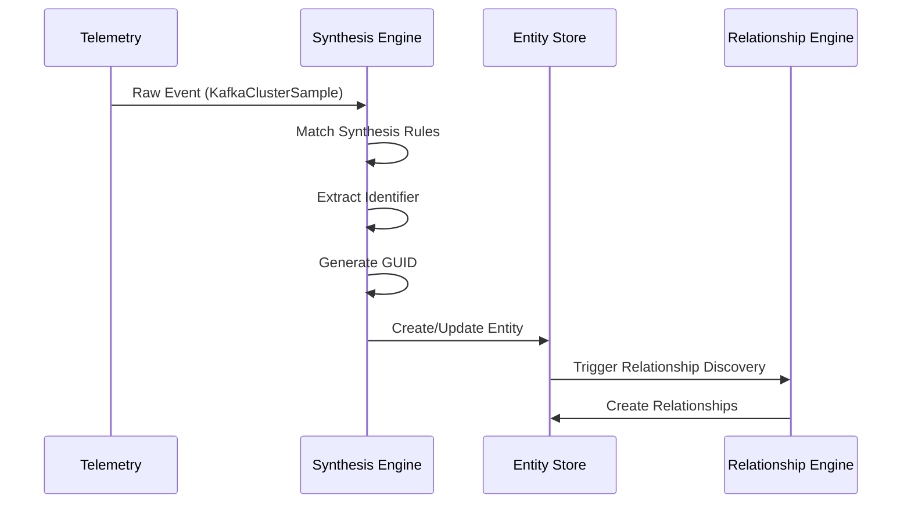
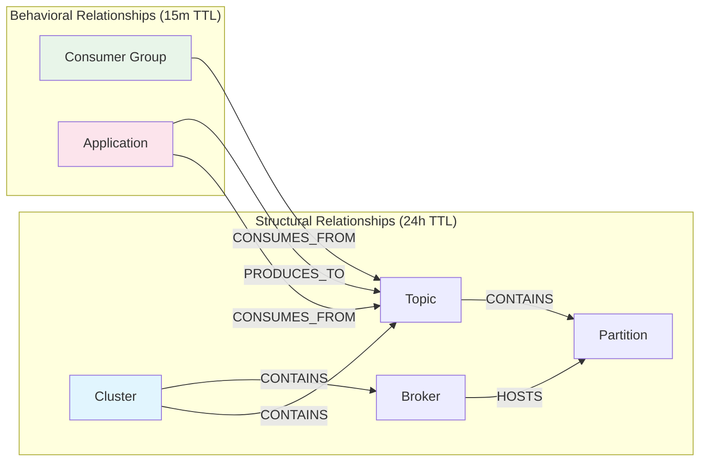

# 📚 The Complete Guide to Kafka Entity Definitions in New Relic's Entity Platform

<div align="center">


**Transform your Kafka monitoring from raw metrics to intelligent entity-based observability**

[🚀 Quick Start](#quick-start) • [📖 Documentation](#introduction) • [🔧 Examples](KAFKA_ENTITY_VISUAL_EXAMPLES_AND_WALKTHROUGHS.md) • [❓ FAQ](#faq)

</div>

---

## 📑 Navigation

<table>
<tr>
<td width="33%" valign="top">

### 🎯 Getting Started
- [Quick Start Guide](#quick-start)
- [Introduction](#introduction)
- [Entity Platform Basics](#entity-platform-fundamentals)
- [Core Concepts](#core-concepts)

</td>
<td width="33%" valign="top">

### 🏗️ Architecture
- [Kafka Entity Hierarchy](#kafka-hierarchy)
- [Entity Synthesis](#entity-synthesis)
- [Golden Metrics](#golden-metrics)
- [Relationships](#relationships)

</td>
<td width="33%" valign="top">

### 🔧 Implementation
- [Provider Guide](#providers)
- [Dashboards](#dashboards)
- [Testing](#testing)
- [Best Practices](#best-practices)

</td>
</tr>
</table>

<div align="center">

### 🔍 Quick Links

[Troubleshooting](#troubleshooting) • [Glossary](#glossary) • [Examples](KAFKA_ENTITY_VISUAL_EXAMPLES_AND_WALKTHROUGHS.md) • [API Reference](#api-reference)

</div>

---

## 🚀 Quick Start Guide {#quick-start}

<table>
<tr>
<td width="50%">

### ✅ What You'll Get

- **7 New Entity Types** for Kafka monitoring
- **Multi-Provider Support** (3 providers)
- **Automatic Relationships** to applications
- **Smart Health Status** calculations
- **Pre-built Dashboards** with key metrics

</td>
<td width="50%">

### 📋 Prerequisites

- ✓ New Relic account with Entity Platform
- ✓ One of these integrations:
  - `nri-kafka` (self-managed)
  - AWS integration (for MSK)
  - Confluent Cloud integration

</td>
</tr>
</table>

### ⚡ 5-Minute Setup

```bash
# 1. Clone the entity definitions
git clone <repository-url>

# 2. Validate definitions
make validate

# 3. Deploy to your account
make deploy ACCOUNT_ID=<your-account>
```

---

## 1. Introduction: Understanding the Big Picture {#introduction}

<div style="background-color: #e6f3ff; border-radius: 8px; padding: 20px; margin: 20px 0;">

### 🎯 The Problem This Solves

Apache Kafka monitoring traditionally suffers from:
- **Fragmented Views**: Metrics scattered across different tools
- **No Context**: Raw metrics without understanding relationships
- **Provider Lock-in**: Different monitoring for each Kafka variant
- **Manual Correlation**: Linking Kafka issues to application impact

### 💡 The Solution

This PR transforms Kafka monitoring by introducing **Entity-Based Observability**:

```
Traditional Monitoring          Entity-Based Monitoring
----------------------         -----------------------
Raw Metrics        →           Smart Entities with Context
Manual Correlation →           Automatic Relationship Discovery  
Provider-Specific  →           Unified Multi-Provider Support
Static Dashboards  →           Dynamic Entity-Aware Dashboards
```

</div>

### 🎨 Visual Overview



---

## 2. Entity Platform Fundamentals {#entity-platform-fundamentals}

<div style="background-color: #f8f9fa; border-left: 4px solid #0078d4; padding: 15px; margin: 20px 0;">

### 🧠 What is an Entity?

An **entity** is an intelligent representation of a monitored component that includes:

| Component | Description | Example |
|-----------|-------------|---------|
| **Identity** | Unique GUID | `MXxJTkZSQXxNRVNTQUdFX1FVRVVFX0NMVVNURVIx` |
| **Type** | What kind of component | `MESSAGE_QUEUE_CLUSTER` |
| **Properties** | Descriptive attributes | `kafka.cluster.name`, `provider` |
| **Metrics** | Performance data | CPU usage, message throughput |
| **Relationships** | Connections to other entities | Cluster → Brokers → Topics |
| **Health** | Calculated status | Healthy, Warning, Critical |

</div>

### 🔄 The Entity Lifecycle

<table>
<tr>
<td width="20%" align="center">

**1️⃣ Discovery**

Raw telemetry arrives

</td>
<td width="20%" align="center">

**2️⃣ Synthesis**

Rules create entities

</td>
<td width="20%" align="center">

**3️⃣ Enrichment**

Tags & metrics added

</td>
<td width="20%" align="center">

**4️⃣ Relationships**

Connections formed

</td>
<td width="20%" align="center">

**5️⃣ Monitoring**

Continuous updates

</td>
</tr>
</table>

---

## 3. Core Concepts and Architecture {#core-concepts}

### 🏗️ Architecture Overview

<div style="background-color: #fff5f5; border-radius: 8px; padding: 20px; margin: 20px 0;">

```
┌─────────────────────────────────────────────────────────────┐
│                     Entity Platform Core                      │
├─────────────────┬─────────────────┬─────────────────────────┤
│  Entity Types   │ Synthesis Rules │ Relationship Engine     │
├─────────────────┼─────────────────┼─────────────────────────┤
│ • Domain        │ • Conditions    │ • Type Definitions      │
│ • Type Name     │ • Identifiers   │ • TTL Management        │
│ • Golden Tags   │ • Tag Mapping   │ • Bi-directional Links  │
│ • Configuration │ • Fallbacks     │ • Dynamic Discovery     │
└─────────────────┴─────────────────┴─────────────────────────┘
```

</div>

### 📊 Key Components Explained

<table>
<tr>
<th width="25%">Component</th>
<th width="35%">Purpose</th>
<th width="40%">Example</th>
</tr>
<tr>
<td>

**Domain**

</td>
<td>High-level categorization</td>
<td>

```yaml
domain: INFRA
```

</td>
</tr>
<tr>
<td>

**Type**

</td>
<td>Specific entity kind</td>
<td>

```yaml
type: MESSAGE_QUEUE_CLUSTER
```

</td>
</tr>
<tr>
<td>

**Golden Tags**

</td>
<td>Primary search attributes</td>
<td>

```yaml
goldenTags:
  - kafka.cluster.name
  - cloud.provider
```

</td>
</tr>
<tr>
<td>

**Synthesis Rules**

</td>
<td>Entity creation logic</td>
<td>

```yaml
rules:
  - identifier: clusterName
    conditions:
      - eventType: KafkaClusterSample
```

</td>
</tr>
</table>

---

## 4. The Kafka Entity Hierarchy {#kafka-hierarchy}

### 🎯 Entity Types Overview

<div align="center">



</div>

### 📋 Entity Type Details

<table>
<tr>
<th>Entity Type</th>
<th>Purpose</th>
<th>Key Metrics</th>
<th>TTL</th>
<th>Alertable</th>
</tr>
<tr>
<td>

**🏢 MESSAGE_QUEUE_CLUSTER**

</td>
<td>Kafka cluster representation</td>
<td>
• Active Controllers<br>
• Offline Partitions<br>
• Total Throughput
</td>
<td>8 days</td>
<td>✅ Yes</td>
</tr>
<tr>
<td>

**🖥️ MESSAGE_QUEUE_BROKER**

</td>
<td>Individual Kafka brokers</td>
<td>
• CPU/Memory/Disk<br>
• Request Handler %<br>
• Partition Count
</td>
<td>8 days</td>
<td>✅ Yes</td>
</tr>
<tr>
<td>

**📬 MESSAGE_QUEUE_TOPIC**

</td>
<td>Kafka topics</td>
<td>
• Messages In/Out<br>
• Consumer Lag<br>
• Partition Count
</td>
<td>8 days</td>
<td>✅ Yes</td>
</tr>
<tr>
<td>

**📁 MESSAGE_QUEUE_PARTITION**

</td>
<td>Topic partitions</td>
<td>
• Leader Broker<br>
• ISR Count<br>
• Log Size
</td>
<td>4 hours</td>
<td>❌ No</td>
</tr>
<tr>
<td>

**👥 MESSAGE_QUEUE_CONSUMER_GROUP**

</td>
<td>Consumer groups</td>
<td>
• Total Lag<br>
• Member Count<br>
• Rebalance Rate
</td>
<td>30 days</td>
<td>✅ Yes</td>
</tr>
<tr>
<td>

**📤 MESSAGE_QUEUE_PRODUCER**

</td>
<td>Producer applications</td>
<td>
• Send Rate<br>
• Error Rate<br>
• Batch Size
</td>
<td>30 days</td>
<td>✅ Yes</td>
</tr>
<tr>
<td>

**📥 MESSAGE_QUEUE_CONSUMER**

</td>
<td>Consumer applications</td>
<td>
• Fetch Rate<br>
• Processing Time<br>
• Assigned Partitions
</td>
<td>30 days</td>
<td>✅ Yes</td>
</tr>
</table>

---

## 5. Entity Synthesis Deep Dive {#entity-synthesis}

### 🔬 How Synthesis Works

<div style="background-color: #f0f8ff; border-radius: 8px; padding: 20px; margin: 20px 0;">



</div>

### 📝 Synthesis Rule Anatomy

<table>
<tr>
<td width="50%">

#### Rule Structure

```yaml
synthesis:
  rules:
    - identifier: clusterName
      name: clusterName
      encodeIdentifierInGUID: true
      conditions:
        - attribute: eventType
          value: KafkaClusterSample
      tags:
        clusterName:
          entityTagName: kafka.cluster.name
        provider:
          value: SELF_MANAGED
```

</td>
<td width="50%">

#### What Each Part Does

| Component | Purpose |
|-----------|---------|
| `identifier` | Unique ID source |
| `name` | Display name |
| `encodeIdentifierInGUID` | Stable GUID creation |
| `conditions` | When to apply rule |
| `tags` | Properties to extract |

</td>
</tr>
</table>

### 🌐 Multi-Provider Synthesis

<div style="display: flex; gap: 20px; margin: 20px 0;">

<div style="flex: 1; background-color: #e8f5e9; padding: 15px; border-radius: 8px;">

#### Self-Managed

```yaml
identifier: clusterName
conditions:
  - eventType: KafkaClusterSample
tags:
  provider:
    value: SELF_MANAGED
```

</div>

<div style="flex: 1; background-color: #fff3e0; padding: 15px; border-radius: 8px;">

#### AWS MSK

```yaml
identifier: aws.kafka.clusterArn
conditions:
  - eventType: AwsMskClusterSample
tags:
  provider:
    value: AWS_MSK
```

</div>

<div style="flex: 1; background-color: #e3f2fd; padding: 15px; border-radius: 8px;">

#### Confluent Cloud

```yaml
identifier: confluent.kafka.cluster.id
conditions:
  - eventType: ConfluentCloudClusterSample
tags:
  provider:
    value: CONFLUENT_CLOUD
```

</div>

</div>

---

## 6. Golden Metrics and Performance Indicators {#golden-metrics}

### 📊 Golden Metrics Overview

<div style="background-color: #fffbf0; border-radius: 8px; padding: 20px; margin: 20px 0;">

**Golden Metrics** are the most important measurements for each entity type. They:
- ✅ Appear prominently in the UI
- ✅ Drive dashboard visualizations
- ✅ Enable smart alerting
- ✅ Support multi-provider queries

</div>

### 🎯 Key Metrics by Entity Type

<details>
<summary><b>🏢 Cluster Metrics</b></summary>

<table>
<tr>
<th>Metric</th>
<th>Purpose</th>
<th>Healthy Range</th>
<th>Critical Condition</th>
</tr>
<tr>
<td>activeControllerCount</td>
<td>Cluster leadership</td>
<td>= 1</td>
<td>≠ 1</td>
</tr>
<tr>
<td>offlinePartitionsCount</td>
<td>Data availability</td>
<td>= 0</td>
<td>> 0</td>
</tr>
<tr>
<td>underReplicatedPartitions</td>
<td>Replication health</td>
<td>= 0</td>
<td>> 10% of total</td>
</tr>
</table>

</details>

<details>
<summary><b>🖥️ Broker Metrics</b></summary>

<table>
<tr>
<th>Metric</th>
<th>Purpose</th>
<th>Healthy Range</th>
<th>Warning Threshold</th>
</tr>
<tr>
<td>cpuPercent</td>
<td>Processing capacity</td>
<td>< 70%</td>
<td>> 85%</td>
</tr>
<tr>
<td>diskUsedPercent</td>
<td>Storage capacity</td>
<td>< 75%</td>
<td>> 90%</td>
</tr>
<tr>
<td>requestHandlerIdlePercent</td>
<td>Request processing</td>
<td>> 30%</td>
<td>< 10%</td>
</tr>
</table>

</details>

<details>
<summary><b>📬 Topic Metrics</b></summary>

<table>
<tr>
<th>Metric</th>
<th>Purpose</th>
<th>Unit</th>
<th>Key Insight</th>
</tr>
<tr>
<td>messagesInPerSec</td>
<td>Ingestion rate</td>
<td>messages/sec</td>
<td>Producer activity</td>
</tr>
<tr>
<td>bytesOutPerSec</td>
<td>Consumption rate</td>
<td>bytes/sec</td>
<td>Consumer demand</td>
</tr>
<tr>
<td>consumerLag</td>
<td>Processing delay</td>
<td>messages</td>
<td>Consumer health</td>
</tr>
</table>

</details>

### 💻 Multi-Provider Query Example

```yaml
throughputInBytesPerSec:
  title: "Incoming Throughput"
  unit: BYTES_PER_SECOND
  queries:
    # Self-managed Kafka
    nriKafka:
      select: "sum(`broker.bytesInPerSec`)"
      from: "KafkaBrokerSample"
    
    # AWS MSK
    awsMsk:
      select: "sum(`aws.kafka.BytesInPerSec.byBroker`)"
      from: "AwsMskBrokerSample"
    
    # Confluent Cloud
    confluentCloud:
      select: "sum(`io.confluent.kafka.server/received_bytes`)"
      from: "Metric"
```

---

## 7. Relationships: Connecting the Dots {#relationships}

### 🔗 Relationship Types

<div align="center">



</div>

### 📋 Relationship Details

<table>
<tr>
<th>Relationship</th>
<th>Type</th>
<th>TTL</th>
<th>Purpose</th>
</tr>
<tr>
<td>Cluster → Broker</td>
<td>CONTAINS</td>
<td>24 hours</td>
<td>Infrastructure hierarchy</td>
</tr>
<tr>
<td>Cluster → Topic</td>
<td>CONTAINS</td>
<td>24 hours</td>
<td>Topic ownership</td>
</tr>
<tr>
<td>Topic → Partition</td>
<td>CONTAINS</td>
<td>24 hours</td>
<td>Partition structure</td>
</tr>
<tr>
<td>Broker → Partition</td>
<td>HOSTS</td>
<td>24 hours</td>
<td>Physical hosting</td>
</tr>
<tr>
<td>Consumer Group → Topic</td>
<td>CONSUMES_FROM</td>
<td>15 minutes</td>
<td>Active consumption</td>
</tr>
<tr>
<td>Application → Topic</td>
<td>PRODUCES_TO</td>
<td>15 minutes</td>
<td>Active production</td>
</tr>
</table>

### 🚀 APM Integration

<div style="background-color: #f5f5f5; border-radius: 8px; padding: 20px; margin: 20px 0;">

```yaml
# Automatic discovery from OpenTelemetry spans
- name: applicationProducesToTopic
  conditions:
    - attribute: span.kind
      value: producer
    - attribute: messaging.system
      value: kafka
  relationship:
    source:
      extractGuid:
        attribute: entity.guid  # Existing APM entity
    target:
      buildGuid:               # Build topic GUID
        identifier:
          fragments:
            - attribute: messaging.kafka.cluster.id
            - value: ":"
            - attribute: messaging.destination.name
```

This enables:
- 🗺️ Service maps showing Kafka connections
- 🔍 End-to-end transaction tracing
- 📊 Impact analysis when issues occur

</div>

---

## 8. Provider-Specific Implementation {#providers}

### 🌍 Provider Comparison

<table>
<tr>
<th width="20%">Feature</th>
<th width="26%">🔧 Self-Managed</th>
<th width="27%">☁️ AWS MSK</th>
<th width="27%">🌊 Confluent Cloud</th>
</tr>
<tr>
<td><b>Integration</b></td>
<td>`nri-kafka`</td>
<td>CloudWatch / Metric Streams</td>
<td>Metrics API</td>
</tr>
<tr>
<td><b>Identifier</b></td>
<td>Cluster name</td>
<td>ARN (globally unique)</td>
<td>Cluster ID (lkc-xxxxx)</td>
</tr>
<tr>
<td><b>Latency</b></td>
<td>Near real-time</td>
<td>1-5 min (polling) / Real-time (streams)</td>
<td>Near real-time</td>
</tr>
<tr>
<td><b>Metrics Depth</b></td>
<td>Full JMX access</td>
<td>CloudWatch subset</td>
<td>API subset</td>
</tr>
<tr>
<td><b>Producer/Consumer</b></td>
<td>✅ Full support</td>
<td>⚠️ Limited</td>
<td>⚠️ Limited</td>
</tr>
<tr>
<td><b>Special Features</b></td>
<td>• Direct JMX access<br>• Custom metrics</td>
<td>• Multi-region support<br>• IAM integration</td>
<td>• Hot partition detection<br>• Cluster load %</td>
</tr>
</table>

### 📝 Provider-Specific Examples

<details>
<summary><b>Self-Managed Kafka Configuration</b></summary>

```yaml
synthesis:
  rules:
    - identifier: clusterName
      name: clusterName
      conditions:
        - attribute: eventType
          value: KafkaClusterSample
      tags:
        provider:
          value: SELF_MANAGED
        integration.type:
          value: polling
```

Event Example:
```json
{
  "eventType": "KafkaClusterSample",
  "clusterName": "prod-kafka-cluster",
  "cluster.activeControllerCount": 1,
  "cluster.offlinePartitionsCount": 0
}
```

</details>

<details>
<summary><b>AWS MSK Configuration</b></summary>

```yaml
# Polling Integration
- identifier: aws.kafka.clusterArn
  conditions:
    - attribute: eventType
      value: AwsMskClusterSample
    - attribute: provider.source
      value: cloudwatch

# Metric Streams
- identifier: "{{ aws.accountId }}:{{ aws.region }}:{{ aws.kafka.ClusterName }}"
  conditions:
    - attribute: eventType
      value: MetricRaw
    - attribute: aws.Namespace
      value: AWS/Kafka
```

</details>

<details>
<summary><b>Confluent Cloud Configuration</b></summary>

```yaml
synthesis:
  rules:
    - identifier: confluent.kafka.cluster.id
      name: resource.kafka.id
      conditions:
        - attribute: eventType
          value: ConfluentCloudClusterSample
      tags:
        provider:
          value: CONFLUENT_CLOUD
```

Special Metrics:
```yaml
clusterLoadPercent:
  title: "Cluster Load %"
  queries:
    confluentCloud:
      select: "latest(`confluent.kafka.cluster_load_percent`)"
```

</details>

---

## 9. Dashboards and Visualization {#dashboards}

### 📊 Dashboard Architecture

<div style="background-color: #f0f9ff; border-radius: 8px; padding: 20px; margin: 20px 0;">

Each entity type can have a multi-page dashboard with:
- **Overview Page**: Health status and key metrics
- **Performance Page**: Detailed performance analysis
- **Relationships Page**: Connected entities and data flow

</div>

### 🎨 Widget Gallery

<table>
<tr>
<td width="50%">

#### 📈 Billboard (Status)
```json
{
  "visualization": {
    "id": "viz.billboard"
  },
  "thresholds": [{
    "alertSeverity": "CRITICAL",
    "value": 0.99
  }]
}
```

**Use for**: Health indicators, key counts

</td>
<td width="50%">

#### 📊 Line Chart (Trends)
```json
{
  "visualization": {
    "id": "viz.line"
  },
  "rawConfiguration": {
    "nrqlQueries": [{
      "query": "SELECT sum(bytes) TIMESERIES"
    }]
  }
}
```

**Use for**: Throughput, performance over time

</td>
</tr>
<tr>
<td width="50%">

#### 📋 Table (Details)
```json
{
  "visualization": {
    "id": "viz.table"
  },
  "rawConfiguration": {
    "facet": {
      "showOtherSeries": false
    }
  }
}
```

**Use for**: Per-broker metrics, consumer groups

</td>
<td width="50%">

#### 🌡️ Heatmap (Distribution)
```json
{
  "visualization": {
    "id": "viz.heatmap"
  }
}
```

**Use for**: Topic activity distribution

</td>
</tr>
</table>

### 🔧 Dynamic Variables

Dashboards use entity context:
- `{{{entity.name}}}` - Entity display name
- `{{{kafka.cluster.name}}}` - Cluster name tag
- `{{{account.id}}}` - Account ID

---

## 10. Testing and Validation {#testing}

### 🧪 Testing Framework

<div style="background-color: #e8f5e9; border-radius: 8px; padding: 20px; margin: 20px 0;">

Each entity type includes comprehensive test data:

```
entity-types/message-queue-cluster/tests/
├── nri-kafka.json           # Self-managed test data
├── aws-msk-polling.json     # AWS MSK polling test
├── aws-msk-streams.json     # AWS MSK streams test
└── confluent-cloud.json     # Confluent Cloud test
```

</div>

### ✅ Validation Checklist

<table>
<tr>
<td width="50%">

**Synthesis Validation**
- [ ] Event type matches rules
- [ ] Required attributes present
- [ ] Identifiers generate correctly
- [ ] Tags map properly

</td>
<td width="50%">

**Metric Validation**
- [ ] Queries return data
- [ ] Units are correct
- [ ] Aggregations appropriate
- [ ] Multi-provider support works

</td>
</tr>
</table>

---

## 11. Troubleshooting Guide {#troubleshooting}

### 🔍 Common Issues and Solutions

<details>
<summary><b>❌ Entities Not Appearing</b></summary>

**Diagnosis Steps:**
1. Check event type matches synthesis rules
2. Verify required attributes present
3. Confirm integration is sending data

**Debug Query:**
```sql
SELECT count(*) 
FROM KafkaClusterSample 
WHERE clusterName IS NOT NULL 
SINCE 1 hour ago
```

</details>

<details>
<summary><b>❌ Wrong Provider Type</b></summary>

**Common Cause:** Synthesis conditions not matching

**Solution:** Verify all conditions:
```yaml
conditions:
  - attribute: eventType
    value: AwsMskClusterSample  # Must match exactly
  - attribute: provider.source
    value: cloudwatch           # Required for polling
```

</details>

<details>
<summary><b>❌ Missing Relationships</b></summary>

**Checklist:**
- Both entities exist
- Identifiers match exactly
- TTL hasn't expired
- Relationship conditions met

</details>

---

## 12. Best Practices and Design Patterns {#best-practices}

### 🎯 Entity Design Principles

<table>
<tr>
<td width="33%">

**✅ Stable Identifiers**

```yaml
# Good
identifier: kafka.cluster.id

# Bad
identifier: displayName
```

</td>
<td width="33%">

**✅ Appropriate TTLs**

- Infrastructure: 8-30 days
- High-cardinality: 4 hours
- Behavioral: 15 minutes

</td>
<td width="33%">

**✅ Provider Abstraction**

```yaml
provider:
  value: AWS_MSK
integration.type:
  value: polling
```

</td>
</tr>
</table>

### 📈 Performance Optimization

<div style="background-color: #fff5f5; border-radius: 8px; padding: 20px; margin: 20px 0;">

**Query Optimization Tips:**
- Use `latest()` for status metrics
- Pre-filter with WHERE before aggregation
- Limit facet cardinality with LIMIT
- Use eventId for deduplication

**Entity Volume Management:**
- Set appropriate TTLs for cardinality
- Use `alertable: false` for partitions
- Consider sampling for high-volume entities

</div>

---

## 13. Comprehensive Glossary {#glossary}

### 📚 Entity Platform Terms

<table>
<tr>
<th>Term</th>
<th>Definition</th>
<th>Example</th>
</tr>
<tr>
<td><b>Domain</b></td>
<td>High-level entity category</td>
<td>INFRA, APM, BROWSER</td>
</tr>
<tr>
<td><b>Entity Type</b></td>
<td>Specific kind of entity</td>
<td>MESSAGE_QUEUE_CLUSTER</td>
</tr>
<tr>
<td><b>GUID</b></td>
<td>Globally Unique Identifier</td>
<td>MTIzNDU2NzhJTkZSQU1FU1NBR0Vf...</td>
</tr>
<tr>
<td><b>Golden Tags</b></td>
<td>Primary searchable attributes</td>
<td>kafka.cluster.name</td>
</tr>
<tr>
<td><b>Synthesis</b></td>
<td>Entity creation from telemetry</td>
<td>Rules matching events to entities</td>
</tr>
<tr>
<td><b>TTL</b></td>
<td>Time To Live before expiration</td>
<td>EIGHT_DAYS, FOUR_HOURS</td>
</tr>
</table>

### 🔧 Kafka Terms

<details>
<summary>Click to expand Kafka terminology</summary>

| Term | Definition |
|------|------------|
| **Broker** | Kafka server storing messages |
| **Cluster** | Group of brokers working together |
| **Topic** | Logical channel for messages |
| **Partition** | Ordered segment within a topic |
| **Consumer Group** | Coordinated set of consumers |
| **ISR** | In-Sync Replicas |
| **Lag** | Messages behind latest offset |

</details>

---

## 🎯 Quick Reference

### Entity Type Summary

| Type | TTL | Alertable | High Cardinality |
|------|-----|-----------|------------------|
| Cluster | 8d | ✅ | ❌ |
| Broker | 8d | ✅ | ❌ |
| Topic | 8d | ✅ | ❌ |
| Partition | 4h | ❌ | ✅ |
| Consumer Group | 30d | ✅ | ❌ |
| Producer/Consumer | 30d | ✅ | ❌ |

### Common NRQL Patterns

```sql
-- Entity-scoped query
SELECT latest(metric) FROM EventType 
WHERE entity.guid = '{entity.guid}'

-- Multi-provider query
SELECT sum(metric) FROM EventA, EventB
WHERE conditionA OR conditionB

-- Time series
SELECT average(metric) FROM EventType
TIMESERIES AUTO
```

---

<div align="center">

### 📚 Additional Resources

[🔧 Visual Examples](KAFKA_ENTITY_VISUAL_EXAMPLES_AND_WALKTHROUGHS.md) • [📖 Entity Platform Docs](#) • [💬 Community Forum](#) • [🐛 Report Issues](#)

---

*Last updated: 2025-01-10 • Entity Platform v2.0*

</div>