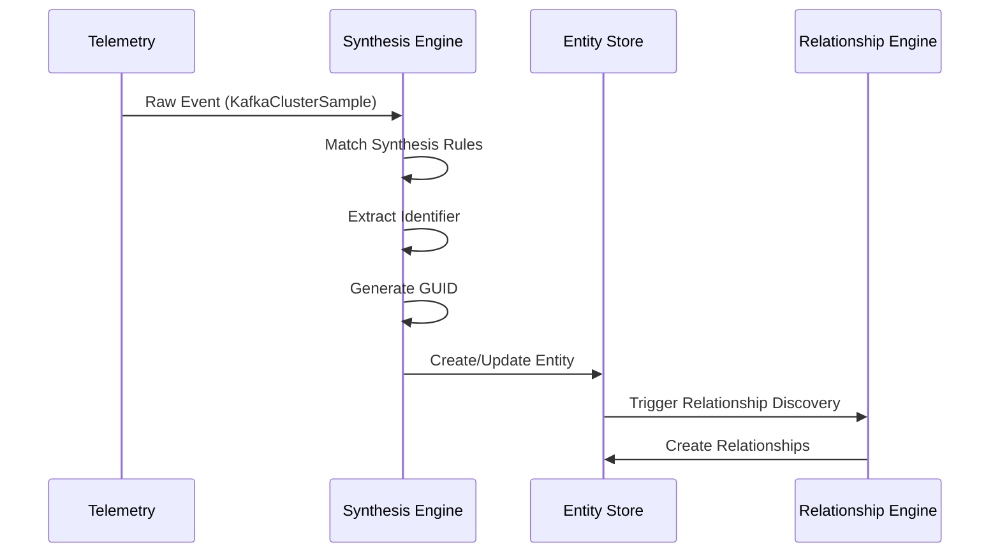

# 📗 Kafka Entity Platform: Implementation and Configuration

<div align="center">


**Master the implementation details of entity synthesis, metrics, relationships, and dashboards**

</div>

---

## 📑 Document Series Navigation

<table>
<tr>
<td width="25%" align="center">

### [📘 Part 1](KAFKA_ENTITY_FUNDAMENTALS.md)
**Fundamentals**
- Introduction
- Platform Basics
- Core Concepts
- Entity Hierarchy
- Lifecycle & Flow

</td>
<td width="25%" align="center" bgcolor="#e8f5e9">

### 📗 Part 2 (This Doc)
**Implementation**
- Synthesis Engine
- Golden Metrics
- Relationships
- Providers
- Dashboards

</td>
<td width="25%" align="center">

### [📙 Part 3](KAFKA_ENTITY_OPERATIONS.md)
**Operations**
- Configuration
- Testing
- Excellence
- Troubleshooting
- Performance

</td>
<td width="25%" align="center">

### [📕 Part 4](KAFKA_ENTITY_ADVANCED.md)
**Advanced**
- Best Practices
- Integration
- Security
- Future
- Reference

</td>
</tr>
</table>

---

## 📖 Table of Contents

6. [Entity Synthesis Deep Dive](#entity-synthesis)
7. [Golden Metrics and Performance Indicators](#golden-metrics)
8. [Relationships and Service Mapping](#relationships)
9. [Provider-Specific Implementations](#providers)
10. [Dashboards and Observability](#dashboards)

---

## 6. Entity Synthesis Deep Dive {#entity-synthesis}

### 🔬 How Synthesis Works

<div style="background-color: #f0f8ff; border-radius: 8px; padding: 20px; margin: 20px 0;">



</div>

### 📝 Synthesis Rule Anatomy

<table>
<tr>
<td width="50%">

#### Rule Structure

```yaml
synthesis:
  rules:
    - identifier: clusterName
      name: clusterName
      encodeIdentifierInGUID: true
      conditions:
        - attribute: eventType
          value: KafkaClusterSample
      tags:
        clusterName:
          entityTagName: kafka.cluster.name
        provider:
          value: SELF_MANAGED
```

</td>
<td width="50%">

#### What Each Part Does

| Component | Purpose |
|-----------|---------|
| `identifier` | Unique ID source |
| `name` | Display name |
| `encodeIdentifierInGUID` | Stable GUID creation |
| `conditions` | When to apply rule |
| `tags` | Properties to extract |

</td>
</tr>
</table>

### 🌐 Multi-Provider Synthesis

<div style="display: flex; gap: 20px; margin: 20px 0;">

<div style="flex: 1; background-color: #e8f5e9; padding: 15px; border-radius: 8px;">

#### Self-Managed

```yaml
identifier: clusterName
conditions:
  - eventType: KafkaClusterSample
tags:
  provider:
    value: SELF_MANAGED
```

</div>

<div style="flex: 1; background-color: #fff3e0; padding: 15px; border-radius: 8px;">

#### AWS MSK

```yaml
identifier: aws.kafka.clusterArn
conditions:
  - eventType: AwsMskClusterSample
tags:
  provider:
    value: AWS_MSK
```

</div>

<div style="flex: 1; background-color: #e3f2fd; padding: 15px; border-radius: 8px;">

#### Confluent Cloud

```yaml
identifier: confluent.kafka.cluster.id
conditions:
  - eventType: ConfluentCloudClusterSample
tags:
  provider:
    value: CONFLUENT_CLOUD
```

</div>

</div>

### 🔍 The Synthesis Engine

The synthesis engine transforms raw telemetry into entities:

```
Input: Raw Telemetry Event
{
  "eventType": "KafkaClusterSample",
  "clusterName": "prod-kafka",
  "cluster.activeControllerCount": 1,
  "cluster.offlinePartitionsCount": 0,
  "timestamp": 1234567890
}

Process: Rule Matching
- Find rules where conditions match
- Extract identifier components
- Generate entity GUID
- Map attributes to tags

Output: Synthesized Entity
{
  "guid": "MTIzNDU2Nzg...",
  "type": "MESSAGE_QUEUE_CLUSTER",
  "name": "prod-kafka",
  "tags": {
    "kafka.cluster.name": "prod-kafka",
    "provider": "SELF_MANAGED"
  }
}
```

### 🔄 Multi-Provider Synthesis Strategy

Different providers require different synthesis approaches:

#### Self-Managed Kafka
```yaml
Identifier: clusterName
Primary Key: Simple cluster name
Challenges: Name uniqueness across accounts
Solution: Include account ID in GUID
```

#### AWS MSK
```yaml
# Polling Integration
Identifier: aws.kafka.clusterArn
Primary Key: Full ARN
Advantages: Globally unique
Format: arn:aws:kafka:region:account:cluster/name/id

# Metric Streams
Identifier: "{{accountId}}:{{region}}:{{clusterName}}"
Primary Key: Composite ID
Reason: ARN not available in stream data
```

#### Confluent Cloud
```yaml
Identifier: confluent.kafka.cluster.id
Primary Key: Cluster ID (lkc-xxxxx)
Advantages: Guaranteed unique
Additional: Environment context available
```

### 📋 Synthesis Rule Components

```yaml
synthesis:
  rules:
    - identifier: "expression"          # What makes this unique
      name: "expression"               # Display name  
      encodeIdentifierInGUID: true     # Include in GUID
      conditions: []                   # When to apply
      tags: {}                        # What to extract
```

### 🎯 Conditional Synthesis

Rules can have complex conditions:

```yaml
conditions:
  # Simple match
  - attribute: eventType
    value: KafkaClusterSample
    
  # Multiple values
  - attribute: eventType
    anyOf: [KafkaClusterSample, AwsMskClusterSample]
    
  # Presence check
  - attribute: clusterName
    present: true
    
  # Negation
  - attribute: test.environment
    value: true
    negate: true
```

### 🏷️ Tag Extraction Patterns

```yaml
tags:
  # Simple mapping
  clusterName:
    entityTagName: kafka.cluster.name
    
  # With fallbacks
  clusterName:
    entityTagName: kafka.cluster.name
    fallbackAttribute: displayName
    fallbackAttribute: name
    
  # With TTL
  consumerLag:
    entityTagName: consumer.lag
    ttl: P5M  # 5 minutes
    
  # Static values
  provider:
    value: AWS_MSK
```

### 📡 Entity Definition Publishing

Entity definitions are distributed via a dedicated service:

<div style="background-color: #f5f5f5; border-radius: 8px; padding: 20px; margin: 20px 0;">

```
Zookeeper (Configuration Paths)
    │
    v
entity-definitions-publisher
    │
    ├── Fetch from S3
    ├── Validate definitions
    └── Publish to Kafka topics:
        ├── entity_definitions_v3
        ├── entity_definitions_v3_synthesis
        ├── entity_definitions_v3_metrics
        ├── entity_definitions_v3_dashboards
        └── entity_definitions_v3_relationships
```

**This enables:**
- Hot configuration updates
- No service restarts needed
- Gradual rollout capabilities
- Version control via S3

</div>

---

## 7. Golden Metrics and Performance Indicators {#golden-metrics}

### Understanding Golden Metrics

Golden metrics are the most critical measurements for each entity type. They:
- Appear prominently in the UI
- Drive health calculations
- Power default dashboards
- Enable smart alerting

### Metric Definition Structure

```yaml
metricName:
  title: "Human-Readable Name"
  unit: UNIT_TYPE
  queries:
    providerName:
      select: "NRQL aggregation function"
      from: "Event type(s)"
      where: "Filter conditions"
      facet: "Group by clause"
      eventId: "Correlation field"
```

### Unit Types

<table>
<tr>
<th width="30%">📊 Unit</th>
<th width="70%">🎯 Usage</th>
</tr>
<tr>
<td><code>COUNT</code></td>
<td>Discrete quantities</td>
</tr>
<tr>
<td><code>PERCENTAGE</code></td>
<td>0-100 values</td>
</tr>
<tr>
<td><code>BYTES</code></td>
<td>Data size</td>
</tr>
<tr>
<td><code>BYTES_PER_SECOND</code></td>
<td>Throughput</td>
</tr>
<tr>
<td><code>REQUESTS_PER_SECOND</code></td>
<td>Rate metrics</td>
</tr>
<tr>
<td><code>MILLISECONDS</code></td>
<td>Latency</td>
</tr>
<tr>
<td><code>STRING</code></td>
<td>Text values</td>
</tr>
</table>

### Provider-Specific Queries

Metrics adapt to different data sources:

```yaml
bytesInPerSec:
  title: "Incoming Throughput"
  unit: BYTES_PER_SECOND
  queries:
    # Self-managed Kafka
    nriKafka:
      select: "average(`broker.bytesInPerSec`)"
      from: "KafkaBrokerSample"
      
    # AWS MSK Polling
    awsMsk:
      select: "average(`aws.kafka.BytesInPerSec.byBroker`)"
      from: "AwsMskBrokerSample"
      
    # AWS MSK Streams (rate calculation)
    awsMskStreams:
      select: "rate(sum(aws.kafka.BytesInPerSec), 1 second)"
      from: "MetricRaw"
      
    # Confluent Cloud
    confluentCloud:
      select: "sum(`io.confluent.kafka.server/received_bytes`)"
      from: "Metric"
```

### 🏢 Cluster-Level Golden Metrics

<div style="background-color: #e3f2fd; border-radius: 8px; padding: 20px; margin: 20px 0;">

#### Critical Health Metrics
- `activeControllerCount`: Must be exactly 1
- `offlinePartitionsCount`: Must be 0
- `underReplicatedPartitions`: Should be 0

#### Performance Metrics
- `throughputInBytesPerSec`: Overall data ingestion
- `throughputOutBytesPerSec`: Overall data delivery
- `clusterLoadPercent`: Confluent capacity usage

#### Scale Metrics
- `totalBrokers`: Cluster size
- `totalTopics`: Data organization
- `totalPartitions`: Parallelism level

</div>

### 🖥️ Broker-Level Golden Metrics

<table>
<tr>
<th width="30%">📊 Category</th>
<th width="70%">🎯 Metrics</th>
</tr>
<tr>
<td><b>Resource Utilization</b></td>
<td>

- `cpuPercent`: Processor usage
- `diskUsedPercent`: Storage consumption
- `memoryUsedPercent`: RAM utilization

</td>
</tr>
<tr>
<td><b>Performance Health</b></td>
<td>

- `requestHandlerAvgIdlePercent`: >70% healthy
- `networkProcessorAvgIdlePercent`: >70% healthy
- `underReplicatedPartitions`: Per-broker issues

</td>
</tr>
<tr>
<td><b>Workload Distribution</b></td>
<td>

- `partitionCount`: Total hosted partitions
- `leaderCount`: Primary partitions
- `bytesInPerSec`: Broker-specific ingestion
- `bytesOutPerSec`: Broker-specific delivery

</td>
</tr>
</table>

### 📬 Topic-Level Golden Metrics

```yaml
Activity Metrics:
  - messagesInPerSec: Message production rate
  - messagesOutPerSec: Message consumption rate
  - bytesInPerSec: Data production volume
  - bytesOutPerSec: Data consumption volume

Consumer Health:
  - maxConsumerLag: Worst-case delay
  - consumerGroupCount: Active consumers
  - activeProducers: Connected producers

Configuration:
  - partitionCount: Parallelism factor
  - replicationFactor: Durability setting
```

### 👥 Consumer Group Golden Metrics

<div style="background-color: #f5f5f5; border-radius: 8px; padding: 20px; margin: 20px 0;">

#### Lag Analysis
- `totalLag`: Sum across all partitions
- `maxLag`: Worst partition lag
- `lagTrend`: Derivative (improving/worsening)

#### Stability Metrics
- `memberCount`: Active consumers
- `rebalanceRate`: Frequency of disruptions
- `state`: Current group status

#### Performance
- `messagesConsumedPerSec`: Processing rate
- `bytesConsumedPerSec`: Data volume
- `assignedPartitions`: Workload size

</div>

### 📊 Summary Metrics

Summary metrics provide quick status in entity lists:

```yaml
providerInfo:
  title: "Provider"
  unit: STRING
  # Shows: AWS_MSK, CONFLUENT_CLOUD, SELF_MANAGED

healthStatus:
  title: "Health"
  unit: STRING
  # Shows: Healthy, Warning, Critical, Unknown

incomingThroughput:
  title: "In"
  unit: BYTES_PER_SECOND
  # Aggregated cluster throughput

brokerCount:
  title: "Brokers"
  unit: COUNT
  # Quick scale indicator
```

### 📈 Metric Query Patterns

#### Aggregation Patterns
```sql
-- Sum across multiple brokers
SELECT sum(broker.bytesInPerSec) 
FROM KafkaBrokerSample 
WHERE clusterName = 'prod-kafka'

-- Average for resource metrics
SELECT average(broker.cpuPercent)
FROM KafkaBrokerSample
WHERE entity.guid = '{entity.guid}'

-- Max for worst-case analysis
SELECT max(consumer.lag)
FROM KafkaOffsetSample
WHERE consumerGroup = 'api-consumers'
```

#### Time-based Patterns
```sql
-- Rate calculation
SELECT rate(sum(messagesIn), 1 second)
FROM KafkaTopicSample
WHERE topic = 'orders'

-- Trend analysis
SELECT derivative(sum(consumer.lag), 1 minute)
FROM KafkaOffsetSample
WHERE consumerGroup = 'analytics'

-- Time series
SELECT average(cpuPercent)
FROM KafkaBrokerSample
TIMESERIES 1 minute
```

#### Multi-Provider Patterns
```sql
-- Handle different attribute names
SELECT sum(broker.bytesInPerSec) OR sum(aws.kafka.BytesInPerSec.byBroker)
FROM KafkaBrokerSample, AwsMskBrokerSample
WHERE clusterName = 'prod' OR aws.kafka.clusterArn LIKE '%prod%'

-- Coalesce missing values
SELECT COALESCE(latest(broker.cpuPercent), 0) as 'CPU %'
FROM KafkaBrokerSample
```

---

## 8. Relationships and Service Mapping {#relationships}

### Understanding Entity Relationships

Relationships connect entities to show how your infrastructure works together:

```
Application Service
    │
    ├── PRODUCES_TO → Kafka Topic
    │                     │
    │                     ├── CONTAINS → Partitions
    │                     │
    │                     └── CONSUMED_BY → Consumer Group
    │                                            │
    └── MONITORED_BY → APM Agent               └── CONTAINS → Consumers
```

### Relationship Types

<table>
<tr>
<th width="30%">🔗 Type</th>
<th width="70%">📝 Description</th>
</tr>
<tr>
<td><b>Structural</b></td>
<td>

**Infrastructure relationships:**
- `CONTAINS`: Ownership hierarchy
- `HOSTS`: Physical hosting
- `OPERATES_IN`: Regional deployment

</td>
</tr>
<tr>
<td><b>Behavioral</b></td>
<td>

**Activity relationships:**
- `PRODUCES_TO`: Data production
- `CONSUMES_FROM`: Data consumption
- `CALLS`: Service communication
- `CONNECTS_TO`: Network connections

</td>
</tr>
</table>

### Relationship Definition Structure

```yaml
relationships:
  - name: uniqueRelationshipName
    version: "1"
    origins: [data-sources]
    conditions: []              # When to create
    relationship:
      expires: P24H            # TTL
      relationshipType: TYPE   
      source:                  # From entity
        buildGuid: {}         # Build new
        extractGuid: {}       # Use existing
        lookupGuid: {}        # Find entity
      target:                  # To entity
        buildGuid: {}
        extractGuid: {}
        lookupGuid: {}
```

### TTL Strategy for Relationships

Different relationship types require different expiration times:

<div style="background-color: #e8f5e9; border-radius: 8px; padding: 20px; margin: 20px 0;">

#### Infrastructure Relationships (24 hours)
- Cluster → Broker
- Topic → Partition
- Broker → Partition

**Reason**: Stable, change infrequently

#### Dynamic Relationships (15 minutes)
- Application → Topic
- Consumer Group → Topic
- Producer → Topic

**Reason**: Based on activity, may stop/start

#### Configuration Relationships (7 days)
- Service → Database
- Container → Host

**Reason**: Semi-permanent but can change

</div>

### Source and Target Patterns

#### Building GUIDs
Used when the entity might not exist yet:

```yaml
source:
  buildGuid:
    account:
      attribute: accountId
    domain:
      value: INFRA
    type:
      value: MESSAGE_QUEUE_CLUSTER
    identifier:
      fragments:
        - attribute: clusterName
        - value: ":"
        - attribute: environment
```

#### Extracting GUIDs
Used when GUID is already in the event:

```yaml
source:
  extractGuid:
    attribute: entity.guid
```

#### Looking Up GUIDs
Used to find existing entities:

```yaml
target:
  lookupGuid:
    candidateCategory: entity
    fields:
      - field: domainType.type
        value: MESSAGE_QUEUE_TOPIC
      - field: kafka.topic.name
        attribute: topicName
```

### 🔑 Key Kafka Relationships

<table>
<tr>
<th width="25%">🔗 Relationship</th>
<th width="25%">📍 Source</th>
<th width="25%">🎯 Target</th>
<th width="25%">⏱️ Details</th>
</tr>
<tr>
<td><b>Cluster Contains Broker</b></td>
<td>MESSAGE_QUEUE_CLUSTER</td>
<td>MESSAGE_QUEUE_BROKER</td>
<td>TTL: 24 hours<br>Shows broker membership</td>
</tr>
<tr>
<td><b>Topic Contains Partition</b></td>
<td>MESSAGE_QUEUE_TOPIC</td>
<td>MESSAGE_QUEUE_PARTITION</td>
<td>TTL: 24 hours<br>Topic structure</td>
</tr>
<tr>
<td><b>Broker Hosts Partition</b></td>
<td>MESSAGE_QUEUE_BROKER</td>
<td>MESSAGE_QUEUE_PARTITION</td>
<td>TTL: 24 hours<br>Shows partition leadership</td>
</tr>
<tr>
<td><b>Consumer Group Consumes From Topic</b></td>
<td>MESSAGE_QUEUE_CONSUMER_GROUP</td>
<td>MESSAGE_QUEUE_TOPIC</td>
<td>TTL: 15 minutes<br>Consumption patterns</td>
</tr>
<tr>
<td><b>Application Produces To Topic</b></td>
<td>APM Application</td>
<td>MESSAGE_QUEUE_TOPIC</td>
<td>TTL: 15 minutes<br>Data flow mapping</td>
</tr>
</table>

### 🚀 APM Integration

The platform creates relationships from distributed tracing:

<div style="background-color: #f0f8ff; border-radius: 8px; padding: 20px; margin: 20px 0;">

#### Producer Span Attributes
```yaml
- span.kind: "producer"
- messaging.system: "kafka"
- messaging.destination.name: "orders"
- messaging.kafka.cluster.id: "prod-cluster"

Result: Application → PRODUCES_TO → Topic
```

#### Consumer Span Attributes
```yaml
- span.kind: "consumer"
- messaging.system: "kafka"
- messaging.source.name: "orders"
- messaging.kafka.consumer.group: "api-consumers"

Result: Application → CONSUMES_FROM → Topic
```

</div>

### Relationship Discovery Process

```
1. Event Arrives
   │
2. Check Conditions
   │
3. Extract Attributes
   │
4. Build/Extract/Lookup Source GUID
   │
5. Build/Extract/Lookup Target GUID
   │
6. Create Relationship with TTL
   │
7. Publish to relationship stream
```

### 🛠️ Troubleshooting Relationships

Common issues and solutions:

<table>
<tr>
<th width="30%">❌ Issue</th>
<th width="70%">✅ Solution</th>
</tr>
<tr>
<td><b>Missing Relationships</b></td>
<td>

**Symptom**: No connection between app and topic

**Checks:**
1. Verify span attributes present
2. Check messaging.system = "kafka"
3. Ensure cluster ID matches
4. Verify TTL hasn't expired

</td>
</tr>
<tr>
<td><b>Incorrect Relationships</b></td>
<td>

**Symptom**: Wrong entities connected

**Checks:**
1. Validate identifier construction
2. Check for naming conflicts
3. Verify attribute mappings
4. Review GUID generation

</td>
</tr>
<tr>
<td><b>Expired Relationships</b></td>
<td>

**Symptom**: Relationships disappear

**Solution:**
1. Check activity still occurring
2. Verify TTL appropriate
3. Monitor relationship events
4. Adjust TTL if needed

</td>
</tr>
</table>

---

## 9. Provider-Specific Implementations {#providers}

### Overview of Supported Providers

The platform supports three main Kafka providers, each with unique characteristics:

<div style="background-color: #f5f5f5; border-radius: 8px; padding: 20px; margin: 20px 0;">

**Providers:**
- `SELF_MANAGED`: Full JMX access, complete metrics, custom deployment
- `AWS_MSK`: Managed service, CloudWatch/Streams, limited metrics
- `CONFLUENT_CLOUD`: SaaS platform, API-based metrics, cloud-native features

</div>

### 🔧 Self-Managed Kafka Implementation

#### Data Collection
```yaml
Integration: nri-kafka
Method: JMX polling
Frequency: 15-60 seconds
Depth: Full metric access
```

#### Entity Identification
```yaml
Cluster: clusterName
Broker: clusterName:brokerId
Topic: clusterName:topicName
Partition: clusterName:topicName:partitionId
```

#### Available Metrics
```yaml
Complete Access:
  - All JMX MBeans
  - Producer metrics
  - Consumer metrics
  - Internal metrics
  - Custom metrics
```

#### Synthesis Rules
```yaml
- identifier: clusterName
  conditions:
    - attribute: eventType
      value: KafkaClusterSample
  tags:
    clusterName:
      entityTagName: kafka.cluster.name
    provider:
      value: SELF_MANAGED
```

### ☁️ AWS MSK Implementation

#### Two Integration Methods

<table>
<tr>
<td width="50%">

##### 1. CloudWatch Polling
```yaml
Method: AWS API polling
Latency: 1-5 minutes
Cost: CloudWatch API charges
Identification: ARN-based
```

</td>
<td width="50%">

##### 2. Metric Streams
```yaml
Method: Kinesis streaming
Latency: Near real-time
Cost: Kinesis charges
Identification: Composite IDs
```

</td>
</tr>
</table>

#### Entity Identification Strategy

<div style="background-color: #fff3e0; border-radius: 8px; padding: 15px; margin: 20px 0;">

**Polling uses ARN (globally unique)**
```yaml
Cluster: arn:aws:kafka:region:account:cluster/name/uuid
Broker: arn:aws:kafka:region:account:cluster/name/uuid:brokerId
```

**Streams use composite (no ARN in stream)**
```yaml
Cluster: accountId:region:clusterName
Broker: accountId:region:clusterName:brokerId
```

</div>

#### Synthesis Differences
```yaml
# Polling synthesis
- identifier: aws.kafka.clusterArn
  conditions:
    - attribute: eventType
      value: AwsMskClusterSample
    - attribute: provider.source
      value: cloudwatch

# Streams synthesis  
- identifier: "{{ aws.accountId }}:{{ aws.region }}:{{ aws.kafka.ClusterName }}"
  conditions:
    - attribute: eventType
      value: MetricRaw
    - attribute: aws.Namespace
      value: AWS/Kafka
    - attribute: metricStreamName
      present: true
```

#### Metric Mappings
```yaml
MSK Metric → Generic Metric:
  aws.kafka.ActiveControllerCount → activeControllerCount
  aws.kafka.OfflinePartitionsCount → offlinePartitionsCount
  aws.kafka.BytesInPerSec.byBroker → broker.bytesInPerSec
  aws.kafka.CpuUser → broker.cpuPercent
```

#### Limitations
```yaml
Not Available in MSK:
  - Producer client metrics
  - Consumer client metrics
  - Detailed JMX metrics
  - Some internal metrics
```

### 🌊 Confluent Cloud Implementation

#### Data Collection
```yaml
Integration: Confluent Metrics API
Method: REST API polling
Authentication: API key/secret
Frequency: 60 seconds
```

#### Unique Features
```yaml
Cloud-Native Metrics:
  - cluster_load_percent
  - hot_partition_ingress/egress
  - cloud_provider attribution
  - environment context
```

#### Entity Identification
```yaml
Cluster: confluent.kafka.cluster.id (lkc-xxxxx)
Broker: confluent.kafka.cluster.id:brokerId
Topic: confluent.kafka.cluster.id:topicName
```

#### Synthesis Rules
```yaml
- identifier: confluent.kafka.cluster.id
  name: resource.kafka.id
  conditions:
    - attribute: eventType
      value: ConfluentCloudClusterSample
  tags:
    confluent.kafka.cluster.id:
      entityTagName: kafka.cluster.id
    provider:
      value: CONFLUENT_CLOUD
```

#### Metric Namespace
```yaml
Confluent Metrics:
  io.confluent.kafka.server/received_bytes
  io.confluent.kafka.server/sent_bytes
  io.confluent.kafka.server/received_records
  kafka.consumer.lag_offsets
```

### 📊 Provider Comparison Matrix

| Feature | Self-Managed | AWS MSK | Confluent Cloud |
|---------|--------------|----------|-----------------|
| **Identification** | Cluster name | ARN/Composite | Cluster ID |
| **Metric Latency** | 15-60s | 1-5min/real-time | 60s |
| **Metric Depth** | Full JMX | CloudWatch subset | API subset |
| **Producer Metrics** | ✓ | Limited | Limited |
| **Consumer Metrics** | ✓ | Limited | Via API |
| **Client Metrics** | ✓ | ✗ | ✗ |
| **Hot Partition Detection** | Manual | ✗ | ✓ |
| **Cost** | Infrastructure | CloudWatch/Kinesis | API calls |
| **Multi-Region** | Manual | Native | Native |
| **Managed Upgrades** | ✗ | ✓ | ✓ |

### 🎯 Choosing the Right Provider

<table>
<tr>
<th width="33%">🔧 Self-Managed</th>
<th width="33%">☁️ AWS MSK</th>
<th width="33%">🌊 Confluent Cloud</th>
</tr>
<tr>
<td valign="top">

**Choose when:**
- Need full control
- Require all metrics
- Custom configurations
- On-premises deployment

**Considerations:**
- Operational overhead
- Manual upgrades
- Infrastructure costs

</td>
<td valign="top">

**Choose when:**
- Already on AWS
- Want managed service
- Need AWS integration
- Require compliance

**Considerations:**
- Limited metrics
- AWS lock-in
- CloudWatch costs

</td>
<td valign="top">

**Choose when:**
- Want full SaaS
- Multi-cloud strategy
- Minimal operations
- Advanced features

**Considerations:**
- Highest cost
- Internet dependency
- Limited customization

</td>
</tr>
</table>

### 🌐 Multi-Provider Strategies

Organizations often run multiple Kafka providers:

<div style="background-color: #e3f2fd; border-radius: 8px; padding: 20px; margin: 20px 0;">

**Common Patterns:**
1. Production on MSK, Development on self-managed
2. Core on self-managed, Edge on Confluent
3. Migration from self-managed to cloud

**Unified Monitoring Benefits:**
- Single dashboard for all Kafka
- Consistent alerting rules
- Unified health scoring
- Cross-provider comparisons

</div>

### 🔄 Provider Migration Support

The entity platform helps during migrations:

```yaml
Migration Visibility:
  - Side-by-side comparisons
  - Throughput matching
  - Consumer lag tracking
  - Relationship preservation

Entity Continuity:
  - Same entity types
  - Consistent metrics
  - Unified dashboards
  - Standard alerts
```

### 📝 Provider-Specific Examples

<details>
<summary><b>Self-Managed Kafka Configuration</b></summary>

```yaml
synthesis:
  rules:
    - identifier: clusterName
      name: clusterName
      conditions:
        - attribute: eventType
          value: KafkaClusterSample
      tags:
        provider:
          value: SELF_MANAGED
        integration.type:
          value: polling
```

Event Example:
```json
{
  "eventType": "KafkaClusterSample",
  "clusterName": "prod-kafka-cluster",
  "cluster.activeControllerCount": 1,
  "cluster.offlinePartitionsCount": 0
}
```

</details>

<details>
<summary><b>AWS MSK Configuration</b></summary>

```yaml
# Polling Integration
- identifier: aws.kafka.clusterArn
  conditions:
    - attribute: eventType
      value: AwsMskClusterSample
    - attribute: provider.source
      value: cloudwatch

# Metric Streams
- identifier: "{{ aws.accountId }}:{{ aws.region }}:{{ aws.kafka.ClusterName }}"
  conditions:
    - attribute: eventType
      value: MetricRaw
    - attribute: aws.Namespace
      value: AWS/Kafka
```

</details>

<details>
<summary><b>Confluent Cloud Configuration</b></summary>

```yaml
synthesis:
  rules:
    - identifier: confluent.kafka.cluster.id
      name: resource.kafka.id
      conditions:
        - attribute: eventType
          value: ConfluentCloudClusterSample
      tags:
        provider:
          value: CONFLUENT_CLOUD
```

Special Metrics:
```yaml
clusterLoadPercent:
  title: "Cluster Load %"
  queries:
    confluentCloud:
      select: "latest(`confluent.kafka.cluster_load_percent`)"
```

</details>

---

## 10. Dashboards and Observability {#dashboards}

### 📊 Dashboard Architecture

<div style="background-color: #f0f9ff; border-radius: 8px; padding: 20px; margin: 20px 0;">

Each entity type can have a multi-page dashboard with:
- **Overview Page**: Health status and key metrics
- **Performance Page**: Detailed performance analysis
- **Relationships Page**: Connected entities and data flow

</div>

```json
{
  "name": "{{{entity.name}}} Kafka Cluster",
  "description": "Comprehensive monitoring dashboard",
  "permissions": "PUBLIC_READ_WRITE",
  "pages": [
    {
      "name": "Overview",
      "description": "Cluster health and key metrics",
      "widgets": [...]
    },
    {
      "name": "Performance",
      "description": "Detailed performance analysis",
      "widgets": [...]
    }
  ]
}
```

### 🎨 Widget Gallery

<table>
<tr>
<td width="50%">

#### 📈 Billboard (Status)
```json
{
  "visualization": {
    "id": "viz.billboard"
  },
  "rawConfiguration": {
    "nrqlQueries": [{
      "query": "SELECT latest(activeControllerCount) as 'Controllers'"
    }],
    "thresholds": [{
      "alertSeverity": "CRITICAL",
      "name": "Not exactly 1",
      "value": 0.99
    }]
  }
}
```

**Use for**: Health indicators, key counts

</td>
<td width="50%">

#### 📊 Line Chart (Trends)
```json
{
  "visualization": {
    "id": "viz.line"
  },
  "rawConfiguration": {
    "nrqlQueries": [{
      "query": "SELECT sum(bytes) TIMESERIES"
    }]
  }
}
```

**Use for**: Throughput, performance over time

</td>
</tr>
<tr>
<td width="50%">

#### 📋 Table (Details)
```json
{
  "visualization": {
    "id": "viz.table"
  },
  "rawConfiguration": {
    "facet": {
      "showOtherSeries": false
    }
  }
}
```

**Use for**: Per-broker metrics, consumer groups

</td>
<td width="50%">

#### 🌡️ Heatmap (Distribution)
```json
{
  "visualization": {
    "id": "viz.heatmap"
  }
}
```

**Use for**: Topic activity distribution

</td>
</tr>
</table>

### 🔧 Dynamic Variables

Dashboards use entity context:
- `{{{entity.name}}}` - Entity display name
- `{{{kafka.cluster.name}}}` - Cluster name tag
- `{{{account.id}}}` - Account ID

### 📐 Dashboard Pages Structure

<div style="background-color: #e8f5e9; border-radius: 8px; padding: 20px; margin: 20px 0;">

#### Overview Page
```yaml
Purpose: Quick health assessment
Widgets:
  - Health Status (Billboard)
  - Throughput Trends (Line)
  - Broker Status (Table)
  - Top Topics (Bar)
  - Consumer Lag Summary (Table)
```

#### Performance Page
```yaml
Purpose: Deep performance analysis
Widgets:
  - Resource Utilization (Line)
  - Request Handler Performance (Line)
  - Partition Distribution (Bar)
  - Replication Status (Table)
```

#### Topic Analytics Page
```yaml
Purpose: Topic-level insights
Widgets:
  - Topic Throughput Heatmap
  - Message Rates (Line)
  - Consumer Lag by Topic (Table)
  - Producer Activity (Bar)
```

#### Consumer Health Page
```yaml
Purpose: Consumption monitoring
Widgets:
  - Consumer Group Lag (Table)
  - Lag Trends (Line)
  - Rebalance Frequency (Billboard)
  - Consumer Distribution (Bar)
```

</div>

### 🎯 Multi-Provider Dashboard Queries

Handle different providers in one query:

```sql
-- Cluster health across providers
SELECT latest(activeControllerCount) 
FROM KafkaClusterSample, AwsMskClusterSample, ConfluentCloudClusterSample
WHERE entity.guid = '{{{entity.guid}}}'

-- Broker metrics with fallbacks
SELECT average(broker.cpuPercent) OR average(aws.kafka.CpuUser)
FROM KafkaBrokerSample, AwsMskBrokerSample
WHERE clusterName = '{{{kafka.cluster.name}}}' 
   OR aws.kafka.clusterArn = '{{{kafka.cluster.arn}}}'
```

### 📏 Dashboard Best Practices

#### Layout Guidelines
```yaml
Grid System:
  - 12 columns wide
  - Variable height rows
  - Responsive design

Widget Sizing:
  - Critical metrics: 4-6 columns
  - Trends: 8-12 columns
  - Tables: 6-12 columns
  - Status: 3-4 columns
```

#### Query Optimization
```yaml
Performance Tips:
  - Use SINCE clause appropriately
  - Limit FACET cardinality
  - Pre-filter with WHERE
  - Avoid SELECT *
  - Use TIMESERIES AUTO
```

#### Color Schemes
```yaml
Status Colors:
  - Green: Healthy/Good
  - Yellow: Warning
  - Red: Critical/Bad
  - Blue: Informational
  - Gray: Unknown/No data
```

### 🛠️ Creating Custom Dashboards

#### Dashboard Template
```json
{
  "name": "Kafka Monitoring - {{{kafka.cluster.name}}}",
  "permissions": "PUBLIC_READ_WRITE",
  "pages": [{
    "name": "Custom View",
    "widgets": [{
      "title": "Custom Metric",
      "layout": {
        "column": 1,
        "row": 1,
        "width": 6,
        "height": 3
      },
      "visualization": {
        "id": "viz.line"
      },
      "rawConfiguration": {
        "nrqlQueries": [{
          "accountId": "{{{account.id}}}",
          "query": "YOUR CUSTOM QUERY HERE"
        }]
      }
    }]
  }]
}
```

#### Adding Business Context
```sql
-- Business-aligned metrics
SELECT 
  sum(messagesInPerSec) as 'Orders/sec'
FROM KafkaTopicSample
WHERE topic = 'orders'

-- SLA monitoring
SELECT 
  percentage(count(*), WHERE consumer.lag < 1000) as 'SLA %'
FROM KafkaOffsetSample
WHERE consumerGroup = 'critical-consumers'
```

### 📊 Observability Strategy

<table>
<tr>
<th width="30%">📈 Level</th>
<th width="70%">🎯 Focus</th>
</tr>
<tr>
<td><b>Executive Dashboard</b></td>
<td>

- Overall health score
- Business KPIs
- Trend indicators

</td>
</tr>
<tr>
<td><b>Operations Dashboard</b></td>
<td>

- Cluster health
- Resource utilization
- Performance metrics

</td>
</tr>
<tr>
<td><b>Engineering Dashboard</b></td>
<td>

- Individual components
- Debug information
- Raw metrics

</td>
</tr>
</table>

#### Alert Integration
```yaml
Dashboard Alerts:
  - Click metric → Create alert
  - Threshold visualization
  - Historical context
  - Related entities
```

#### Mobile Considerations
```yaml
Mobile Dashboards:
  - Simplified layout
  - Key metrics only
  - Single column design
  - Touch-friendly widgets
```

---

## 🎯 Next Steps

You've completed Part 2 of the Kafka Entity Platform documentation! You now understand:

- ✅ How entity synthesis transforms telemetry into entities
- ✅ Golden metrics design and multi-provider support
- ✅ Relationship mapping and APM integration
- ✅ Provider-specific implementations and differences
- ✅ Dashboard creation and visualization strategies

<div align="center">

### 📚 Continue Your Journey

<table>
<tr>
<td width="33%" align="center">

**[📘 Part 1: Fundamentals](KAFKA_ENTITY_FUNDAMENTALS.md)**

Review:
- Core concepts
- Platform basics
- Entity hierarchy
- Lifecycle management

</td>
<td width="33%" align="center">

**[📙 Part 3: Operations](KAFKA_ENTITY_OPERATIONS.md)**

Master:
- Configuration management
- Testing strategies
- Operational excellence
- Troubleshooting
- Performance tuning

</td>
<td width="33%" align="center">

**[📕 Part 4: Advanced Topics](KAFKA_ENTITY_ADVANCED.md)**

Explore:
- Best practices
- Platform integration
- Security & compliance
- Future roadmap
- Complete glossary

</td>
</tr>
</table>

</div>

---

<div align="center">

### 🆘 Need Help?

[📖 Entity Platform Docs](#) • [💬 Community Forum](#) • [🐛 Report Issues](#) • [📧 Contact Support](#)

---

*Entity Platform for Kafka • Part 2 of 4 • Last Updated: January 2025*

</div>