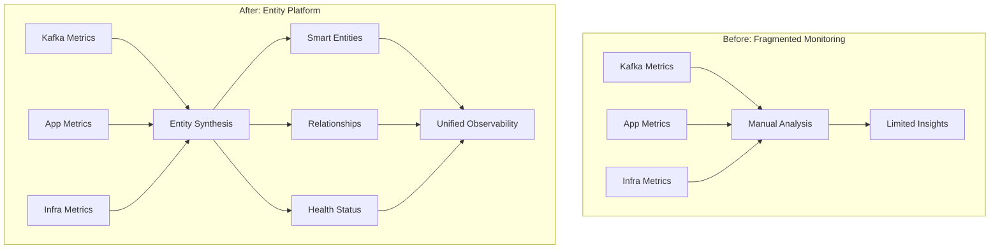

# 🚀 Kafka Entity Platform: Quick Start & Overview

<div align="center">


**Transform your Kafka monitoring from raw metrics to intelligent entity-based observability**

[📖 Architecture Guide](KAFKA_ENTITY_ARCHITECTURE.md) • [🔧 Provider Configuration](KAFKA_ENTITY_PROVIDERS_CONFIG.md) • [📋 Operations Guide](KAFKA_ENTITY_OPERATIONS_REFERENCE.md)

</div>

---

## 📑 Document Navigation

<table>
<tr>
<td width="25%" align="center">

### 📄 This Document
**Quick Start & Overview**
- Getting Started
- Introduction
- Core Concepts

</td>
<td width="25%" align="center">

### 📄 [Architecture Guide](KAFKA_ENTITY_ARCHITECTURE.md)
**Entity Architecture**
- Entity Hierarchy
- Synthesis Engine
- Golden Metrics

</td>
<td width="25%" align="center">

### 📄 [Provider Guide](KAFKA_ENTITY_PROVIDERS_CONFIG.md)
**Implementation**
- Provider Setup
- Relationships
- Dashboards

</td>
<td width="25%" align="center">

### 📄 [Operations Guide](KAFKA_ENTITY_OPERATIONS_REFERENCE.md)
**Operations**
- Testing
- Troubleshooting
- Best Practices

</td>
</tr>
</table>

---

## 🚀 Quick Start Guide

<table>
<tr>
<td width="50%">

### ✅ What You'll Get

- **7 New Entity Types** for Kafka monitoring
- **Multi-Provider Support** (3 providers)
- **Automatic Relationships** to applications
- **Smart Health Status** calculations
- **Pre-built Dashboards** with key metrics

</td>
<td width="50%">

### 📋 Prerequisites

- ✓ New Relic account with Entity Platform
- ✓ One of these integrations:
  - `nri-kafka` (self-managed)
  - AWS integration (for MSK)
  - Confluent Cloud integration

</td>
</tr>
</table>

### ⚡ 5-Minute Setup

```bash
# 1. Clone the entity definitions
git clone <repository-url>

# 2. Validate definitions
make validate

# 3. Deploy to your account
make deploy ACCOUNT_ID=<your-account>
```

### 🎯 Quick Verification

After deployment, verify your entities:

```sql
-- Check for Kafka clusters
FROM entity SELECT name, tags.provider 
WHERE type = 'MESSAGE_QUEUE_CLUSTER' 
SINCE 10 minutes ago

-- Check entity relationships
FROM relationship SELECT sourceEntityGuid, targetEntityGuid, type 
WHERE sourceEntityType = 'MESSAGE_QUEUE_CLUSTER' 
SINCE 10 minutes ago
```

---

## 1. Introduction: Understanding the Big Picture

<div style="background-color: #e6f3ff; border-radius: 8px; padding: 20px; margin: 20px 0;">

### 🎯 The Problem This Solves

Apache Kafka monitoring traditionally suffers from:
- **Fragmented Views**: Metrics scattered across different tools
- **No Context**: Raw metrics without understanding relationships
- **Provider Lock-in**: Different monitoring for each Kafka variant
- **Manual Correlation**: Linking Kafka issues to application impact

### 💡 The Solution

This PR transforms Kafka monitoring by introducing **Entity-Based Observability**:

```
Traditional Monitoring          Entity-Based Monitoring
----------------------         -----------------------
Raw Metrics        →           Smart Entities with Context
Manual Correlation →           Automatic Relationship Discovery  
Provider-Specific  →           Unified Multi-Provider Support
Static Dashboards  →           Dynamic Entity-Aware Dashboards
```

</div>

### 🎨 Visual Overview



### 🌟 Key Benefits

<table>
<tr>
<th width="33%">🔗 Automatic Context</th>
<th width="33%">🌍 Multi-Provider</th>
<th width="33%">📊 Smart Dashboards</th>
</tr>
<tr>
<td valign="top">

- Application connections
- Infrastructure mapping
- Consumer group tracking
- Producer identification

</td>
<td valign="top">

- Self-managed Kafka
- AWS MSK
- Confluent Cloud
- Unified experience

</td>
<td valign="top">

- Entity-aware widgets
- Health calculations
- Relationship views
- Dynamic filtering

</td>
</tr>
</table>

---

## 2. Entity Platform Fundamentals

<div style="background-color: #f8f9fa; border-left: 4px solid #0078d4; padding: 15px; margin: 20px 0;">

### 🧠 What is an Entity?

An **entity** is an intelligent representation of a monitored component that includes:

| Component | Description | Example |
|-----------|-------------|---------|
| **Identity** | Unique GUID | `MXxJTkZSQXxNRVNTQUdFX1FVRVVFX0NMVVNURVIx` |
| **Type** | What kind of component | `MESSAGE_QUEUE_CLUSTER` |
| **Properties** | Descriptive attributes | `kafka.cluster.name`, `provider` |
| **Metrics** | Performance data | CPU usage, message throughput |
| **Relationships** | Connections to other entities | Cluster → Brokers → Topics |
| **Health** | Calculated status | Healthy, Warning, Critical |

</div>

### 🔄 The Entity Lifecycle

<table>
<tr>
<td width="20%" align="center">

**1️⃣ Discovery**

Raw telemetry arrives

</td>
<td width="20%" align="center">

**2️⃣ Synthesis**

Rules create entities

</td>
<td width="20%" align="center">

**3️⃣ Enrichment**

Tags & metrics added

</td>
<td width="20%" align="center">

**4️⃣ Relationships**

Connections formed

</td>
<td width="20%" align="center">

**5️⃣ Monitoring**

Continuous updates

</td>
</tr>
</table>

### 💡 Entity vs Traditional Monitoring

<table>
<tr>
<th>Aspect</th>
<th>Traditional Monitoring</th>
<th>Entity Platform</th>
</tr>
<tr>
<td><b>Data Model</b></td>
<td>Metrics & events</td>
<td>Entities with metrics</td>
</tr>
<tr>
<td><b>Context</b></td>
<td>Manual correlation</td>
<td>Automatic relationships</td>
</tr>
<tr>
<td><b>Visualization</b></td>
<td>Static dashboards</td>
<td>Dynamic entity views</td>
</tr>
<tr>
<td><b>Health</b></td>
<td>Threshold alerts</td>
<td>Calculated health status</td>
</tr>
<tr>
<td><b>Discovery</b></td>
<td>Manual configuration</td>
<td>Automatic synthesis</td>
</tr>
</table>

---

## 3. Core Concepts and Architecture

### 🏗️ Architecture Overview

<div style="background-color: #fff5f5; border-radius: 8px; padding: 20px; margin: 20px 0;">

```
┌─────────────────────────────────────────────────────────────┐
│                     Entity Platform Core                      │
├─────────────────┬─────────────────┬─────────────────────────┤
│  Entity Types   │ Synthesis Rules │ Relationship Engine     │
├─────────────────┼─────────────────┼─────────────────────────┤
│ • Domain        │ • Conditions    │ • Type Definitions      │
│ • Type Name     │ • Identifiers   │ • TTL Management        │
│ • Golden Tags   │ • Tag Mapping   │ • Bi-directional Links  │
│ • Configuration │ • Fallbacks     │ • Dynamic Discovery     │
└─────────────────┴─────────────────┴─────────────────────────┘
```

</div>

### 📊 Key Components Explained

<table>
<tr>
<th width="25%">Component</th>
<th width="35%">Purpose</th>
<th width="40%">Example</th>
</tr>
<tr>
<td>

**Domain**

</td>
<td>High-level categorization</td>
<td>

```yaml
domain: INFRA
```

</td>
</tr>
<tr>
<td>

**Type**

</td>
<td>Specific entity kind</td>
<td>

```yaml
type: MESSAGE_QUEUE_CLUSTER
```

</td>
</tr>
<tr>
<td>

**Golden Tags**

</td>
<td>Primary search attributes</td>
<td>

```yaml
goldenTags:
  - kafka.cluster.name
  - cloud.provider
```

</td>
</tr>
<tr>
<td>

**Synthesis Rules**

</td>
<td>Entity creation logic</td>
<td>

```yaml
rules:
  - identifier: clusterName
    conditions:
      - eventType: KafkaClusterSample
```

</td>
</tr>
</table>

### 🔍 Understanding Entity GUIDs

Entity GUIDs are globally unique identifiers with this structure:

```
<accountId>|<domain>|<type>|<identifier>
```

Example breakdown:
```
MXxJTkZSQXxNRVNTQUdFX1FVRVVFX0NMVVNURVIx
│   │         │
│   │         └─ Type: MESSAGE_QUEUE_CLUSTER
│   └─ Domain: INFRA
└─ Account: 1
```

### 🎯 Supported Entity Types

This implementation adds **7 new entity types** to the platform:

| Entity Type | Icon | Purpose | Example |
|-------------|------|---------|---------|
| MESSAGE_QUEUE_CLUSTER | 🏢 | Kafka cluster | prod-kafka-cluster |
| MESSAGE_QUEUE_BROKER | 🖥️ | Individual brokers | broker-1.kafka.local |
| MESSAGE_QUEUE_TOPIC | 📬 | Kafka topics | user-events |
| MESSAGE_QUEUE_PARTITION | 📁 | Topic partitions | user-events-0 |
| MESSAGE_QUEUE_CONSUMER_GROUP | 👥 | Consumer groups | payment-processor |
| MESSAGE_QUEUE_PRODUCER | 📤 | Producer apps | order-service |
| MESSAGE_QUEUE_CONSUMER | 📥 | Consumer apps | analytics-consumer |

---

## 🎯 Next Steps

<div align="center">

### 📚 Continue Your Journey

<table>
<tr>
<td width="33%" align="center">

**🏗️ [Entity Architecture](KAFKA_ENTITY_ARCHITECTURE.md)**

Deep dive into:
- Entity hierarchy
- Synthesis engine
- Golden metrics
- Health calculations

</td>
<td width="33%" align="center">

**🔧 [Provider Configuration](KAFKA_ENTITY_PROVIDERS_CONFIG.md)**

Learn about:
- Multi-provider setup
- Relationship mapping
- Dashboard creation
- APM integration

</td>
<td width="33%" align="center">

**📋 [Operations Guide](KAFKA_ENTITY_OPERATIONS_REFERENCE.md)**

Master:
- Testing strategies
- Troubleshooting
- Best practices
- Reference material

</td>
</tr>
</table>

</div>

---

<div align="center">

### 🆘 Need Help?

[📖 Entity Platform Docs](#) • [💬 Community Forum](#) • [🐛 Report Issues](#) • [📧 Contact Support](#)

---

*Entity Platform for Kafka • Version 2.0 • Last Updated: 2025-01-10*

</div>