# 🔧 Kafka Entity Definitions: Visual Examples and Code Walkthroughs


**Hands-on examples and visual walkthroughs to master Kafka entity monitoring**

[⬅️ Back to Main Guide](KAFKA_ENTITY_DEFINITIONS_COMPLETE_WIKI.md) • [📋 PR Details](PR_TO_BE_VERIFIED.md)


---

## 📑 Example Navigation

<table>
<tr>
<td width="50%" valign="top">

### 🎯 Basic Examples
1. [Complete Entity Creation Flow](#example-1)
2. [Multi-Provider Entity Handling](#example-2)
3. [Relationship Discovery](#example-3)
4. [Health Calculation](#example-4)
5. [Consumer Lag Tracking](#example-5)

</td>
<td width="50%" valign="top">

### 🚀 Advanced Examples
6. [Dashboard in Action](#example-6)
7. [TTL and Lifecycle](#example-7)
8. [Error Handling](#example-8)
9. [Query Patterns](#example-9)
10. [Complete Monitoring](#example-10)

</td>
</tr>
</table>

---

## Example 1: Complete Entity Creation Flow {#example-1}

### 📖 Scenario: New Kafka Cluster Deployment

> **📘 Note**
> 
> **Goal**: Follow data from a freshly deployed Kafka cluster through the entire Entity Platform


### Step 1: Raw Telemetry Arrives

<table>
<tr>
<td width="50%">

**Incoming Event**

```json
{
  "eventType": "KafkaClusterSample",
  "clusterName": "orders-prod-kafka",
  "kafka.version": "3.5.0",
  "kafka.cluster.id": "MkU3OEVBNTcw",
  "cluster.activeControllerCount": 1,
  "cluster.offlinePartitionsCount": 0,
  "cluster.underReplicatedPartitions": 0,
  "integration.name": "com.newrelic.kafka",
  "accountId": 12345678,
  "timestamp": 1700000000000
}
```

</td>
<td width="50%">

**What Happens Next**

1. ✅ Event ingested by Entity Platform
2. ✅ Synthesis rules evaluated
3. ✅ Matching rule found
4. ✅ Entity creation triggered

</td>
</tr>
</table>

### Step 2: Synthesis Rule Matches

```yaml
# This rule from definition.yml matches our event
- identifier: clusterName
  name: clusterName
  encodeIdentifierInGUID: true
  conditions:
    - attribute: eventType
      value: KafkaClusterSample  # ✓ Matches!
```

### Step 3: Entity Creation

> **✅ Success**
> 
> **🎉 Entity Created Successfully!**

```
GUID: MTIzNDU2NzhJTkZSQU1FU1NBR0VfUVVFVUVfQ0xVU1RFUm9yZGVycy1wcm9kLWthZmth
Domain: INFRA
Type: MESSAGE_QUEUE_CLUSTER
Name: orders-prod-kafka
Tags:
  - kafka.cluster.name: orders-prod-kafka
  - kafka.cluster.id: MkU3OEVBNTcw
  - kafka.version: 3.5.0
  - provider: SELF_MANAGED
  - integration.type: polling
```


### Step 4: Golden Metrics Populate

```sql
-- Query executed for activeControllerCount metric
SELECT latest(`cluster.activeControllerCount`)
FROM KafkaClusterSample
WHERE entity.guid = 'MTIzNDU2NzhJTkZSQU1FU1NBR0VfUVVFVUVfQ0xVU1RFUm9yZGVycy1wcm9kLWthZmth'

-- Result: 1 (Healthy!)
```

### 🎨 Visual Flow


---

## Example 2: Multi-Provider Entity Handling {#example-2}

### 📖 Scenario: Same Kafka Topic Across Providers

> **⚠️ Important**
> 
> **Goal**: Understand how the same logical topic "user-events" appears differently across providers


### Provider Comparison

<table>
<tr>
<th width="33%">🔧 Self-Managed</th>
<th width="33%">☁️ AWS MSK</th>
<th width="33%">🌊 Confluent Cloud</th>
</tr>
<tr>
<td>

**Event Data**
```json
{
  "eventType": "KafkaTopicSample",
  "clusterName": "prod-kafka",
  "topic": "user-events",
  "topic.partitions": 12,
  "topic.replicationFactor": 3
}
```

**Entity ID**: `prod-kafka:user-events`

</td>
<td>

**Event Data**
```json
{
  "eventType": "AwsMskTopicSample",
  "aws.kafka.clusterArn": "arn:aws:kafka:us-east-1:123456789012:cluster/msk-prod/uuid",
  "aws.kafka.topic": "user-events",
  "aws.kafka.PartitionCount": 12
}
```

**Entity ID**: `arn:aws:kafka...:user-events`

</td>
<td>

**Event Data**
```json
{
  "eventType": "ConfluentCloudTopicSample",
  "confluent.kafka.cluster.id": "lkc-abc123",
  "topic": "user-events",
  "resource.kafka.id": "confluent-prod"
}
```

**Entity ID**: `lkc-abc123:user-events`

</td>
</tr>
</table>

### Unified View

> **📝 Summary**
> 
> **Result**: Three different entities, but all share:
> - ✅ Type: `MESSAGE_QUEUE_TOPIC`
> - ✅ Golden tag: `kafka.topic.name = "user-events"`
> - ✅ Provider-specific identifiers
> - ✅ Same golden metrics structure


---

## Example 3: Relationship Discovery in Action {#example-3}

### 📖 Scenario: Application Producing to Kafka

> **🎯 Goal**
> 
> **Goal**: See how APM spans create relationships between applications and Kafka topics


### Step-by-Step Process

#### Step 1: APM Span Data
```json
{
  "span.kind": "producer",
  "messaging.system": "kafka",
  "messaging.destination.name": "order-events",
  "messaging.kafka.cluster.id": "prod-cluster",
  "entity.guid": "MTIzNDU2NzhBUE1BUFBMSUNBVElPTm9yZGVyLXNlcnZpY2U",
  "entity.name": "order-service",
  "accountId": 12345678
}
```

#### Step 2: Relationship Rule Triggers
```yaml
- name: applicationProducesToTopic
  conditions:
    - attribute: span.kind
      value: producer          # ✓
    - attribute: messaging.system  
      value: kafka            # ✓
```

#### Step 3: Relationship Created

<table>
<tr>
<td width="50%">

**Relationship Details**
```
Type: PRODUCES_TO
TTL: 15 minutes
Source: order-service (APM entity)
Target: order-events (Kafka topic)
```

</td>
<td width="50%">

**Service Map View**
```
[order-service]
      |
      | PRODUCES_TO
      ↓
[order-events topic]
      |
      | CONTAINED_IN
      ↓
[prod-cluster]
```

</td>
</tr>
</table>

### 🎨 Complete Flow Visualization


---

## Example 4: Complex Health Calculation {#example-4}

### 📖 Scenario: Cluster Health Degradation

> **⚠️ Warning**
> 
> **Goal**: Trace how a broker failure affects cluster health status


### Timeline of Events

#### ⏰ Time T0: Healthy State

<table>
<tr>
<td width="60%">

**Metrics**
```json
{
  "eventType": "KafkaClusterSample",
  "clusterName": "prod-kafka",
  "cluster.activeControllerCount": 1,
  "cluster.offlinePartitionsCount": 0,
  "cluster.underReplicatedPartitions": 0
}
```

</td>
<td width="40%">

**Health Calculation**
```sql
CASE 
  WHEN activeControllerCount = 1  ✓
   AND offlinePartitionsCount = 0 ✓
  THEN 'Healthy' ← Result
```

**Status**: 🟢 Healthy

</td>
</tr>
</table>

#### ⏰ Time T1: Broker Fails

<table>
<tr>
<td width="60%">

**Metrics**
```json
{
  "eventType": "KafkaClusterSample",
  "clusterName": "prod-kafka",
  "cluster.activeControllerCount": 1,
  "cluster.offlinePartitionsCount": 3,     // ⚠️
  "cluster.underReplicatedPartitions": 15  // ⚠️
}
```

</td>
<td width="40%">

**Health Calculation**
```sql
CASE 
  WHEN activeControllerCount = 1  ✓
   AND offlinePartitionsCount = 0 ✗
  THEN 'Healthy'
  WHEN offlinePartitionsCount > 0 ✓
  THEN 'Critical' ← Result
```

**Status**: 🔴 Critical

</td>
</tr>
</table>

### Impact Analysis

> **📋 Overview**
> 
> **🚨 Cascading Effects**

1. **Entity Update**: Health Status: Healthy → Critical
2. **Summary Metric**: "3 Offline Partitions" displayed
3. **Alert Triggered**: If configured for health status
4. **Dashboard Update**: Red status indicators
5. **Service Map**: Shows impacted relationships


---

## Example 5: Consumer Lag Tracking {#example-5}

### 📖 Scenario: Consumer Group Falling Behind

> **✅ Success**
> 
> **Goal**: Monitor and analyze consumer lag patterns


### Step 1: Consumer Group Data

```json
{
  "eventType": "KafkaOffsetSample",
  "clusterName": "prod-kafka",
  "consumerGroup": "payment-processor",
  "topic": "payment-events",
  "partition": 0,
  "consumer.lag": 1500
}
```

### Step 2: Entity and Metrics

<table>
<tr>
<td width="50%">

**Entity Created/Updated**
```
Type: MESSAGE_QUEUE_CONSUMER_GROUP
Name: payment-processor
ID: prod-kafka:payment-processor
```

</td>
<td width="50%">

**Lag Metrics Calculated**
```sql
-- Total lag
SUM(consumer.lag) = 15,000

-- Max partition lag  
MAX(consumer.lag) = 3,500

-- Lag trend
DERIVATIVE(SUM(lag)) = +100/min
```

</td>
</tr>
</table>

### Step 3: Visual Analysis

```mermaid
graph TD
    subgraph "Consumer Group: payment-processor"
        A[Total Lag: 15,000] --> B[Partition 0: 1,500]
        A --> C[Partition 1: 2,000]
        A --> D[Partition 2: 1,800]
        A --> E[Partition 7: 3,500 🔴]
        A --> F[... 6 more partitions]
    end
    
    G[Lag Trend: +100/min ⚠️] --> A
    
    style E fill:#ffebee
    style G fill:#fff3e0
```



### Step 4: Relationship Context

```yaml
relationship:
  type: CONSUMES_FROM
  source: payment-processor
  target: payment-events
  expires: 15 minutes
  metadata:
    totalLag: 15000
    partitionsConsumed: 10
    lagTrend: increasing
```

---

## Example 6: Dashboard in Action {#example-6}

### 📖 Scenario: Investigating Topic Performance

> **📘 Note**
> 
> **Goal**: Use dashboard widgets to diagnose performance issues


### Dashboard Analysis Flow

#### Widget 1: Topic Throughput
<table>
<tr>
<td width="50%">

**Configuration**
```json
{
  "title": "Message Rate by Topic",
  "visualization": "viz.bar",
  "query": "SELECT sum(topic.messagesInPerSec) 
           FROM KafkaTopicSample 
           WHERE clusterName = 'prod-kafka' 
           FACET topic 
           LIMIT 20"
}
```

</td>
<td width="50%">

**Visual Result**
```
payment-events:    5,000 msg/s ████████████
order-events:      3,500 msg/s ████████
user-events:       2,000 msg/s ████
inventory-updates:   500 msg/s █
```

**Insight**: payment-events has highest load

</td>
</tr>
</table>

#### Widget 2: Consumer Lag Heatmap

> **⚠️ Important**
> 
> **Discovery**: payment-processor group showing increasing lag on payment-events topic

```
Consumer Groups →
                  Topics ↓        Low Lag    Medium Lag    High Lag
payment-processor payment-events     ░░░░        ████        ████████
                  order-events       ████        ░░░░        ░░░░░░░░
order-processor   order-events       ████        ████        ░░░░░░░░
```


#### Widget 3: Broker Resource Usage

```mermaid
graph LR
    subgraph "Broker Resource Timeline"
        A[Broker 1<br/>CPU: 45%] --> B[Broker 2<br/>CPU: 95% 🔴]
        B --> C[Broker 3<br/>CPU: 60%]
    end
    
    style B fill:#ffebee
```



### Root Cause Analysis

> **📝 Summary**
> 
> **🔍 Findings**
> 1. High message rate on payment-events topic
> 2. Broker 2 CPU at 95% (bottleneck)
> 3. Consumer lag increasing due to broker saturation
> 4. Need to rebalance partitions or scale brokers


---

## Example 7: TTL and Lifecycle Management {#example-7}

### 📖 Scenario: Partition Scaling Event

> **🔮 Scenario**
> 
> **Goal**: Understand how TTLs affect entity lifecycle during scaling


### Timeline

#### T0: Original State (6 Partitions)
```
Topic: user-events
├── partition-0 (created 3h ago)
├── partition-1 (created 3h ago)
├── partition-2 (created 3h ago)
├── partition-3 (created 3h ago)
├── partition-4 (created 3h ago)
└── partition-5 (created 3h ago)
```

#### T1: Scale to 12 Partitions
```
Topic: user-events
├── partition-0 through 5 (existing)
├── partition-6 (NEW) ← Created now
├── partition-7 (NEW) ← Created now
├── partition-8 (NEW) ← Created now
├── partition-9 (NEW) ← Created now
├── partition-10 (NEW) ← Created now
└── partition-11 (NEW) ← Created now
```

#### T4: Four Hours Later

<table>
<tr>
<td width="50%">

**TTL Configuration**
```yaml
configuration:
  entityExpirationTime: FOUR_HOURS
```

</td>
<td width="50%">

**Entity Status**
- Partitions 0-5: ✅ Active (recent data)
- Partitions 6-11: ✅ Active (< 4 hours old)

</td>
</tr>
</table>

#### T8: Scale Back to 6 Partitions


### Key Learning

> **✅ Success**
> 
> **💡 TTL Benefits**
> - Prevents accumulation of obsolete partition entities
> - Automatically cleans up after scaling events
> - Reduces storage and query overhead
> - Maintains accurate current state


---

## Example 8: Error Handling and Edge Cases {#example-8}

### 📖 Scenario: Handling Incomplete Data

> **⚠️ Warning**
> 
> **Goal**: Understand how the system handles missing or malformed data


### Case 1: Missing Required Attribute

<table>
<tr>
<td width="50%">

**Incoming Event**
```json
{
  "eventType": "KafkaClusterSample",
  // ❌ Missing clusterName!
  "cluster.activeControllerCount": 1
}
```

</td>
<td width="50%">

**Result**
```
❌ No entity created
Reason: identifier field missing
Action: Event logged, metrics recorded
       but no entity synthesis
```

</td>
</tr>
</table>

### Case 2: Fallback Attributes

<table>
<tr>
<td width="50%">

**Event with Missing Primary**
```json
{
  "eventType": "AwsMskBrokerSample",
  "aws.kafka.clusterArn": "arn:aws:kafka...",
  // aws.kafka.clusterName missing
  "displayName": "msk-prod-cluster"
}
```

</td>
<td width="50%">

**Fallback Chain**
```yaml
aws.kafka.clusterName:
  entityTagName: kafka.cluster.name
  fallbackAttribute: clusterName    ❌
  fallbackAttribute: displayName    ✅
```

**Result**: Uses displayName

</td>
</tr>
</table>

### Case 3: Conditional TTL Tags


### Error Recovery Patterns

> **📝 Summary**
> 
> **🛡️ Built-in Resilience**

1. **Graceful Degradation**: Missing optional fields don't break entity creation
2. **Fallback Chains**: Multiple attempts to find required data
3. **TTL Expiration**: Temporary conditions don't persist forever
4. **Event Preservation**: Raw events stored even if synthesis fails


---

## Example 9: Query Pattern Examples {#example-9}

### 📖 Common Query Patterns

> **📘 Note**
> 
> **Goal**: Master NRQL queries for different monitoring scenarios


### Pattern 1: Find Unhealthy Clusters

<table>
<tr>
<td width="60%">

**Query**
```sql
FROM KafkaClusterSample, AwsMskClusterSample
SELECT latest(clusterName), 
       latest(activeControllerCount),
       latest(offlinePartitionsCount)
WHERE activeControllerCount != 1 
   OR offlinePartitionsCount > 0
SINCE 5 minutes ago
```

</td>
<td width="40%">

**Results**
```
prod-kafka     0    3  🔴
staging-kafka  2    0  🔴
test-kafka     1    0  🟢
```

</td>
</tr>
</table>

### Pattern 2: Top Topics by Volume

```sql
FROM KafkaTopicSample
SELECT sum(topic.bytesInPerSec) as 'Throughput'
FACET topic
SINCE 1 hour ago
LIMIT 10
```

**Visual Result**:
```
payment-events    ████████████████████ 5.2 GB/s
order-events      ████████████         3.1 GB/s
user-events       ████████             2.0 GB/s
audit-log         ████                 0.8 GB/s
```

### Pattern 3: Consumer Groups with Growing Lag

> **⚠️ Important**
> 
```sql
FROM KafkaOffsetSample
SELECT derivative(sum(consumer.lag), 1 minute) as 'Lag Growth Rate'
WHERE derivative(sum(consumer.lag), 1 minute) > 0
FACET consumerGroup
SINCE 30 minutes ago
```

**Alert-worthy Results**:
- payment-processor: +1000 messages/min ⚠️
- order-processor: +500 messages/min ⚠️
- analytics-consumer: +50 messages/min ℹ️


### Pattern 4: Cross-Provider Overview

```sql
SELECT uniqueCount(clusterName) as 'Self-Managed',
       uniqueCount(aws.kafka.clusterArn) as 'AWS MSK',
       uniqueCount(confluent.kafka.cluster.id) as 'Confluent'
FROM KafkaClusterSample, AwsMskClusterSample, ConfluentCloudClusterSample
SINCE 1 day ago
```

**Infrastructure Summary**:
```
Self-Managed: 5 clusters
AWS MSK: 3 clusters
Confluent: 2 clusters
Total: 10 Kafka clusters
```

---

## Example 10: Complete Monitoring Scenario {#example-10}

### 📖 Scenario: End-to-End Kafka Monitoring

> **✅ Success**
> 
> **Goal**: See how all components work together in a production environment


### Initial Infrastructure State


### Entity Creation Summary

<table>
<tr>
<td width="33%">

**Infrastructure Entities**
- 1 Cluster entity
- 3 Broker entities
- 10 Topic entities
- ~100 Partition entities
- 5 Consumer Group entities

**Total**: 119 entities

</td>
<td width="33%">

**Application Entities**
- 3 Producer entities
- 3 Consumer entities
- (from APM spans)

**Total**: 6 entities

</td>
<td width="33%">

**Relationships**
- 13 CONTAINS
- ~100 HOSTS
- 15 CONSUMES_FROM
- 8 PRODUCES_TO

**Total**: ~136 relationships

</td>
</tr>
</table>

### Monitoring Dashboard View

> **📝 Summary**
> 
> **📊 Key Metrics Dashboard**

```
┌─────────────────────────┬─────────────────────────┬─────────────────────────┐
│ Cluster Health: 🟢      │ Total Throughput        │ Active Connections      │
│ Controllers: 1          │ In: 50K msg/s           │ Producers: 3            │
│ Offline Parts: 0        │ Out: 48K msg/s          │ Consumers: 15           │
└─────────────────────────┴─────────────────────────┴─────────────────────────┘

┌─────────────────────────────────────────────────────────────────────────────┐
│ Broker Performance                                                           │
│ Broker-1: CPU 45% | Disk 60% | 34 partitions | 🟢                          │
│ Broker-2: CPU 50% | Disk 65% | 33 partitions | 🟢                          │
│ Broker-3: CPU 48% | Disk 62% | 33 partitions | 🟢                          │
└─────────────────────────────────────────────────────────────────────────────┘

┌─────────────────────────────────────────────────────────────────────────────┐
│ Consumer Lag Overview                                                        │
│ payment-processor:  Total: 5,000  | Max: 800   | Trend: Stable             │
│ order-processor:    Total: 3,000  | Max: 500   | Trend: Decreasing        │
│ analytics-consumer: Total: 50,000 | Max: 10,000| Trend: Increasing ⚠️      │
└─────────────────────────────────────────────────────────────────────────────┘
```


### Incident Response Flow

#### 🚨 When Broker 2 Fails

```mermaid
sequenceDiagram
    participant B2 as Broker 2
    participant EP as Entity Platform
    participant D as Dashboard
    participant A as Alerts
    participant SM as Service Map
    
    B2->>EP: Stops sending metrics
    EP->>EP: Broker entity health → Critical
    EP->>EP: Cluster offline partitions → 10
    EP->>D: Update dashboard status
    EP->>A: Trigger health alerts
    EP->>SM: Show impacted relationships
    
    Note over D: Shows red indicators
    Note over A: PagerDuty notification
    Note over SM: Highlights affected apps
```



### Impact Analysis

> **⚠️ Warning**
> 
> **🔍 Automated Impact Discovery**

1. **Cluster Status**: Critical (10 offline partitions)
2. **Affected Topics**: payment-events, order-events (partially offline)
3. **Impacted Apps**: payment-service, order-service (producers)
4. **Consumer Impact**: payment-processor lag increasing
5. **Business Impact**: Payment processing delays


### Resolution Tracking

```
Timeline:
00:00 - Broker 2 fails
00:01 - Entities update, alerts fire
00:05 - Ops team notified
00:15 - Broker 2 restarted
00:16 - Partitions rebalancing
00:20 - All partitions online
00:25 - Consumer lag recovering
00:30 - System fully healthy
```

---

## 🎯 Key Takeaways

> **📘 Note**
> 
### What These Examples Demonstrate

1. **Entity Creation**: Raw events → Smart entities with context
2. **Multi-Provider Support**: Unified monitoring across platforms
3. **Relationship Discovery**: Automatic connection mapping
4. **Health Calculations**: Intelligent status determination
5. **Lag Tracking**: Proactive consumer monitoring
6. **Dashboard Power**: Visual insights and drill-downs
7. **TTL Management**: Automatic lifecycle handling
8. **Error Resilience**: Graceful handling of edge cases
9. **Query Patterns**: Powerful analysis capabilities
10. **Complete Observability**: Full-stack Kafka monitoring


---

### 📚 Continue Learning

[⬅️ Back to Main Guide](KAFKA_ENTITY_DEFINITIONS_COMPLETE_WIKI.md) • [📋 View PR](PR_TO_BE_VERIFIED.md) • [🏠 Repository Home](/)

---

*These examples demonstrate real-world Kafka monitoring scenarios using the Entity Platform*

</div>