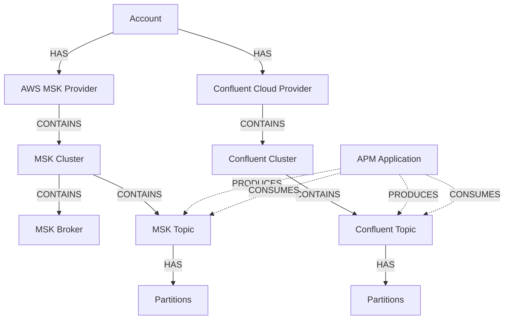

# Entity Model & Synthesis

## Overview

The Message Queues monitoring system leverages New Relic's powerful entity synthesis platform to transform raw Kafka telemetry into first-class entities with relationships, alertability, and rich metadata.

## Entity Types (Actual Implementation)

### AWS MSK Entity Types

```typescript
// Actual entity types from the codebase
export const AWS_ENTITY_TYPES = {
  CLUSTER: 'AWSMSKCLUSTER',
  BROKER: 'AWSMSKBROKER', 
  TOPIC: 'AWSMSKTOPIC'
} as const;

// Entity domain
export const ENTITY_DOMAIN = 'INFRA';
```

### Confluent Cloud Entity Types

```typescript
export const CONFLUENT_ENTITY_TYPES = {
  CLUSTER: 'CONFLUENTCLOUDCLUSTER',
  TOPIC: 'CONFLUENTCLOUDKAFKATOPIC',
  CONNECTOR: 'CONFLUENTCLOUDCONNECTOR'
} as const;
```

## Entity Query Filters (from query-utils.ts)

### AWS MSK Query Filters

```typescript
// Actual query filters from the implementation
export const AWS_CLUSTER_QUERY_FILTER = 
  "domain IN ('INFRA') AND type='AWSMSKCLUSTER'";

export const AWS_TOPIC_QUERY_FILTER = 
  "domain IN ('INFRA') AND type='AWSMSKTOPIC'";

export const AWS_BROKER_QUERY_FILTER = 
  "domain IN ('INFRA') AND type='AWSMSKBROKER'";

// Dynamic filter functions
export const AWS_CLUSTER_QUERY_FILTER_FUNC = (searchName: string) => {
  return `${AWS_CLUSTER_QUERY_FILTER} ${searchName ? `AND name IN (${searchName})` : ''}`;
};

export const AWS_TOPIC_QUERY_FILTER_FUNC = (searchName: string) => {
  return `${AWS_TOPIC_QUERY_FILTER} AND type='AWSMSKTOPIC' AND name IN (${searchName})`;
};
```

### Confluent Cloud Query Filters

```typescript
export const CONFLUENT_CLOUD_QUERY_FILTER_CLUSTER = 
  "domain IN ('INFRA') AND type='CONFLUENTCLOUDCLUSTER'";

export const CONFLUENT_CLOUD_QUERY_FILTER_TOPIC = 
  "domain IN ('INFRA') AND type='CONFLUENTCLOUDKAFKATOPIC'";

export const CONFLUENT_CLOUD_QUERY_FILTER_CLUSTER_FUNC = (searchName: string) => {
  return `${CONFLUENT_CLOUD_QUERY_FILTER_CLUSTER} ${searchName ? `AND name IN (${searchName})` : ''}`;
};

export const CONFLUENT_CLOUD_QUERY_FILTER_TOPIC_FUNC = (searchName: string) => {
  return `${CONFLUENT_CLOUD_QUERY_FILTER_TOPIC} AND name IN (${searchName})`;
};
```

## Entity Synthesis

### AWS MSK Cluster Synthesis

```yaml
synthesis:
  name: awsMskCluster
  identifier: arn
  conditions:
    - attribute: provider.source
      value: "cloudwatch"
    - attribute: provider.service
      value: "AWS/Kafka"
  tags:
    kafka.cluster:
      entityTagName: clusterName
    kafka.version:
      entityTagName: kafkaVersion
    aws.region:
      entityTagName: awsRegion
    account.id:
      entityTagName: aws.accountId
    aws.arn:
      entityTagName: aws.arn
  goldenTags:
    - kafka.cluster
    - kafka.version
    - aws.region
    - account.id
```

### Confluent Cloud Cluster Synthesis

```yaml
synthesis:
  name: confluentCloudCluster
  identifier: provider.resource.kafka.id
  conditions:
    - attribute: provider.source
      value: "confluent"
    - attribute: provider.service
      value: "kafka"
  tags:
    confluent.cluster:
      entityTagName: kafka.id
    confluent.environment:
      entityTagName: provider.resource.environment.id
    confluent.organization:
      entityTagName: provider.organizationId
    confluent.cloud:
      entityTagName: provider.cloud
    confluent.region:
      entityTagName: provider.region
  goldenTags:
    - confluent.cluster
    - confluent.environment
    - confluent.cloud
    - confluent.region
```

## Entity Attributes (Actual Implementation)

### Common Entity Attributes

```typescript
interface BaseKafkaEntity {
  // New Relic entity attributes
  guid: string;
  name: string;
  domain: 'INFRA';
  type: string;
  reporting: boolean;
  alertSeverity: AlertSeverity;
  permalink: string;
  
  // Common Kafka attributes
  tags: {
    accountId: string;
    provider: 'AWS MSK' | 'Confluent Cloud';
    environment?: string;
    team?: string;
    [key: string]: string | undefined;
  };
}
```

### AWS MSK Specific Attributes

```typescript
interface AWSMSKClusterEntity extends BaseKafkaEntity {
  type: 'AWSMSKCLUSTER';
  
  // AWS specific tags
  tags: BaseKafkaEntity['tags'] & {
    'aws.clusterName': string;
    'aws.clusterArn': string;
    'aws.region': string;
    'aws.kafka.version': string;
    'aws.kafka.ClusterName'?: string; // Metric stream tag
    'aws.enhancedMonitoring'?: 'DEFAULT' | 'PER_BROKER' | 'PER_TOPIC_PER_BROKER';
  };
  
  // Relationships
  relationships?: {
    brokers: string[]; // AWSMSKBROKER GUIDs
    topics: string[]; // AWSMSKTOPIC GUIDs
  };
}

interface AWSMSKBrokerEntity extends BaseKafkaEntity {
  type: 'AWSMSKBROKER';
  
  tags: BaseKafkaEntity['tags'] & {
    'aws.brokerId': string;
    'aws.clusterName': string;
    'aws.instanceType': string;
  };
}

interface AWSMSKTopicEntity extends BaseKafkaEntity {
  type: 'AWSMSKTOPIC';
  
  tags: BaseKafkaEntity['tags'] & {
    'aws.topicName': string;
    'aws.clusterName': string;
    'aws.partitionCount': string;
    'aws.replicationFactor': string;
  };
}
```

### Confluent Cloud Specific Attributes

```typescript
interface ConfluentCloudClusterEntity extends BaseKafkaEntity {
  type: 'CONFLUENTCLOUDCLUSTER';
  
  tags: BaseKafkaEntity['tags'] & {
    'confluent.kafka.id': string;
    'confluent.kafka.display_name': string;
    'confluent.environment.id': string;
    'confluent.organization.id': string;
    'confluent.cloud': 'AWS' | 'GCP' | 'AZURE';
    'confluent.region': string;
    'confluent.availability': 'single-zone' | 'multi-zone';
  };
}

interface ConfluentCloudTopicEntity extends BaseKafkaEntity {
  type: 'CONFLUENTCLOUDKAFKATOPIC';
  
  tags: BaseKafkaEntity['tags'] & {
    'confluent.topic.name': string;
    'confluent.kafka.id': string;
    'confluent.partitions_count': string;
    'confluent.replication_factor': string;
  };
}
```

## Entity Discovery (Actual Implementation)

### GraphQL Entity Search (from ALL_KAFKA_TABLE_QUERY)

```typescript
// From ALL_KAFKA_TABLE_QUERY in query-utils.ts
const ALL_KAFKA_TABLE_QUERY = ngql`
  query ALL_KAFKA_TABLE_QUERY(
    $awsQuery: String!, 
    $confluentCloudQuery: String!, 
    $facet: EntitySearchCountsFacet!,
    $orderBy: EntitySearchOrderBy!
  ) {
    actor {
      awsEntitySearch: entitySearch(query: $awsQuery) {
        count
        facetedCounts(facets: {facetCriterion: {facet: $facet}, orderBy: $orderBy}) {
          counts {
            count
            facet
          }
        }
        results {
          accounts {
            id
            name
            reportingEventTypes(filter: "AwsMskBrokerSample")
          }
        }
      }
      confluentCloudEntitySearch: entitySearch(query: $confluentCloudQuery) {
        count
        facetedCounts(facets: {facetCriterion: {facet: $facet}, orderBy: $orderBy}) {
          counts {
            count
            facet
          }
        }
        results {
          accounts {
            id
            name
          }
        }
      }
    }
  }
`;
```

### Entity Group Query Usage (from EntityNavigator)

```typescript
// From EntityNavigator component
const { loading, error, data } = useNerdGraphQuery({
  query: ENTITY_GROUP_QUERY,
  variables: {
    filters: groupFilters,
    sortBy: EntitySearchQuery.SORT_TYPE.NAME,
    caseSensitiveTagMatching: false,
  },
  attributionHeaders: {
    component: 'Message - Queues - Entity - Group - Query',
    componentId: 'message-queues-entity-group-query',
  },
});
```

## Entity Metrics Association

### Metric Sample Types

```typescript
// AWS MSK Sample Types
export const AWS_MSK_SAMPLES = {
  CLUSTER: 'AwsMskClusterSample',
  BROKER: 'AwsMskBrokerSample',
  TOPIC: 'AwsMskTopicSample'
} as const;

// Confluent Cloud Sample Types
export const CONFLUENT_SAMPLES = {
  CLUSTER: 'ConfluentCloudClusterSample',
  TOPIC: 'ConfluentCloudKafkaTopicSample',
  CONNECTOR: 'ConfluentCloudConnectorSample'
} as const;
```

### Metric Tag Attributes (from constants.ts)

```typescript
export const METRIC_TAG_ATTRIBUTES = [
  'tags.component',
  'tags.department',
  'tags.environment',
  'tags.Name',
  'tags.owning_team',
  'tags.product',
  'tags.cell_type',
  'tags.tls_mode',
  'tags.service_name',
  'tags.cell_name',
  'tags.service',
  'tags.team',
  'tags.kafka.topic.name',
  'tags.kafka.partition',
  'tags.kafka.consumer.group',
  'tags.kafka.broker.id'
];
```

## Entity Relationships

### Topic to Cluster Relationship Discovery

```typescript
// From GET_CLUSTERS_FROM_TOPIC_FILTER_QUERY
const GET_CLUSTERS_FROM_TOPIC_FILTER_QUERY = ngql`
  query GET_CLUSTERS_FROM_TOPIC_FILTER_QUERY(
    $awsTopicQuery: String!, 
    $confluentTopicQuery: String!
  ) {
    actor {
      awsTopicEntitySearch: entitySearch(query: $awsTopicQuery) {
        __typename
        polling: groupedResults(by: {tag: "aws.clusterName"}) {
          group
        }
        metrics: groupedResults(by: {tag: "aws.kafka.ClusterName"}) {
          group
        }
      }
      confluentTopicEntitySearch: entitySearch(query: $confluentTopicQuery) {
        groupedResults(by: {tag: "confluent.kafka.id"}) {
          group
        }
      }
    }
  }
`;
```

### Relationship Types



### Relationship Synthesis

```typescript
// Relationship synthesis implementation
interface RelationshipSynthesis {
  // Cluster to Broker relationship
  clusterToBroker: {
    type: 'CONTAINS',
    source: {
      type: 'AWSMSKCLUSTER',
      identifier: 'aws.clusterName'
    },
    target: {
      type: 'AWSMSKBROKER',
      condition: 'aws.clusterName = source.aws.clusterName'
    }
  };
  
  // Cluster to Topic relationship
  clusterToTopic: {
    type: 'CONTAINS',
    source: {
      type: 'AWSMSKCLUSTER',
      identifier: 'aws.clusterName'
    },
    target: {
      type: 'AWSMSKTOPIC',
      condition: 'aws.clusterName = source.aws.clusterName'
    }
  };
  
  // APM to Topic relationships
  producerToTopic: {
    type: 'PRODUCES',
    source: {
      type: 'APPLICATION',
      condition: 'kafka.producer.topic IS NOT NULL'
    },
    target: {
      type: 'AWSMSKTOPIC',
      condition: 'provider.topic = source.kafka.producer.topic'
    }
  };
}
```

## Provider Constants (from constants.ts)

### Provider Mappings

```typescript
export const PROVIDERS_ID_MAP: any = {
  'AWS MSK': 'aws',
  'Confluent Cloud': 'confluent_cloud',
};

export const MSK_PROVIDER = 'AWS MSK';
export const CONFLUENT_CLOUD_PROVIDER = 'Confluent Cloud';
export const MSK_PROVIDER_POLLING = 'AWS MSK SAMPLE';
```

### Filter Constants

```typescript
// Combined topic query filter
export const COUNT_TOPIC_QUERY_FILTER = 
  `domain IN ('INFRA') AND type IN ('AWSMSKTOPIC', 'CONFLUENTCLOUDKAFKATOPIC')`;
```

### Entity Metadata Enrichment

```typescript
// Entity metadata enrichment process
const enrichEntity = (entity: RawEntity): EnrichedEntity => {
  return {
    ...entity,
    // Add computed metadata
    metadata: {
      // Health status calculation
      healthStatus: calculateHealthStatus(entity),
      
      // Relationship counts
      brokerCount: entity.type === 'CLUSTER' ? getBrokerCount(entity) : undefined,
      topicCount: entity.type === 'CLUSTER' ? getTopicCount(entity) : undefined,
      partitionCount: entity.type === 'TOPIC' ? getPartitionCount(entity) : undefined,
      
      // Performance metrics
      throughputMetrics: {
        bytesInPerSec: entity.metrics?.bytesInPerSec,
        bytesOutPerSec: entity.metrics?.bytesOutPerSec,
        messagesPerSec: entity.metrics?.messagesPerSec
      },
      
      // Integration metadata
      lastSeen: entity.timestamp,
      dataFreshness: calculateDataFreshness(entity.timestamp)
    }
  };
};
```

## Golden Metrics & Summary Metrics

### Golden Metrics Definition

Golden metrics represent the most important measurements for each entity type:

```yaml
# AWS MSK Cluster Golden Metrics
goldenMetrics:
  - title: "Active Controllers"
    query: 
      select: "latest(`provider.activeControllerCount.Sum`)"
      from: "AwsMskClusterSample"
      where: "entity.guid = '{entityGuid}'"
    unit: COUNT
    
  - title: "Offline Partitions"
    query:
      select: "latest(`provider.offlinePartitionsCount.Sum`)"
      from: "AwsMskClusterSample"
      where: "entity.guid = '{entityGuid}'"
    unit: COUNT
    
  - title: "Cluster Throughput"
    query:
      select: "sum(bytesInPerSec) + sum(bytesOutPerSec)"
      from: "(SELECT average(provider.bytesInPerSec.Average) as bytesInPerSec, 
              average(provider.bytesOutPerSec.Average) as bytesOutPerSec 
              FROM AwsMskBrokerSample 
              WHERE aws.clusterName = '{clusterName}' 
              FACET provider.brokerId)"
    unit: BYTES_PER_SECOND
```

### Summary Metrics Configuration

```yaml
# Summary metrics for entity lists
summaryMetrics:
  - title: "Health Score"
    query:
      select: "CASE WHEN activeControllers = 1 AND offlinePartitions = 0 
               THEN 100 ELSE 0 END as healthScore"
      from: "(SELECT latest(`provider.activeControllerCount.Sum`) as activeControllers,
              latest(`provider.offlinePartitionsCount.Sum`) as offlinePartitions
              FROM AwsMskClusterSample WHERE entity.guid = '{entityGuid}')"
    unit: PERCENTAGE
    
  - title: "Topic Count"
    query:
      select: "uniqueCount(entityGuid)"
      from: "AwsMskTopicSample"
      where: "provider.clusterName = '{clusterName}'"
    unit: COUNT
```

## Entity Lifecycle Management

### Entity Creation

```typescript
// Entity synthesis pipeline
const entitySynthesisPipeline = {
  // 1. Telemetry ingestion
  ingest: (telemetry: TelemetryEvent) => {
    // Validate event type
    if (!isValidEventType(telemetry.eventType)) return;
    
    // Extract entity attributes
    const entityAttributes = extractEntityAttributes(telemetry);
    
    // Generate entity GUID
    const guid = generateEntityGuid(entityAttributes);
    
    // Create or update entity
    return createOrUpdateEntity(guid, entityAttributes);
  },
  
  // 2. Relationship discovery
  discoverRelationships: (entity: Entity) => {
    // Find parent entities
    const parents = findParentEntities(entity);
    
    // Find child entities
    const children = findChildEntities(entity);
    
    // Find peer relationships (APM)
    const peers = findPeerRelationships(entity);
    
    return { parents, children, peers };
  },
  
  // 3. Metadata enrichment
  enrichMetadata: (entity: Entity) => {
    // Add computed fields
    entity.computedFields = computeFields(entity);
    
    // Add external metadata
    entity.externalMetadata = fetchExternalMetadata(entity);
    
    // Add user-defined tags
    entity.userTags = getUserDefinedTags(entity);
    
    return entity;
  }
};
```

### Entity Expiration

```yaml
# Entity expiration configuration
entityExpirationTime:
  expiration_duration_seconds: 691200  # 8 days default
  
  # Custom expiration rules
  rules:
    - condition: "entity.type = 'TOPIC' AND bytesInPerSec = 0"
      expiration_duration_seconds: 172800  # 2 days for inactive topics
      
    - condition: "entity.type = 'BROKER' AND reporting = false"
      expiration_duration_seconds: 86400   # 1 day for non-reporting brokers
```

### Entity Updates

```typescript
// Entity update mechanisms
const entityUpdateHandlers = {
  // Metric updates
  updateMetrics: (guid: string, metrics: Metrics) => {
    // Update latest values
    updateLatestMetrics(guid, metrics);
    
    // Update time series
    appendTimeSeriesData(guid, metrics);
    
    // Trigger dependent calculations
    recalculateDerivedMetrics(guid);
  },
  
  // Tag updates
  updateTags: (guid: string, tags: Tags) => {
    // Merge with existing tags
    const mergedTags = mergeEntityTags(guid, tags);
    
    // Validate tag constraints
    validateEntityTags(mergedTags);
    
    // Apply tag updates
    applyTagUpdates(guid, mergedTags);
  },
  
  // Relationship updates
  updateRelationships: (guid: string, relationships: Relationships) => {
    // Validate relationship integrity
    validateRelationships(relationships);
    
    // Update bidirectional links
    updateBidirectionalLinks(guid, relationships);
    
    // Trigger relationship-based calculations
    recalculateRelationshipMetrics(guid);
  }
};
```

## Query Integration

### Entity-Based Queries

```typescript
// Entity-aware NRQL queries
const entityQueries = {
  // Query by entity GUID
  byGuid: (guid: string) => `
    FROM AwsMskClusterSample 
    SELECT * 
    WHERE entity.guid = '${guid}'
    SINCE 1 hour ago
  `,
  
  // Query by entity type
  byType: (type: string) => `
    FROM Infrastructure 
    SELECT count(*) 
    WHERE entity.type = '${type}'
    FACET entity.name
  `,
  
  // Query with relationships
  withRelationships: (guid: string) => ngql`
    query EntityWithRelationships($guid: EntityGuid!) {
      actor {
        entity(guid: $guid) {
          name
          type
          relationships {
            source {
              entity { guid name type }
            }
            target {
              entity { guid name type }
            }
            type
          }
        }
      }
    }
  `
};
```

### Entity Search Patterns

```typescript
// Common entity search patterns
const entitySearchPatterns = {
  // Search clusters by provider
  clustersByProvider: (provider: string) => 
    `domain IN ('INFRA') AND type IN ('AWSMSKCLUSTER', 'CONFLUENTCLOUDCLUSTER') 
     AND tags.provider = '${provider}'`,
  
  // Search topics by cluster
  topicsByCluster: (clusterName: string) => 
    `domain = 'INFRA' AND type IN ('AWSMSKTOPIC', 'CONFLUENTCLOUDKAFKATOPIC') 
     AND tags.clusterName = '${clusterName}'`,
  
  // Search unhealthy entities
  unhealthyEntities: () => 
    `domain = 'INFRA' AND type LIKE '%KAFKA%' 
     AND alertSeverity IN ('CRITICAL', 'WARNING')`,
  
  // Search by custom tags
  byCustomTags: (tagFilters: TagFilter[]) => {
    const conditions = tagFilters.map(f => `tags.${f.key} = '${f.value}'`);
    return `domain = 'INFRA' AND ${conditions.join(' AND ')}`;
  }
};
```

## Best Practices

### 1. Entity Naming
- Use consistent, descriptive names
- Include environment/region in cluster names
- Avoid special characters in identifiers

### 2. Tag Management
- Use standard tag keys across providers
- Implement tag namespacing for custom tags
- Keep tag values concise and meaningful

### 3. Relationship Modeling
- Define clear parent-child hierarchies
- Use appropriate relationship types
- Maintain bidirectional consistency

### 4. Performance Optimization
- Limit tag cardinality
- Use efficient entity identifiers
- Implement proper expiration policies

### 5. Monitoring Entity Health
- Define clear health criteria
- Implement graduated severity levels
- Use entity-based alerting

## Conclusion

The entity model forms the foundation of the Message Queues monitoring system, enabling sophisticated visualization, alerting, and analysis capabilities. By leveraging New Relic's entity synthesis platform, Kafka infrastructure becomes first-class observable entities with rich relationships and metadata.