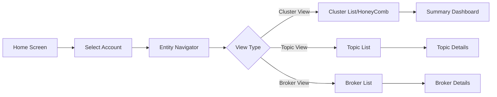

# Functional Workflows

## Overview

This document describes the actual user workflows and component interactions in the Message Queues monitoring system, showing how users navigate through the application and how data flows between components.

## User Navigation Workflow

### Account → Cluster → Topic Navigation



### Implementation Flow

```typescript
// 1. Home Screen - Account Selection
const HomeNerdlet = () => {
  // Load accounts with Kafka entities
  const accounts = useKafkaAccounts();
  
  // User selects account
  const handleAccountSelect = (account) => {
    navigation.setNerdletState({ 
      item: {
        'Account Id': account.id,
        'Provider': account.provider,
        'Name': account.name
      }
    });
  };
};

// 2. Entity Navigator receives account context
const EntityNavigator = ({ filterSet }) => {
  // Get selected account from nerdlet state
  const [{ item = { 'Account Id': '' } }] = useNerdletState();
  
  // Initialize view filters
  const [filters, setFilters] = useState({ 
    show: 'cluster',  // cluster | topic | broker
    metric: 'health'  // health | alert-status | throughput
  });
  
  // Fetch entities based on filters
  const { EntityMetrics } = useFetchEntityMetrics({
    item,
    show: filters.show,
    groupBy: filters.groupBy,
    filterSet
  });
};

// 3. Navigation to Summary
const handleEntityClick = (entity) => {
  navigation.openStackedNerdlet({
    id: 'message-queues.summary',
    urlState: {
      entityGuid: entity.guid,
      entityType: entity.type,
      accountId: item['Account Id']
    }
  });
};
```

## Filter Propagation Workflow

### Filter State Management

```typescript
// Filter state flows through multiple components
interface FilterFlow {
  // 1. User applies filters in FilterBar
  userInput: {
    component: 'FilterBar',
    action: 'applyFilters',
    filters: Filter[]
  };
  
  // 2. Filters update URL state
  urlStateUpdate: {
    component: 'FilterBar',
    action: 'updateUrlState',
    state: { filters: encodedFilters }
  };
  
  // 3. Parent component receives filter changes
  parentUpdate: {
    component: 'HomeNerdlet',
    action: 'onFilterChange',
    filterSet: Filter[]
  };
  
  // 4. Filters propagate to data fetching
  dataFetch: {
    component: 'EntityNavigator',
    action: 'useFetchEntityMetrics',
    params: { filterSet, item, show }
  };
}
```

### Provider-Specific Filter Logic

```typescript
// From EntityNavigator.tsx
const buildQueryFilters = (item, filters, filterSet) => {
  // Provider-specific query filters
  const providerFilter = item?.Provider === CONFLUENT_CLOUD_PROVIDER
    ? FilterQuery[`CONFLUENT_CLOUD_QUERY_FILTER_${filters.show.toUpperCase()}`]
    : FilterQuery[`AWS_${filters.show.toUpperCase()}_QUERY_FILTER`];
  
  // Account filter
  const accountFilter = `tags.accountId = '${item['Account Id']}'`;
  
  // Combine all filters
  const queryFilters = [providerFilter, accountFilter].join(' AND ');
  
  // Apply additional filter set
  return mergeFiltersWithAND(queryFilters, filterSet);
};
```

## Entity Metrics Fetching Workflow

### Data Fetching Pipeline

```typescript
// 1. Hook initialization
const useFetchEntityMetrics = ({ item, show, groupBy, filterSet }) => {
  const [state, setState] = useState({
    loading: true,
    error: null,
    EntityMetrics: []
  });
  
  useEffect(() => {
    fetchMetrics();
  }, [item, show, groupBy, filterSet]);
  
  const fetchMetrics = async () => {
    try {
      setState({ loading: true });
      
      // Build provider-specific query
      const query = buildMetricQuery(item.Provider, show, groupBy);
      
      // Execute NRQL query
      const results = await NrqlQuery.query({
        accountId: item['Account Id'],
        query
      });
      
      // Transform results
      const metrics = transformMetricResults(results, show);
      
      setState({ 
        loading: false, 
        EntityMetrics: metrics 
      });
    } catch (error) {
      setState({ loading: false, error });
    }
  };
  
  return state;
};
```

### Metric Query Building

```typescript
// Provider-specific metric queries
const buildMetricQuery = (provider, entityType, groupBy) => {
  const baseQuery = getBaseQuery(provider, entityType);
  const aggregations = getAggregations(entityType);
  const timeRange = 'SINCE 1 hour ago';
  
  return `
    ${baseQuery}
    SELECT ${aggregations}
    ${groupBy ? `FACET ${groupBy}` : ''}
    ${timeRange}
  `;
};

const getBaseQuery = (provider, entityType) => {
  const queryMap = {
    'AWS MSK': {
      cluster: 'FROM AwsMskClusterSample',
      topic: 'FROM AwsMskTopicSample',
      broker: 'FROM AwsMskBrokerSample'
    },
    'Confluent Cloud': {
      cluster: 'FROM ConfluentCloudClusterSample',
      topic: 'FROM ConfluentCloudKafkaTopicSample'
    }
  };
  
  return queryMap[provider][entityType];
};
```

## Component Interaction Patterns

### State Sharing via Nerdlet Context

```typescript
// Parent component sets shared state
const HomeNerdlet = () => {
  const [sharedState, setSharedState] = useNerdletState();
  
  // Update shared state
  const updateSharedState = (updates) => {
    setSharedState({
      ...sharedState,
      ...updates,
      lastUpdated: Date.now()
    });
  };
  
  return (
    <Stack>
      <FilterBar 
        onFilterChange={(filters) => 
          updateSharedState({ filters })
        }
      />
      <EntityNavigator 
        filterSet={sharedState.filters}
      />
    </Stack>
  );
};

// Child components consume shared state
const EntityNavigator = ({ filterSet }) => {
  const [{ item, filters }] = useNerdletState();
  
  // React to state changes
  useEffect(() => {
    refreshData();
  }, [item, filters]);
};
```

### Data Transformation Pipeline

```typescript
// From data-utils.ts
const dataTransformationPipeline = {
  // 1. Raw metric data
  rawData: async () => {
    const results = await NrqlQuery.query({ query });
    return results;
  },
  
  // 2. Entity grouping
  groupEntities: (data) => {
    return prepareEntityGroups(
      data,
      provider,
      entityType,
      groupBy
    );
  },
  
  // 3. Alert severity mapping
  mapAlertSeverity: (groups, entityData) => {
    return groups.map(group => ({
      ...group,
      counts: group.counts.map(count => {
        const entity = entityData.find(e => e.name === count.name);
        return {
          ...count,
          alertSeverity: entity?.alertSeverity || 'NOT_CONFIGURED'
        };
      })
    }));
  },
  
  // 4. Health calculation
  calculateHealth: (groups) => {
    return groups.map(group => ({
      ...group,
      health: calculateGroupHealth(group)
    }));
  },
  
  // 5. Final formatting
  formatForDisplay: (groups) => {
    return prepareTableData(groups);
  }
};
```

## HoneyComb View Workflow

### HoneyComb Data Flow

```typescript
// 1. Entity selection in NavigatorControlBar
const NavigatorControlBar = ({ filters, onFilterChange }) => {
  const handleViewChange = (newView) => {
    onFilterChange({ ...filters, show: newView });
  };
  
  const handleMetricChange = (newMetric) => {
    onFilterChange({ ...filters, metric: newMetric });
  };
};

// 2. HoneyComb receives grouped entities
const HoneyCombView = ({ entityGroups, metric }) => {
  // Transform entities to hexagon data
  const hexagons = entityGroups.flatMap(group => 
    group.counts.map(entity => ({
      id: entity.guid,
      name: entity.name,
      value: getMetricValue(entity, metric),
      color: getColor(entity, metric),
      size: entity.count || 1
    }))
  );
  
  // Render hexagonal grid
  return <HexagonalGrid hexagons={hexagons} />;
};

// 3. Hexagon click navigation
const handleHexagonClick = (hexagon) => {
  const entityType = detectEntityType(hexagon);
  
  if (entityType === 'cluster') {
    // Navigate to summary
    navigation.openStackedNerdlet({
      id: 'message-queues.summary',
      urlState: { 
        entityGuid: hexagon.id,
        view: 'cluster-overview'
      }
    });
  } else if (entityType === 'topic') {
    // Navigate to topic details
    navigation.openStackedNerdlet({
      id: 'message-queues.mq-detail',
      urlState: { 
        entityGuid: hexagon.id,
        view: 'topic-details'
      }
    });
  }
};
```

## Summary Dashboard Workflow

### Data Loading in Summary

```typescript
// Summary nerdlet initialization
const SummaryNerdlet = () => {
  const { entityGuid } = useNerdletUrlState();
  const [entity, setEntity] = useState(null);
  const [metrics, setMetrics] = useState({});
  
  // Load entity details
  useEffect(() => {
    loadEntityDetails();
  }, [entityGuid]);
  
  const loadEntityDetails = async () => {
    // 1. Fetch entity
    const entityData = await NerdGraphQuery.query({
      query: GET_ENTITY_QUERY,
      variables: { guid: entityGuid }
    });
    
    setEntity(entityData.actor.entity);
    
    // 2. Determine entity type and load appropriate metrics
    const metricQueries = getMetricQueries(entityData.actor.entity.type);
    
    // 3. Execute metric queries in parallel
    const metricResults = await Promise.all(
      metricQueries.map(q => 
        NrqlQuery.query({
          accountId: entityData.actor.entity.accountId,
          query: q.query
        })
      )
    );
    
    // 4. Process and store metrics
    const processedMetrics = processMetricResults(metricResults, metricQueries);
    setMetrics(processedMetrics);
  };
};
```

## Error Handling Workflow

### Error Propagation Pattern

```typescript
// Error handling at different levels
const errorHandlingFlow = {
  // 1. Data fetching level
  dataFetch: async () => {
    try {
      const data = await fetchData();
      return { success: true, data };
    } catch (error) {
      console.error('Data fetch error:', error);
      return { 
        success: false, 
        error: {
          message: error.message,
          code: error.code || 'UNKNOWN_ERROR'
        }
      };
    }
  },
  
  // 2. Component level
  component: ({ error }) => {
    if (error) {
      return (
        <InlineMessage 
          type={InlineMessage.TYPE.CRITICAL}
          title="Error loading data"
          description={error.message}
        />
      );
    }
    return <DataDisplay />;
  },
  
  // 3. User notification
  userNotification: (error) => {
    if (error.code === 'PERMISSION_DENIED') {
      Toast.showToast({
        title: 'Access Denied',
        description: 'You do not have permission to view this data',
        type: Toast.TYPE.CRITICAL
      });
    } else {
      Toast.showToast({
        title: 'Error',
        description: error.message,
        type: Toast.TYPE.NORMAL
      });
    }
  }
};
```

## Performance Optimization Workflow

### Data Caching Pattern

```typescript
// Cache implementation for expensive queries
const queryCache = new Map();

const useCachedQuery = (query, variables, options = {}) => {
  const cacheKey = JSON.stringify({ query, variables });
  const cached = queryCache.get(cacheKey);
  
  // Return cached data if fresh
  if (cached && Date.now() - cached.timestamp < options.ttl) {
    return { ...cached.result, fromCache: true };
  }
  
  // Fetch new data
  const result = useNerdGraphQuery({ query, variables });
  
  // Cache successful results
  if (!result.loading && !result.error) {
    queryCache.set(cacheKey, {
      result,
      timestamp: Date.now()
    });
  }
  
  return result;
};
```

### Progressive Loading

```typescript
// Load data progressively for better UX
const useProgressiveEntityLoad = (accountId) => {
  const [state, setState] = useState({
    basic: { loading: true, data: null },
    detailed: { loading: true, data: null },
    relationships: { loading: true, data: null }
  });
  
  useEffect(() => {
    // Load basic entity info first
    loadBasicInfo().then(data => 
      setState(s => ({ ...s, basic: { loading: false, data } }))
    );
    
    // Then load detailed metrics
    loadDetailedMetrics().then(data => 
      setState(s => ({ ...s, detailed: { loading: false, data } }))
    );
    
    // Finally load relationships
    loadRelationships().then(data => 
      setState(s => ({ ...s, relationships: { loading: false, data } }))
    );
  }, [accountId]);
  
  return state;
};
```

## Best Practices

### 1. State Management
- Use Nerdlet state for cross-component communication
- Keep component state minimal and derived
- Leverage URL state for deep linking
- Cache expensive computations

### 2. Data Fetching
- Batch related queries when possible
- Implement proper error boundaries
- Use loading states consistently
- Cache results with appropriate TTLs

### 3. Navigation
- Use proper Nerdlet navigation methods
- Maintain navigation context
- Support browser back/forward
- Preserve filter state across navigation

### 4. Performance
- Implement virtual scrolling for large lists
- Use React.memo for expensive components
- Debounce user inputs
- Progressive data loading

### 5. Error Handling
- Provide meaningful error messages
- Implement retry mechanisms
- Log errors for debugging
- Graceful degradation

## Conclusion

Understanding these functional workflows is crucial for maintaining and extending the Message Queues monitoring system. The patterns shown here represent the actual implementation and can serve as a guide for adding new features or troubleshooting issues.